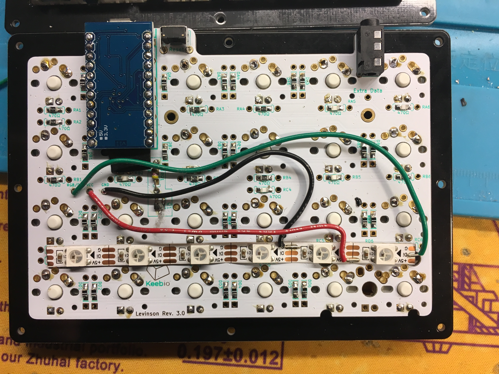
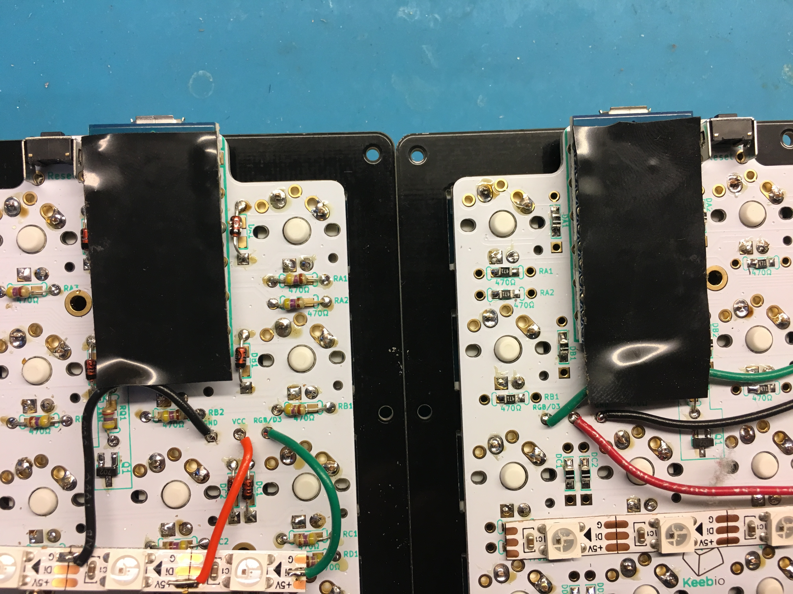
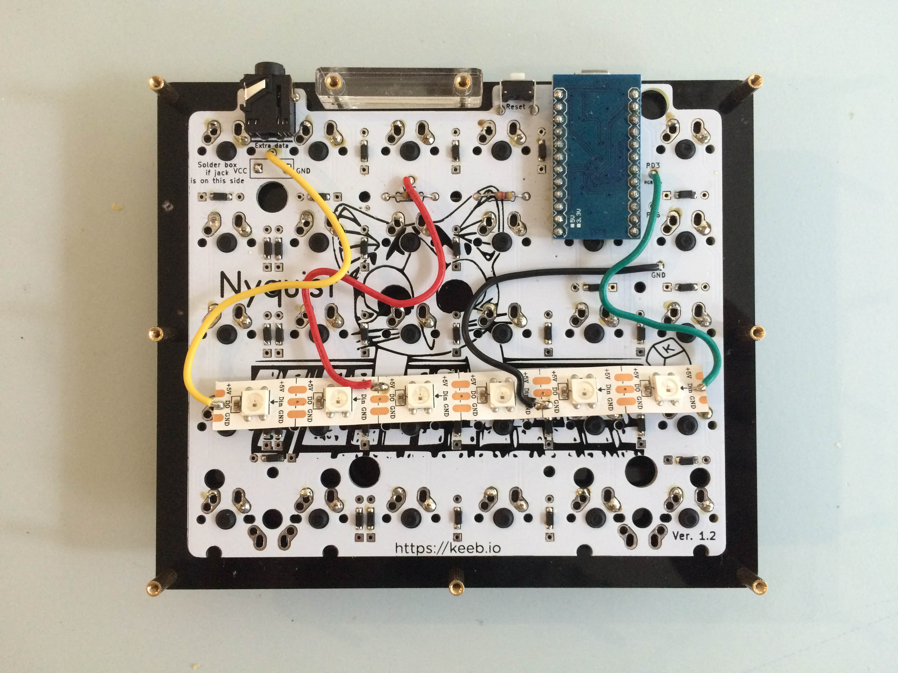
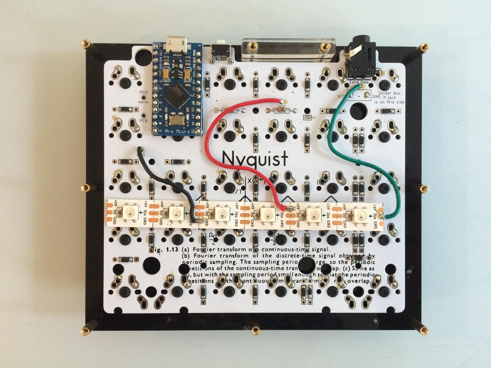

To add RGB underglow to your board, you'll need the following parts:

- WS2812B RGB LED Strip
- Wires
  - Something like 22 AWG hookup wire works: [6-Color Hookup wire kit](https://www.amazon.com/Elenco-Hook-Up-Colors-dispenser-WK-106/dp/B008L3QJAS)
  - 22 to 28 AWG tends to work well

There are 4 pins of note on the WS2812B strip:

- VCC or +5V
- GND
- Din \(Data in\)
- Do or Dout \(Data out\) - Only used by the strip on the master \(left\) side of the board

When connecting VCC and GND from the PCB to the strip, any of the VCC and GND pads can be used on the strip, it doesn't have to be at the beginning or the end.

## Methods for wiring

There are two methods for wiring in RGB strips. The older way is to wire the strips of each half as a single chain. The issue with this is that the RGB strips with only work when the USB cable is plugged into the half wired up as master, as only the controller on the master half controls the RGB strips on both halves.

The newer method is to wire both halves the same way. This way, the controller on each half controls its own RGB strip. This is the recommended way to add RGB.

## Newer Method (Recommended - both halves wired the same way)

Wiring for both halves:

- Din on strip connects to PD3 breakout pad on PCB (on some boards, this may be marked as RGB instead)
- GND on strip to GND pad
- +5V on strip to VCC pad

The Extra Data pad on the PCB and Dout/Do pin on the RGB strip are unused for this method.

Right half shown here: 

Both halves shown here: 

### QMK configuration

For the newer method of wiring, the `RGBLED_SPLIT` option needs to be used. Currently, it is the default option for Keebio Pro Micro-based split keyboards, so you will not need to add it in manually in your keymap's `config.h` file, as it's present in the keyboard's `config.h` file.

## Older Method (single chain controlled by master)

As for the other two pins, Din needs to be connected on the first LED on the strip, and Dout needs to be connected to the last LED on the strip on the master side of the board. The flow of RGB data from the Pro Micro and through the strip is like this:

- TX0 Pin on Pro Micro --&gt; Din on master strip --&gt; Dout on master strip --&gt; Extra data line of TRRS cable --&gt; Din on slave strip

### Master \(left\) side

- Din on strip connects to PD3 breakout pad on PCB (on some boards, this may be marked as RGB instead)
- GND on strip to GND pad
- +5V on strip to VCC pad
- DO/Dout on strip to Extra Data pad



### Slave \(right\) side

- Din on strip connects to Extra Data pad
- GND on strip to GND pad
- +5V on strip to VCC pad




### QMK configuration

For the older method of wiring, make sure the `RGBLED_NUM` setting in `config.h` matches the total number of RGB LEDs you are using. If it does not match, then you'll need to add the following lines to your keymap's `config.h` file (change the number below accordingly):

```js
#undef RGBLED_NUM
#define RGBLED_NUM 12
#undef RGBLED_SPLIT
```
