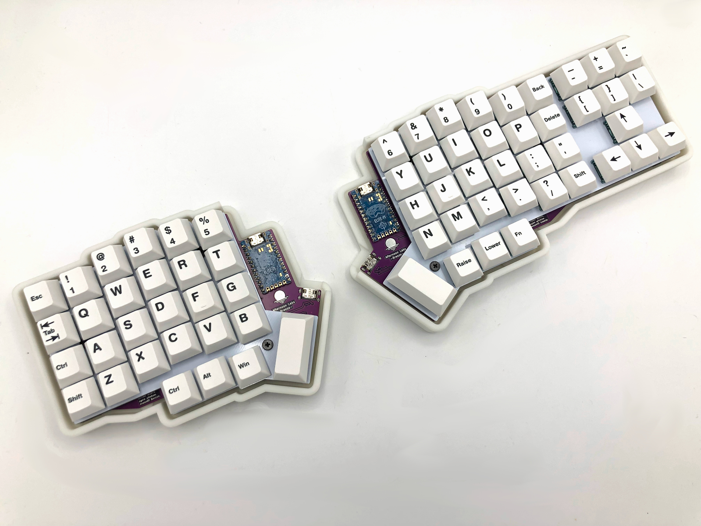

The [Afternoon Labs Breeze Rev. 1.3](https://keeb.io/products/afternoon-labs-breeze-keyboard-kit) is a version of the Breeze that has some modifications made to it (like replacing TRRS with USB-C), and all the needed components except for the microcontrollers are pre-soldered on the boards.

## Build Compatibility

This build guide is specifically for the Breeze Rev. 1.3 sold by Keebio, which comes in a kit with PCB and case.

## Parts List

First up, time to get your parts:

- [Breeze Kit](https://keeb.io/products/afternoon-labs-breeze-keyboard-kit) which includes:
  - Breeze Rev. 1.3 PCBs
  - FR4 Switch Plates
  - 10mm M3 Screws with O-rings
  - SKUF Feet
- [USB-C to USB-C cable](https://keeb.io/products/usb-c-to-usb-c-cable)
- [2x 2u PCB mount MX stabilizers](https://keeb.io/products/cherry-mx-stabilizer)
- [70 Switches](https://keeb.io/collections/switches) (MX-compatible ones)
- [Keycaps](https://keeb.io/collections/keycaps) (MX-compatible ones)

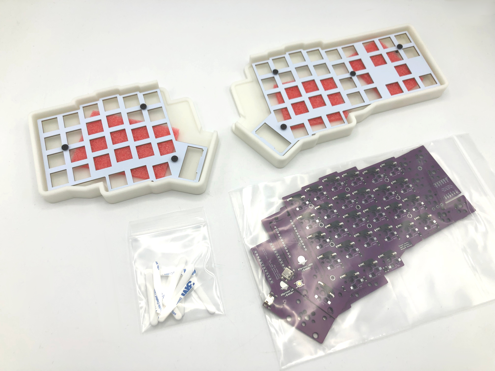

## Build Steps Summary

1. Disassemble Case
2. Test Microcontrollers
3. Solder Microcontrollers
4. Add Stabilizers
5. Add Switches
6. Assemble Case
7. Add Keycaps
8. Board Notes

## Disassemble Case

The first thing to do is unscrew the screws from the case. Keep the o-rings on the screws, as the o-rings are used to prevent the screws from damaging the top housing of the switches.

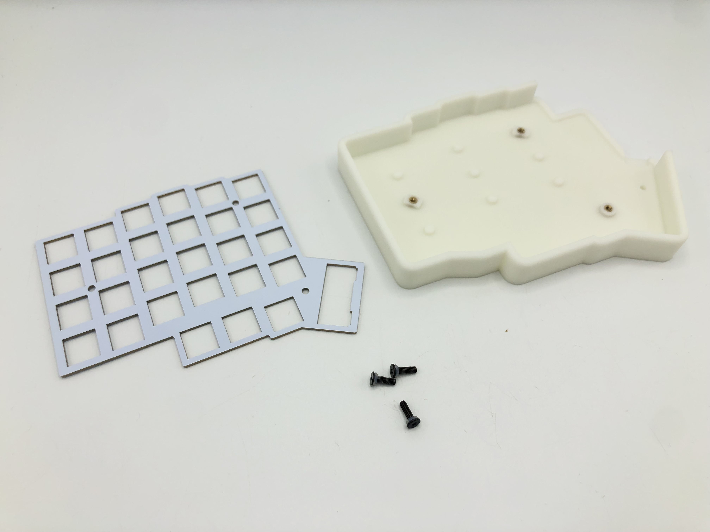

## Test Microcontrollers

Test the microcontrollers first by flashing the firmware to them, as removing the controllers from the PCB is difficult if you have any problems with it and need to desolder them.

## Solder Microcontrollers

Place both of the PCBs face up and insert the header pins into the holes for them.

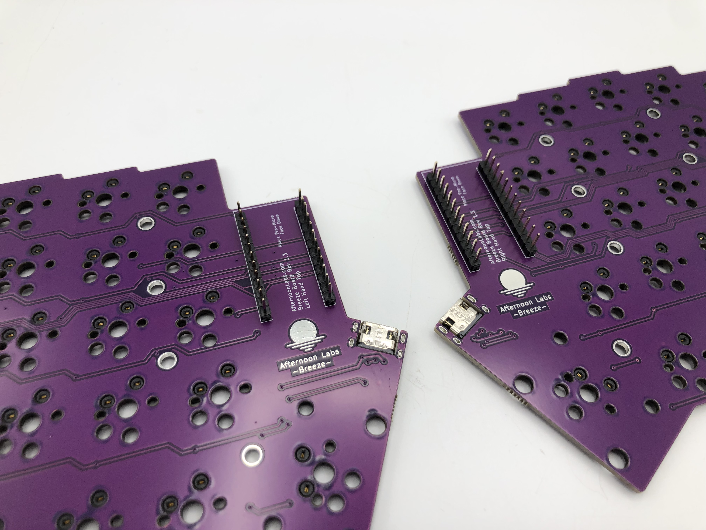

Flip the PCBs over and solder the header pins.

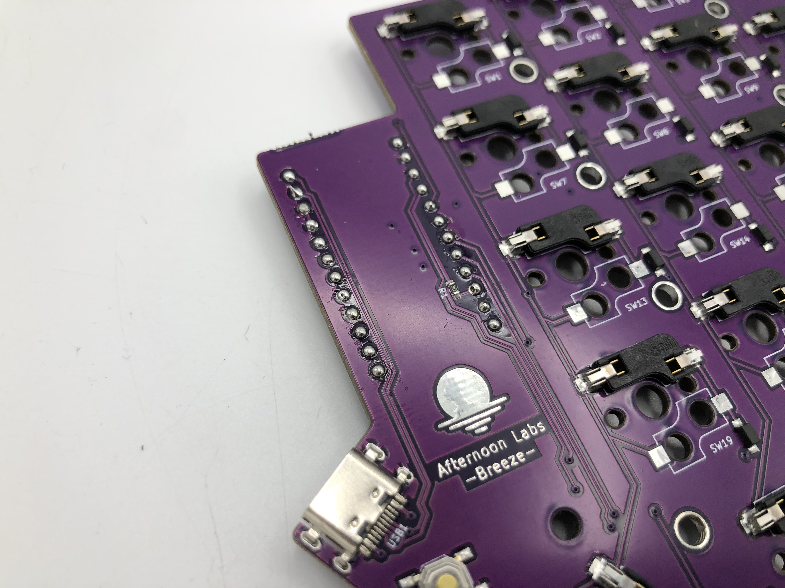

Flip the PCBs back over and put the controllers over the header pins. The chip side of the controller should be facing down.

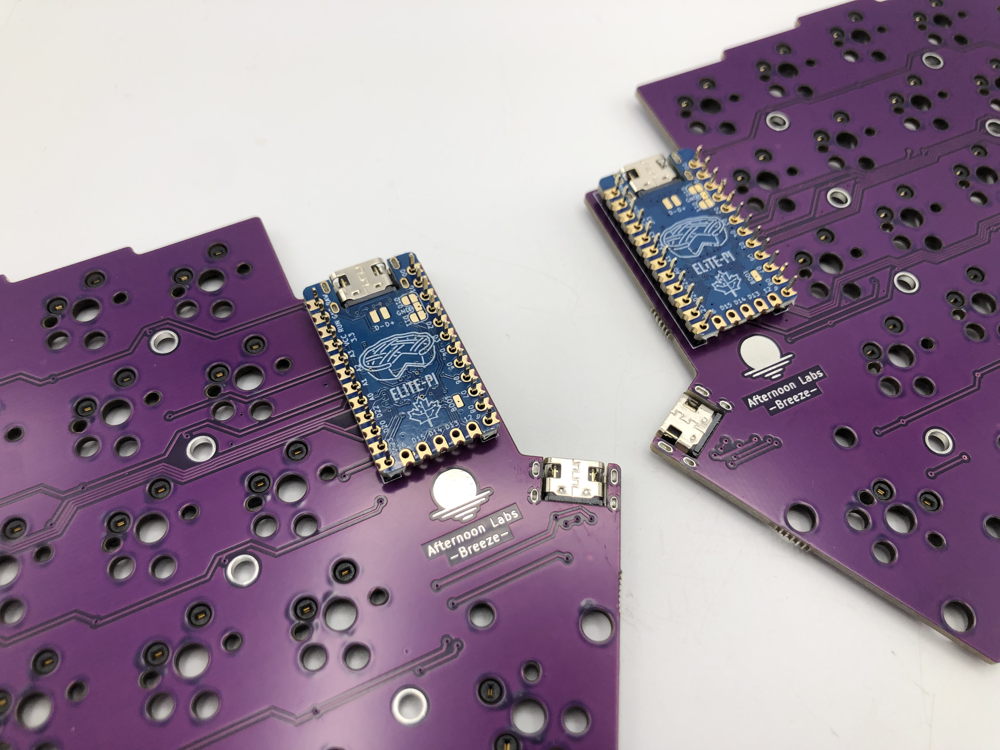

Solder the controllers to the header pins, and then clip the extra length of the header pins off.

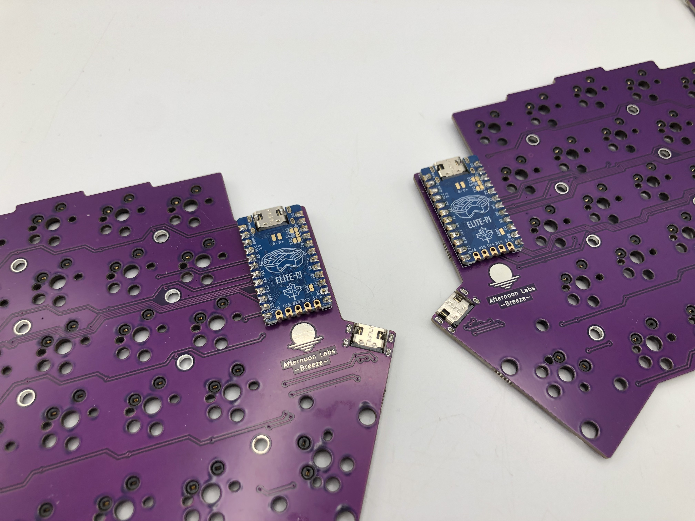

## Add Stabilizers

Assemble the MX stabilizers and insert them into the PCB. If you are unfamiliar with assembling and inserting stabilizers, here's a guide for that: [Stabilizer Handbook](https://imgur.com/gallery/pHK0vhz)

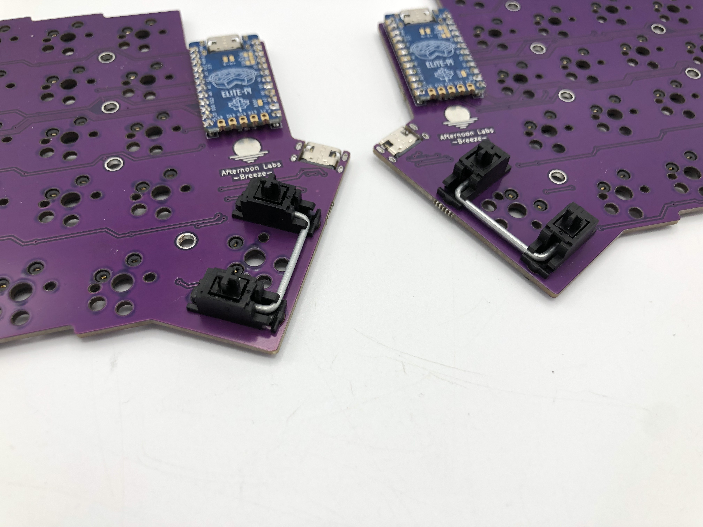

## Add Switches

Start off by inserting switches into the switch plate at the corners and a couple spots in the middle.

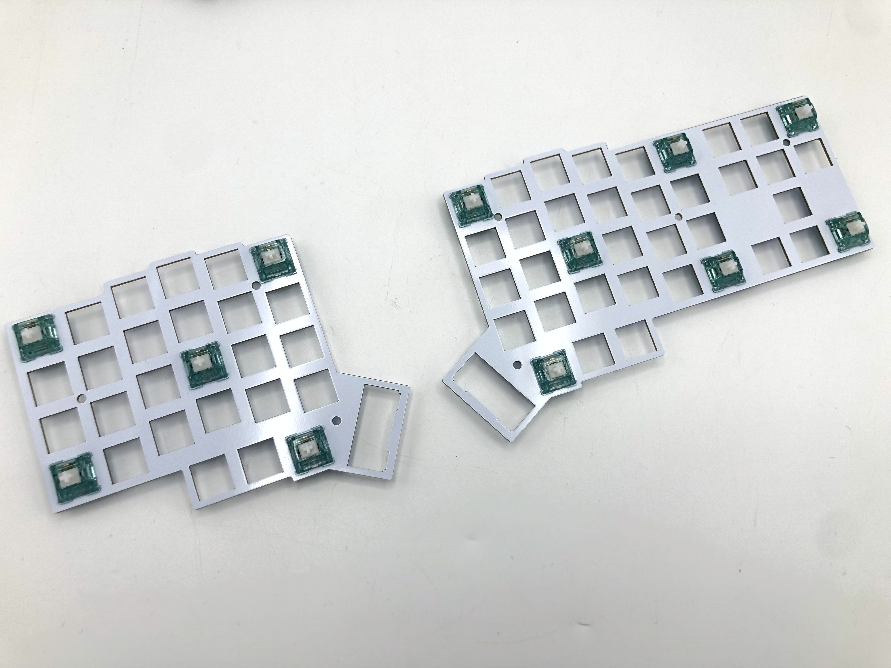

:::danger

Don't attempt to insert switches with bent pins into the hotswap socket, as that can push the socket off of the PCB and damage it.

:::

If you have a switch with a bent pin, unbend the pin. Sometimes it helps to have something like a pair of tweezers to straighten out the pin.

Overlay the switch plate with switches combo onto the PCB and push them together.

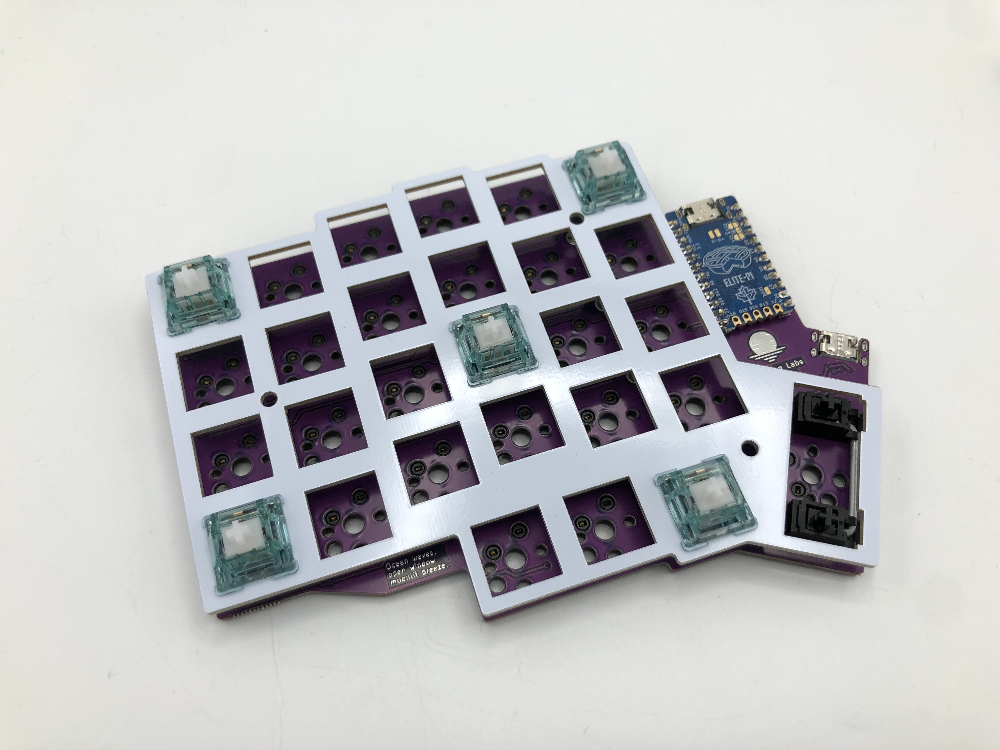

Add the rest of the switches to the plate/PCB.

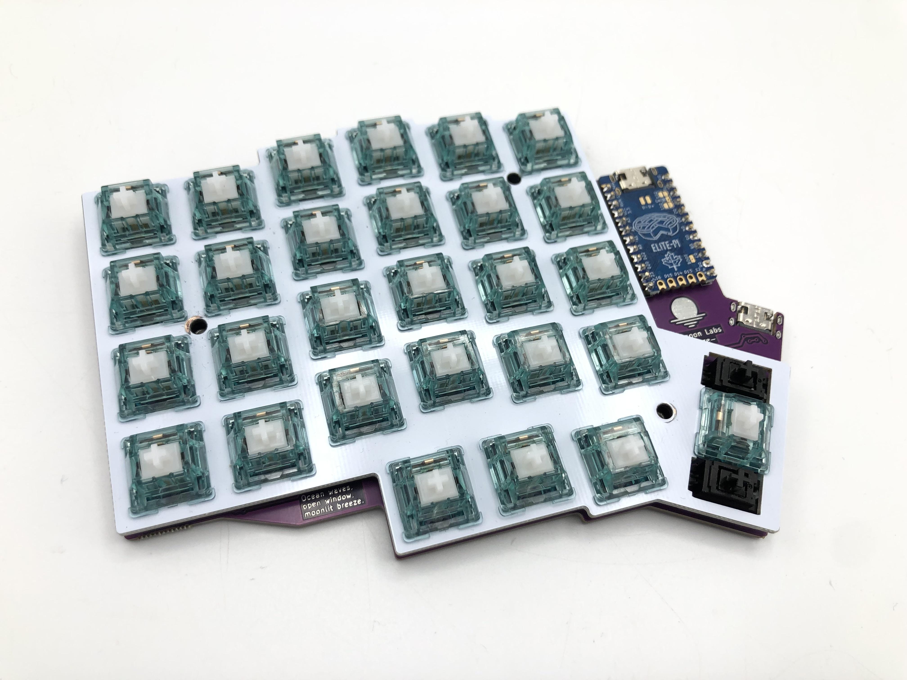

## Assemble Case

First, add SKUF feet to the bottom part of the case. Here's a suggested arrangement of the feet:

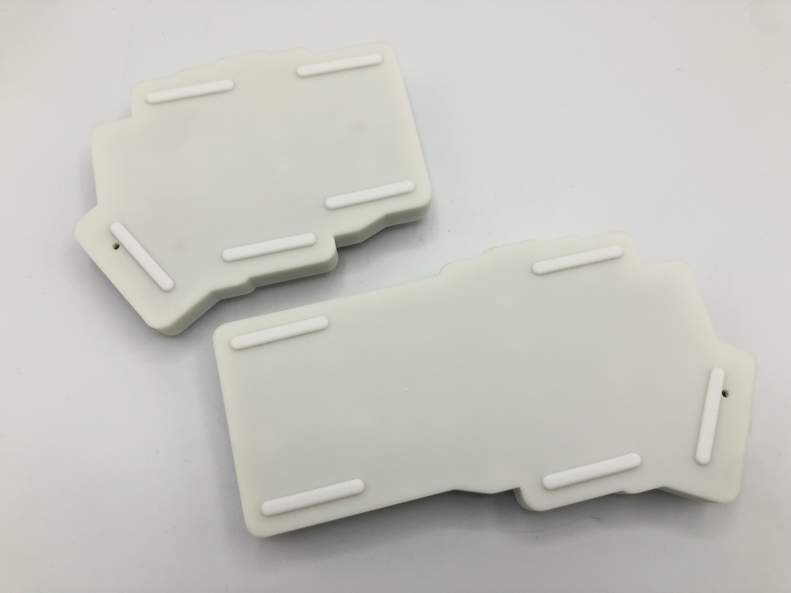

Next, line up the PCB/plate into the case and screw it in with the screws/o-rings. Do not screw in the screws too tightly, as the threaded inserts may get ripped out.

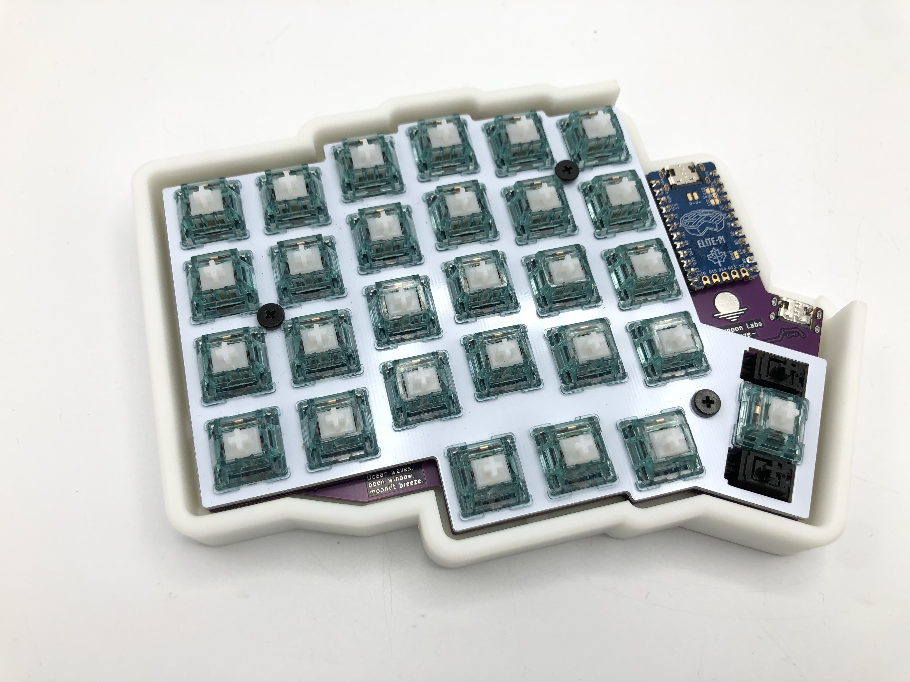

## Add Keycaps

Finally, add your keycaps to your board.

## Board Notes

### Remapping/reprogramming Board

Looking to remap/reprogram your board? Check out our guide for [remapping your keyboard](remapping-keyboard).

On the bottom of the case is a hole to that allows access to the reset button on the PCB.

### Connect the Halves

Use the USB-C to USB-C cable to connect the two halves together using the pre-soldered USB-C port on the Breeze PCB (not the ones on the controllers).
