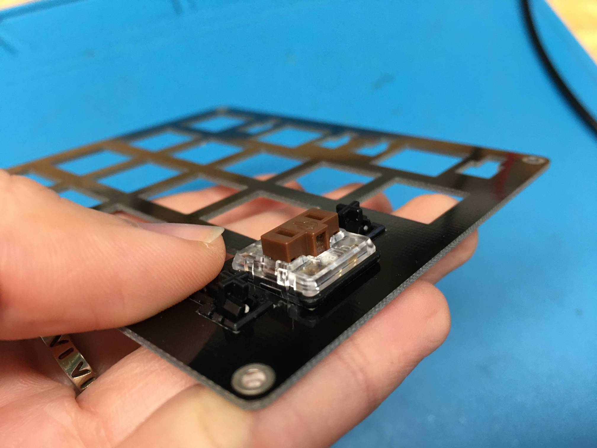
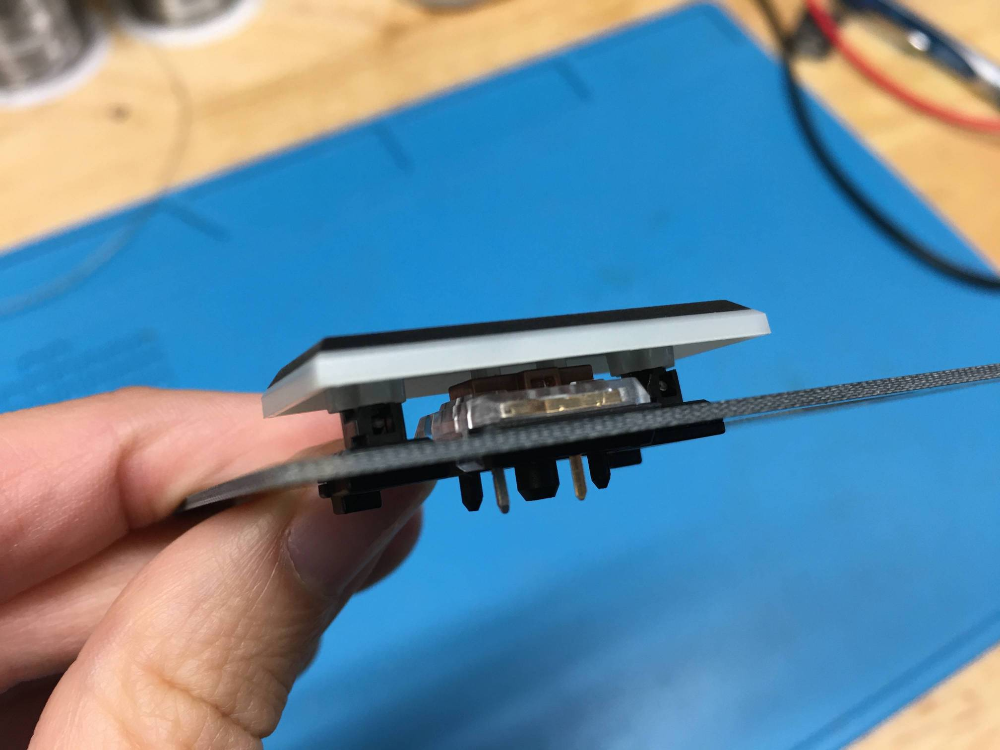
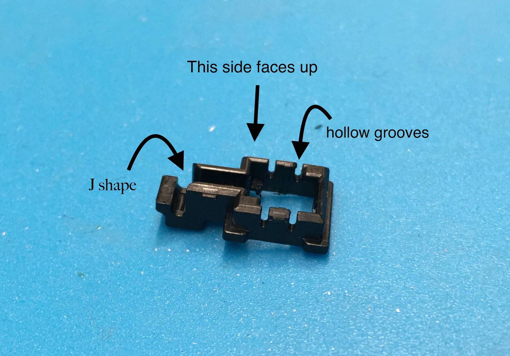
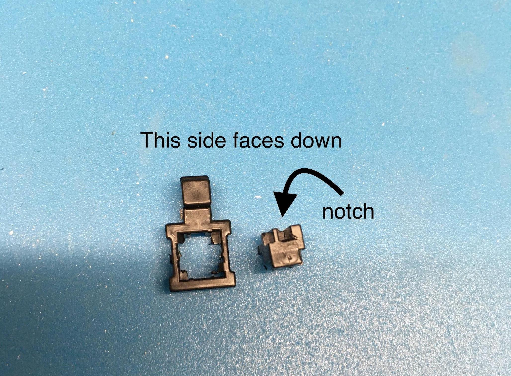
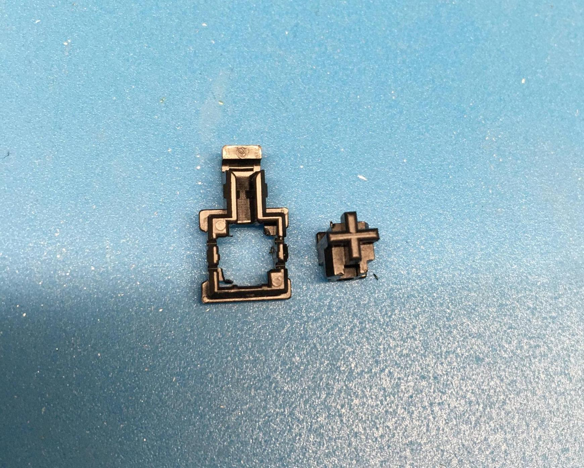
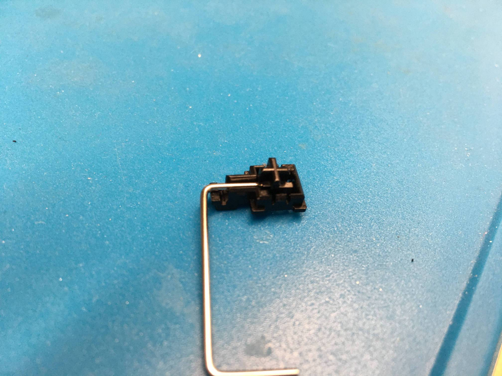
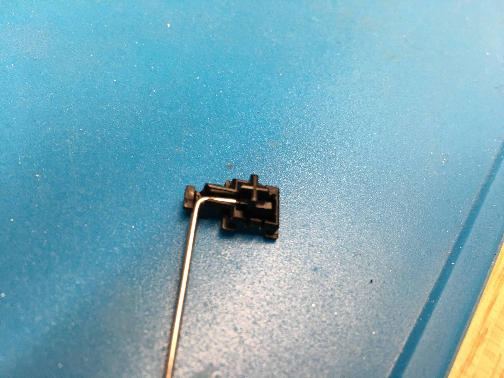
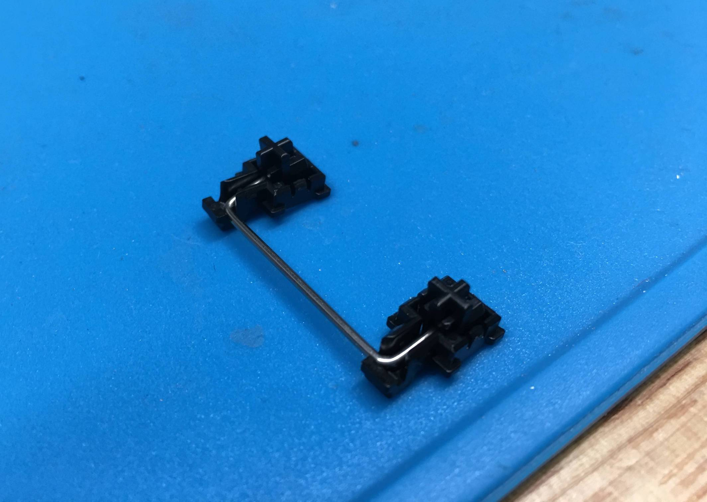

The goal with these Choc stabilizers is to give two friends to your bigger keycap. What nice support!
### Final Results First

When you're done, the plate, stabilizer, and switch setup should look like this:

This is with the keycap off.

Here's with the keycap on.

### Step 1: Know What's What
The bigger piece that looks like a box with an extruded bit is going to be visible on both sides. The part you want to have facing up is the part that has 4 hollowed out grooves on its edge. The other side will not have these grooves and will be facing down toward your PCB.

### Step 2: Make the black pieces click
The small piece that has the plus sign on it is going to be poked through the bigger piece. With the bigger piece's flat side facing you with the extruded notch pointing up, push the smaller piece into the opening with the notch also pointing up. Click? Success!

Do this with the other two pieces. Two friends now!

### Step 3: Make the metal connection
Time to add the metal bar piece. This part is fiddly, so don't worry if it takes a few tries. Push the bar legs into the notch opening on the small piece, and nestle it into the groove that looks like a J.

### Step 4: Connect stabilizer to Choc switch plate

It can be tricky trying to hold onto both sides of the stabilizer for inserting it into the switch plate. Here's a protip: gently push the switch plate down onto the stabilizer. It should snap into place this way easily. 

*TODO: place recorded video here*

You have the Choc Stabilizers installed! Show off that chocolatey goodness to a friend.

### Other Random Notes

If you're designing your own [switch plate for Choc switches](https://plate.keeb.io), your plate must be 1.2mm thick so that the Choc stabilizers can clip into the plate properly. The stabilizers will not clip into thicker plates properly.
