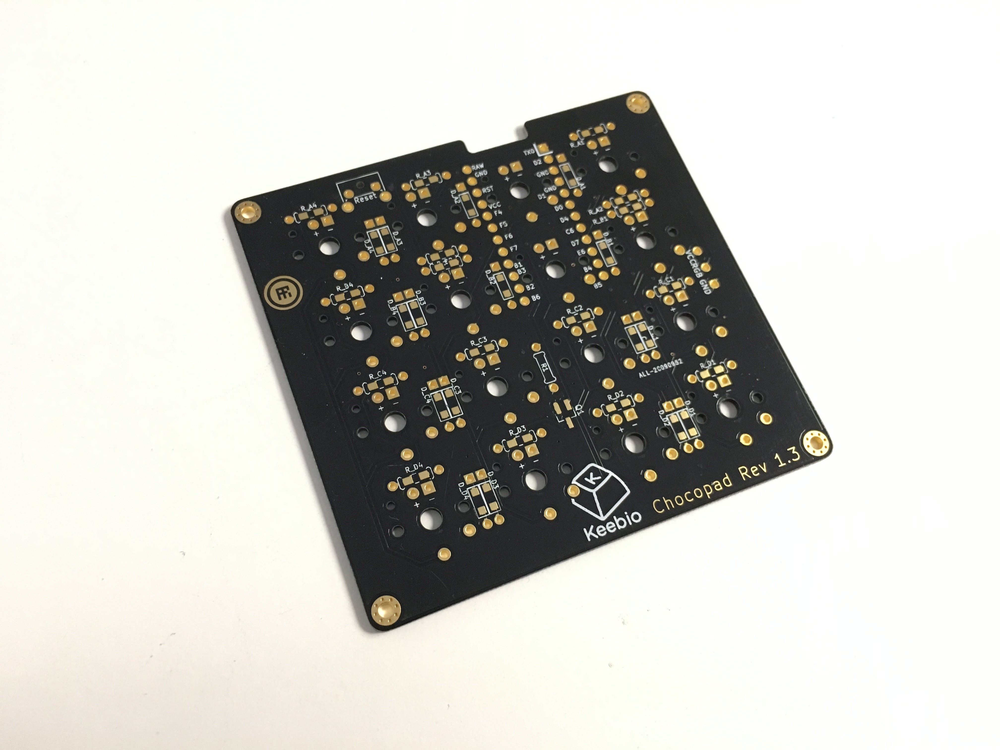
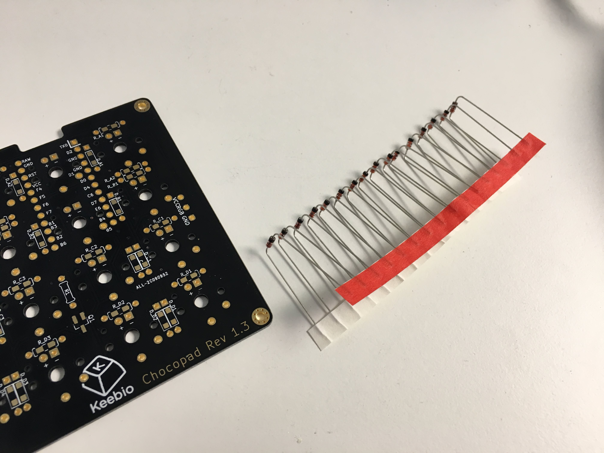
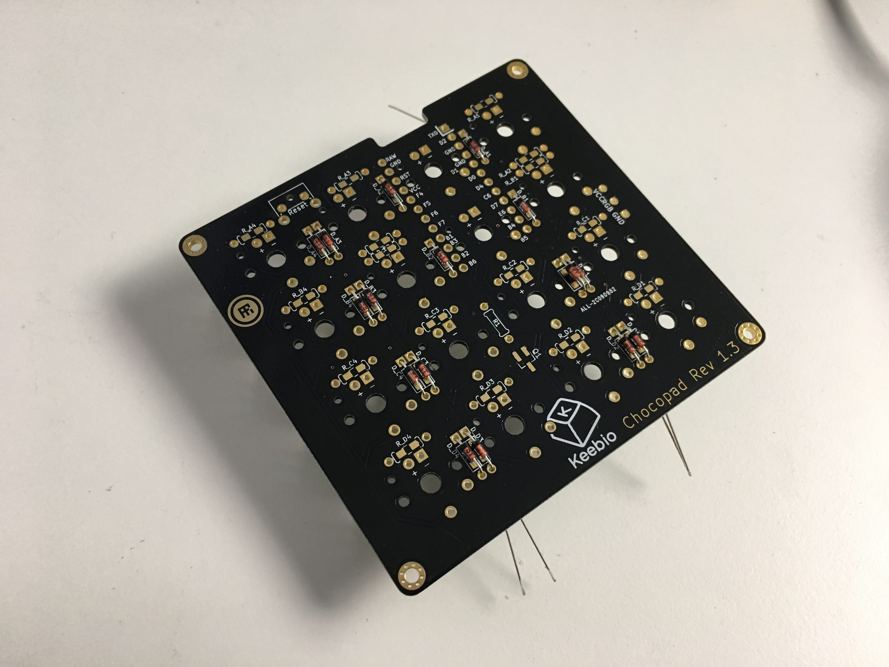
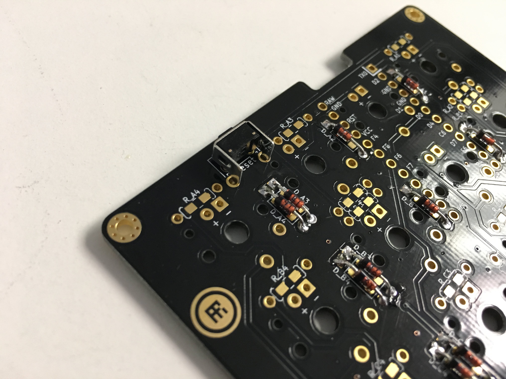
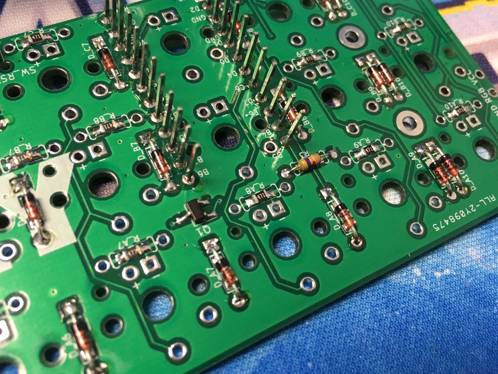
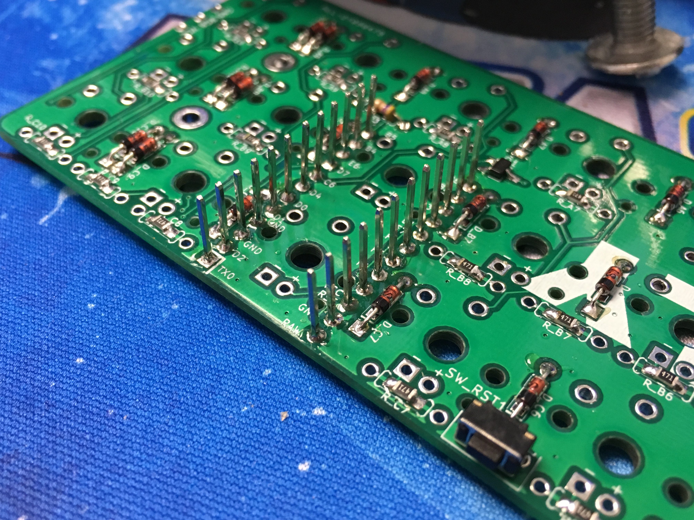
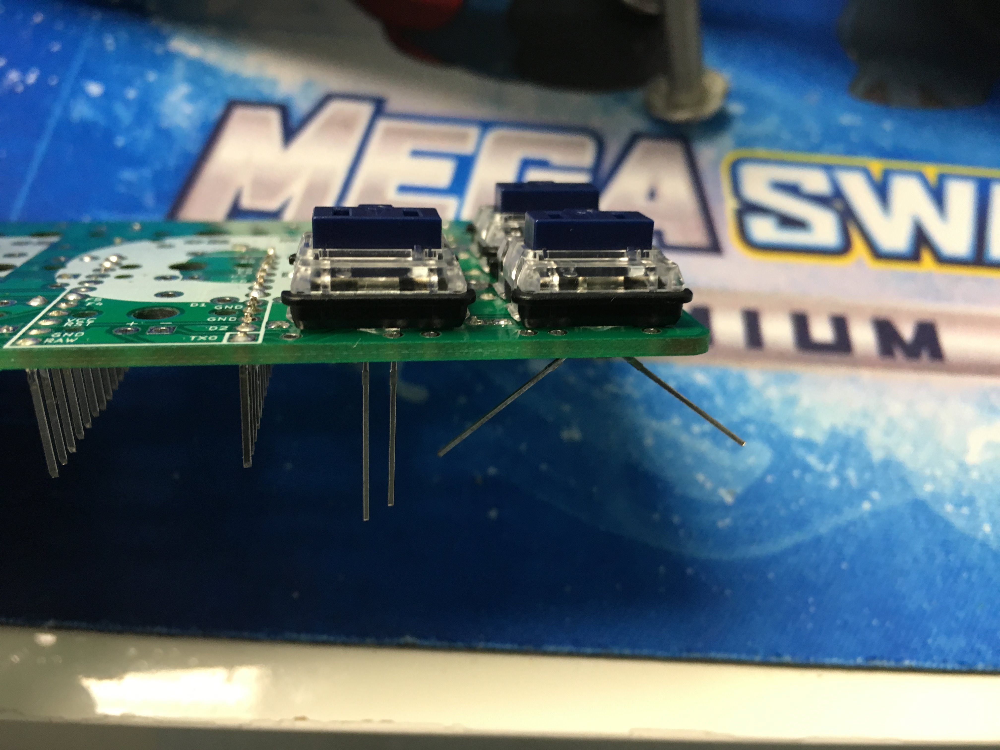
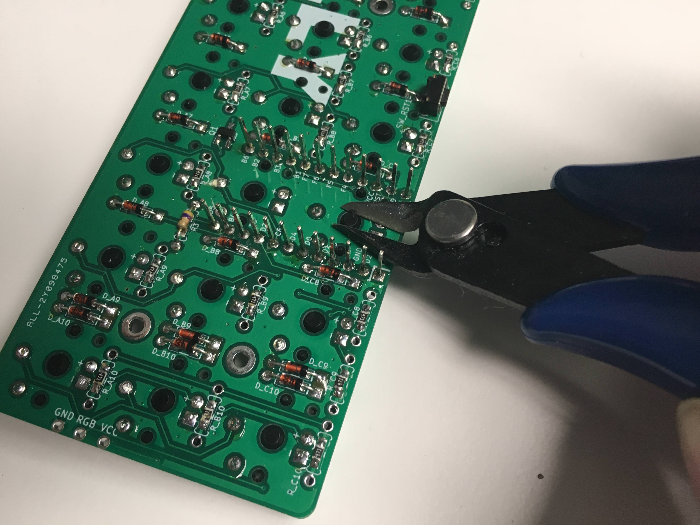
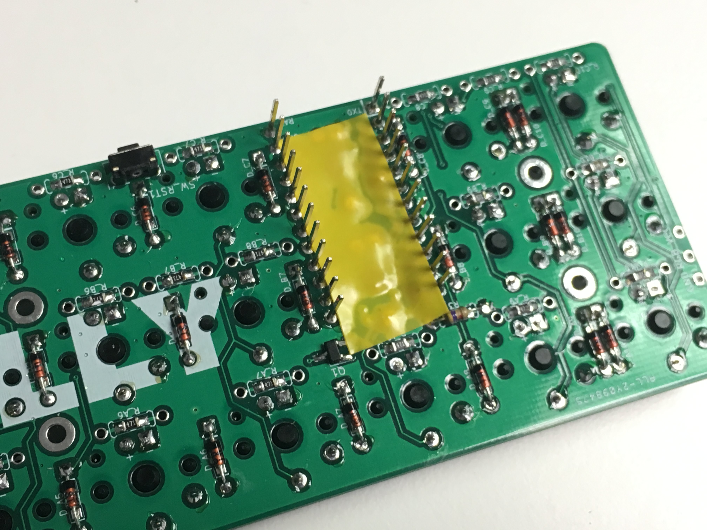
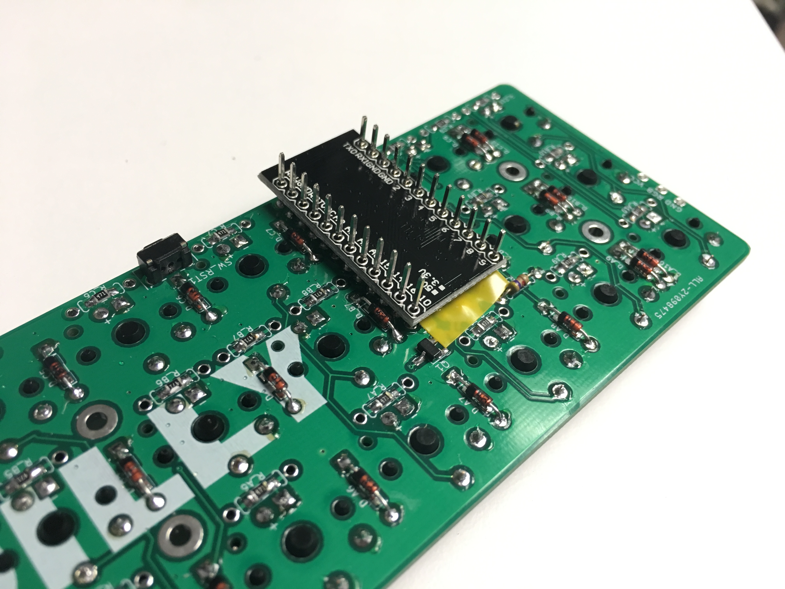

# Chocopad Build Guide

## Parts List

Here's a list of parts needed for the build:

* 1 [Chocopad PCB & PCB Bottom Plate with M2 Screws and Standoffs](https://keeb.io/collections/frontpage/products/chocopad-16-key-macropad-for-kailh-choc-low-profile-switches)
* 1 Push Button reset switch (Included in Barebones & Full kit)
* 1 16 1N4148 diodes (Included in Full Kit)
* 1 Pro Micro (Included in Full Kit)
* 16 470 Ohm resistors (Included in Full Kit) \(optional, for LEDs\)
* 1 MOSFET (Included in Full Kit) \(optional, for LED control\)
* 1 4.7k Ohm resistor (for R1 slot) (Included in Full Kit) \(optional, for LEDs\)
* 16 1.8mm or 2mm LEDs (3mm will not fit in Kailh Low Profile switches) \(optional\)
* 16 Kailh "Choc" Low Profile Switches - [Available at Novelkeys](https://www.novelkeys.xyz/product-category/switches/)
* 16 Kailh "Chow" Low Profile Keycaps - [Available at Novelkeys](https://www.novelkeys.xyz/product-category/keycaps/)

## Build Steps

Here's a summary of the build steps:

1. Prepare & Solder components
  1. Solder diodes
  2. Solder push button
  3. Solder 4.7kΩ resistor \(for LEDs, optional\)
  4. Solder LED components \(MOSFET and resistors\) \(optional\)
  5. Solder Pro Micro header pins
2. Solder switches
3. Solder LEDs \(optional\)
4. Flash Pro Micro
5. Solder Pro Micro

## Prepare & Solder components

Dude, you're getting a Chocopad:

Bend those diodes:

Stick them in, bend the legs out to hold them in place when you flip it over. Black band points towards the square pad. Solder, and clip the legs:

Add reset switch and solder it in:

If you're doing LEDs, add the resistors. SMD reistors shown here, but it's cool if you feel like going with through hole ones. Orientation does not matter for resistors:

If adding LEDs, add the 4.7k Ohm resistor to the R3 slot:

Add a bit of solder to one leg of the MOSFET pad Q1. Solder one leg of the MOSFET first and once that is aligned, solder the other two legs. Also add 470 Ohm resistors to all the resistor slots (all horizontally oriented):

Solder the Pro Micro header pins:

Add LEDs and then place the switch on top of it. Make sure the LED does not get in the way of the switch clickbar if it is a clicky switch:

After soldering the LEDs and switches, use some flush cutters to clip the switch legs and plastic pieces of the 2 switches that sit on top of the Pro Micro, so they don't interfere with the Pro Micro:

Put some electrical or Kapton tape on top of the area the Pro Micro will be:

Insert Pro Micro over the header pins and solder. But only do this after you've flashed your Pro Micro to ensure that it works:

Slap some keycaps on it and clack away!
