## Build Compatibility

This build guide is exclusively for the Demod LM, a low-profile number pad.

## Parts List

Get your parts ready:

* [Demod LM Kit](https://keeb.io/products/demod-lm-keyboard-kit?utm_source=docs)
  * PCBs (Yours will be purple, while photos here show a green one)
  * Tray Case
  * Silicone liners
  * O-rings
  * Switch plate
  * Switch plate support foam
  * 8mm M2 screws
  * Shroomie feet
* [Low-Profile Kailh Choc Switches](https://keeb.io/collections/switches?filter.p.m.keyboard.switch_compatibility=Choc+V1+Low-Profile&filter.p.m.keyboard.switch_compatibility=Choc+V2+Low-Profile&sort_by=best-selling&utm_source=docs) - Choc V2
* [Number Pad Keycaps](https://keeb.io/products/lpf-glow-numpad-keycaps?utm_source=docs)

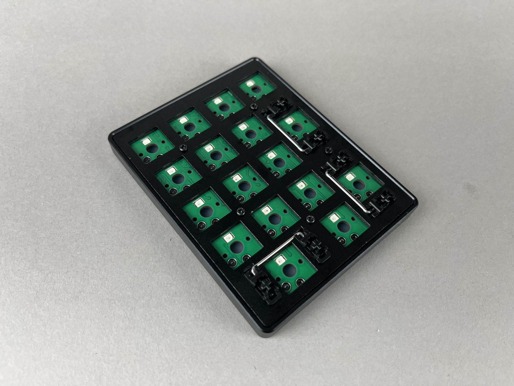

## Build Steps Summary

1. Inspect/Test Parts
2. Add switches
3. Assemble Case
4. Board Notes

## Inspect/Test Parts

Before starting assembly of the board, check if there's any issues with the parts in the keyboard kit.

Plug in a USB-C cable into the board and see if it lights up. If it doesn't light up, check that you are not using a charging-only USB-C cable.

Optional: Unscrew the switch plate and inspect that there is switch plate support foam, silicone tray liners, and o-rings on the mounting points. See [Full Breakdown](#full-breakdown) for more information.

## Add switches

To insert a switch, make sure the pins line up with the hotswap socket on the PCB.

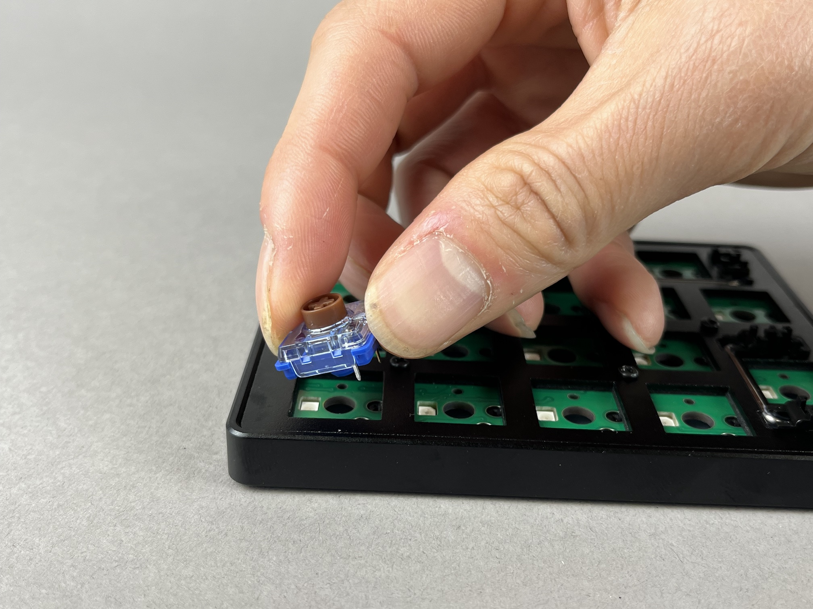

Then push down on the part of the switch that is above the pins until it clicks into place.

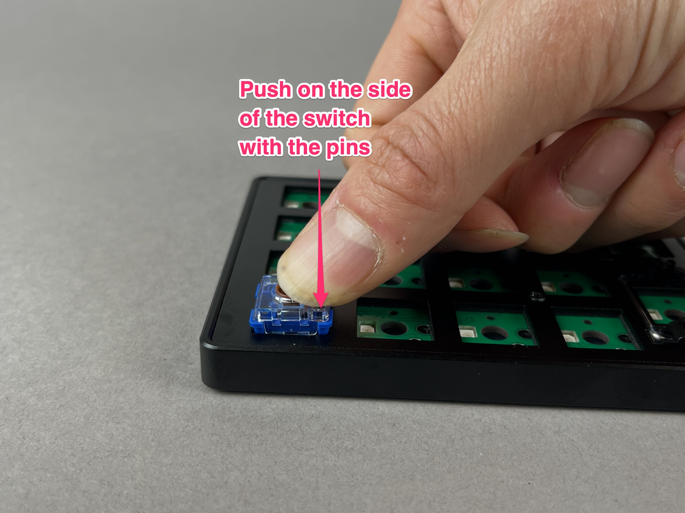

Add the rest of the switches.

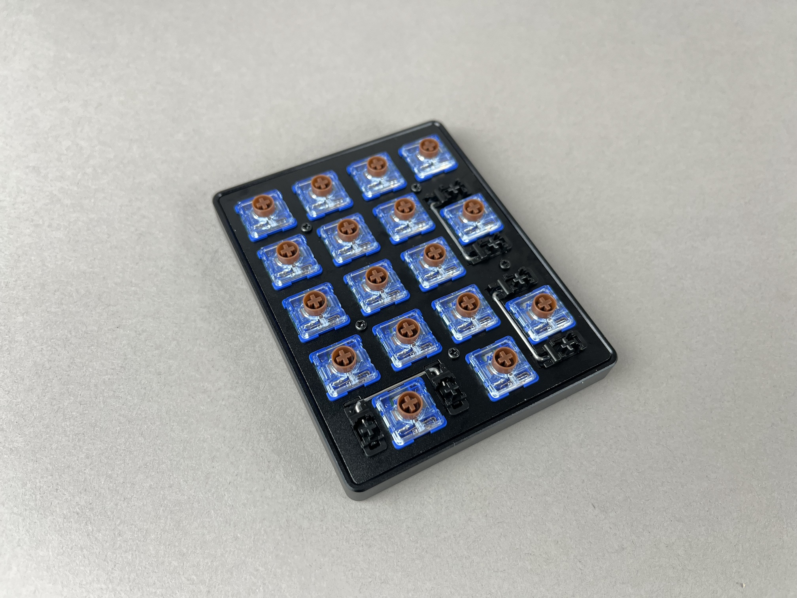

## Test keys

Before reassembling the case, plug the USB cable into the PCB and test all of the keys to make sure everything is working, as it'll be easier to fix switch issues now than later.

It's best to test using the [Key Tester in VIA](via#key-tester-tab) with `Test Matrix` mode on, as this will let you test the top-left key, which is mapped to RGB Mode by default..

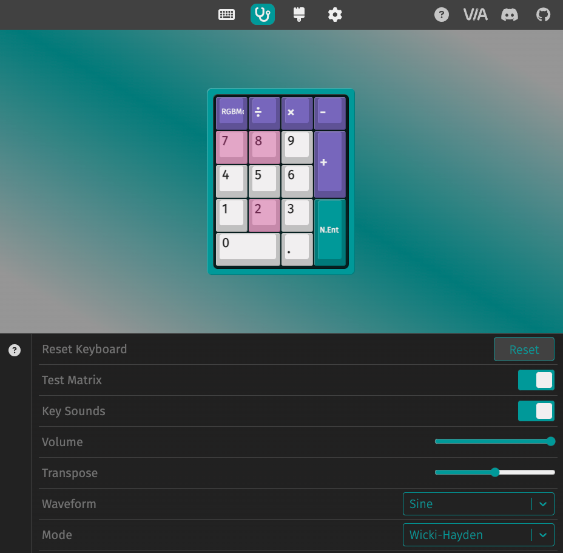

If a key is not working, check that the switch is inserted properly and that the pins are aligned with the hotswap socket. Sometimes, a pin can get bent during insertion, which can cause the switch to not work.

## Add Keycaps

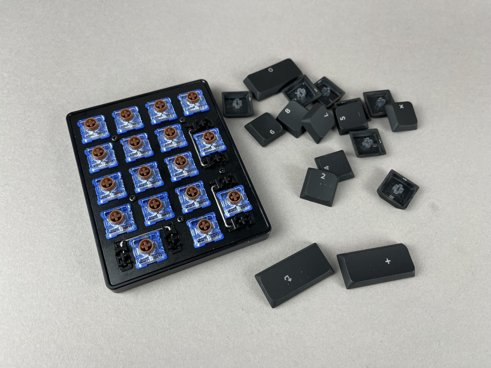

Add keycaps to all of the switches.

Plug it in and type away!

## Default Keymap

Here's the default keymap if you need it: [Demod LM Default Keymap](https://github.com/the-via/qmk_userspace_via/blob/main/keyboards/keebio/demod_lm/keymaps/via/keymap.json)

## Remapping/reprogramming Board

Looking to remap/reprogram your board? Check out our guide for [remapping your keyboard](remapping-keyboard).

While the bottom plates have a hole at the bottom to allow you to access the reset button to allow your Demod LM to be reflashed if you are using QMK, if you don't want to be flipping your board over to press reset, you can also use one of the following options when remapping your Iris:

1. Use [VIA](via.md) to remap your keys. The stock firmware on the Demod LM already has VIA support enabled. This allows you to remap the keyboard without having to reflash the board.

For reference, the Demod LM PCB uses a STM32G431 microcontroller.

## Turning off RGB LEDs

If you'd like to turn the RGB LEDs off, you can control the [RGB settings in VIA](via#lighting).

## Full Breakdown

If you want to fully unscrew the case to check the parts inside, you can unscrew the switch plate and inspect that there is switch plate support foam, silicone tray liners, and o-rings on the mounting points.

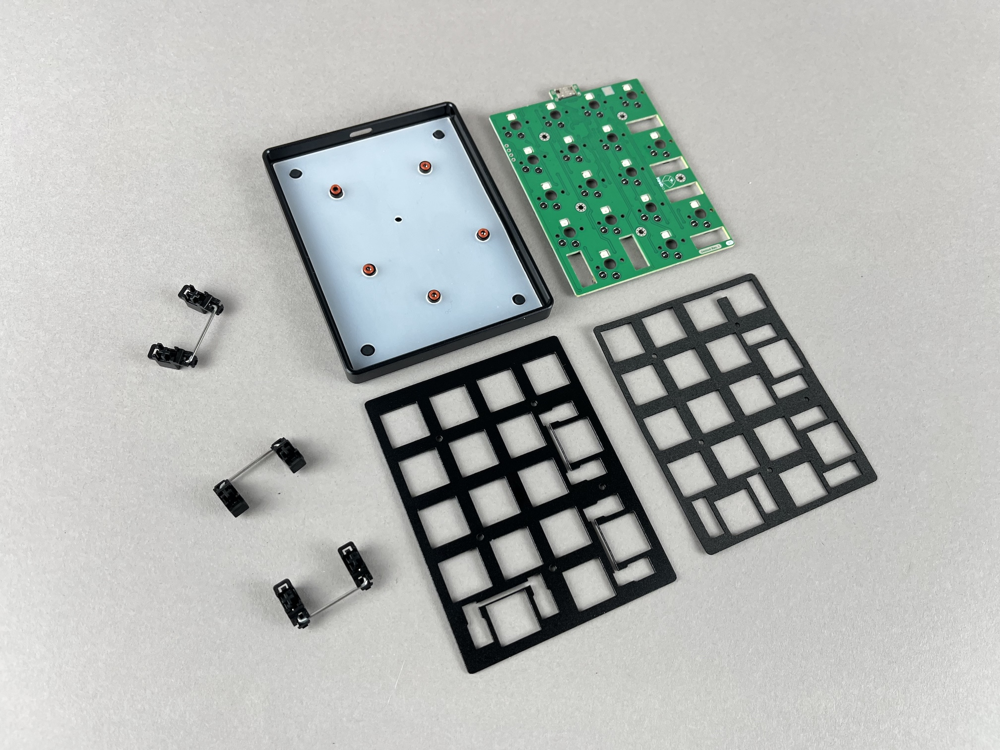

Starting from the bottom of the case, you should see the tray with o-rings mounted on the mounting points and silicone liner on the tray.

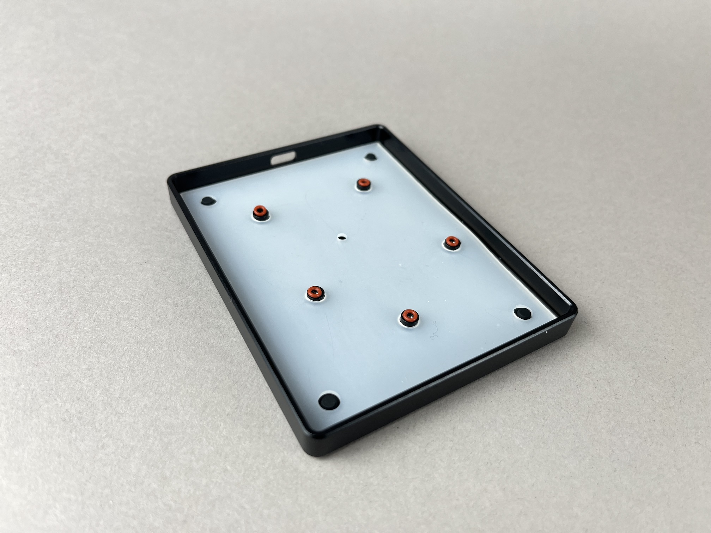

Next, the PCB goes on top of the tray.

If the Choc V2 stabilizers have been removed, reinstall them by first sticking the wire side of the stabilizer into the switch plate.

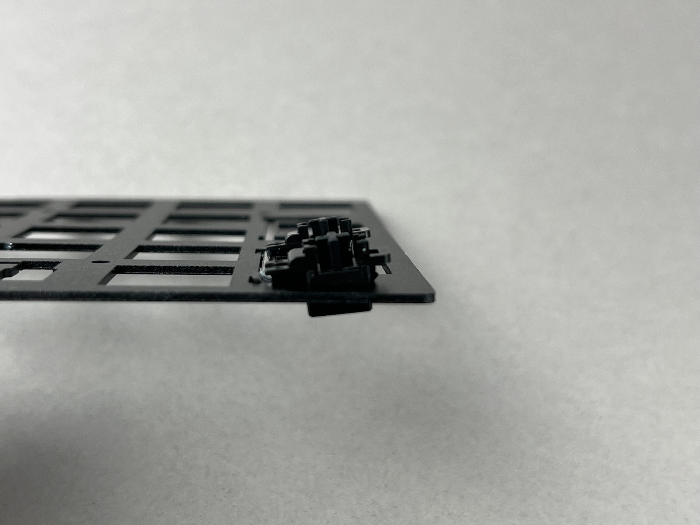

Next, push the other side of the stabilizer down until it clicks into place.

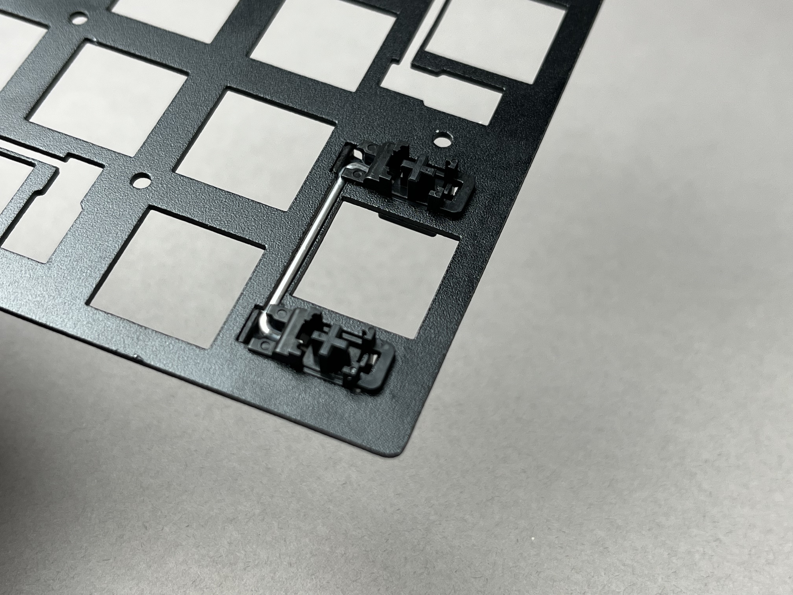

Repeat this process for the other stabilizers.

Place the switch support foam on top of the PCB.

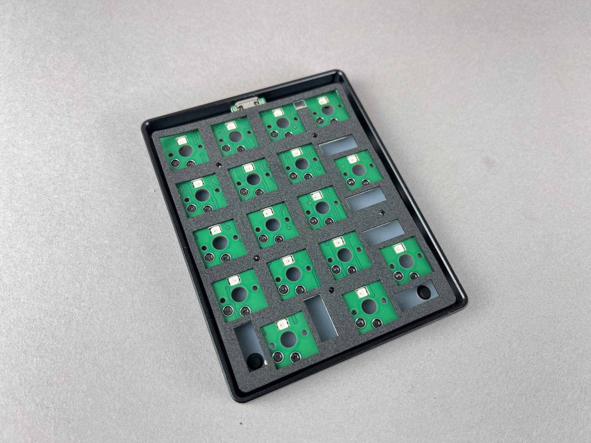

Then, the switch plate with stabilizers goes on top of the switch support foam.

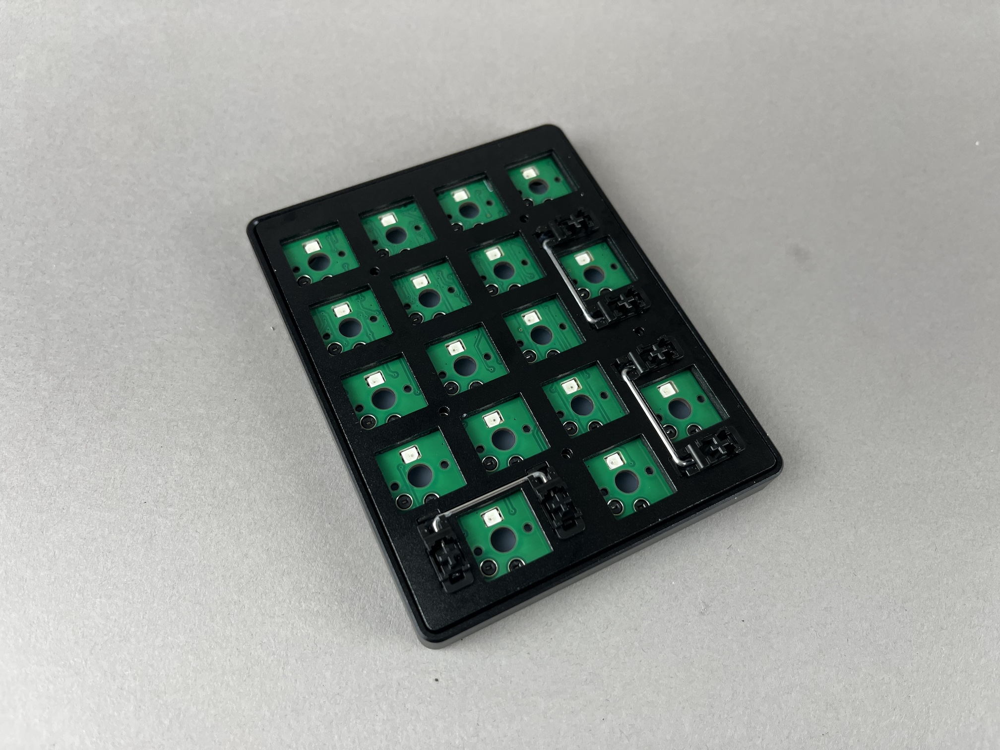

Finally, screw in the switch plate.

:::info

Do not overtighten the screws, as this will cause bowing of the switch plate. The screws do not need to be tightened in very hard.

:::

