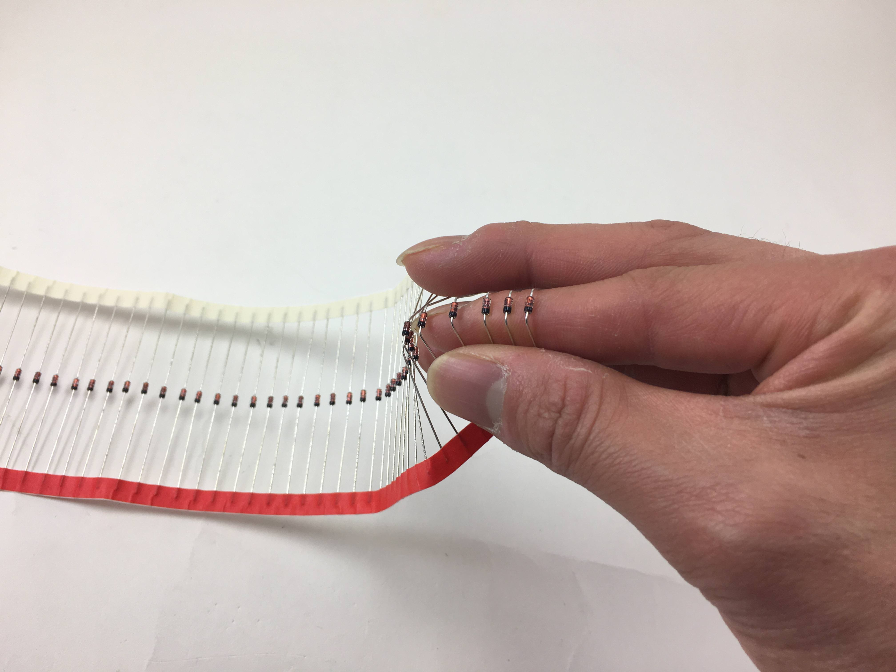
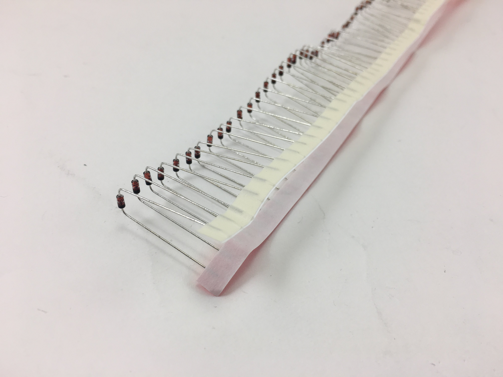
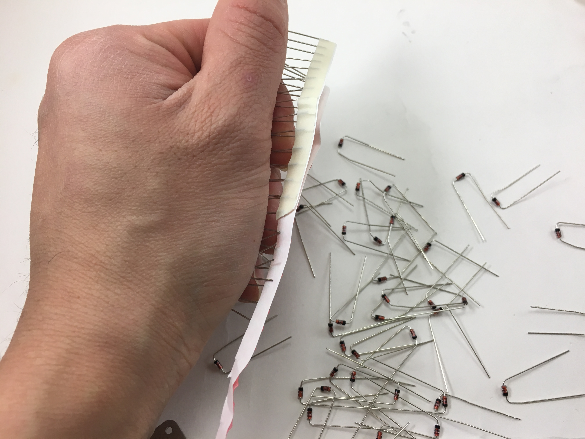
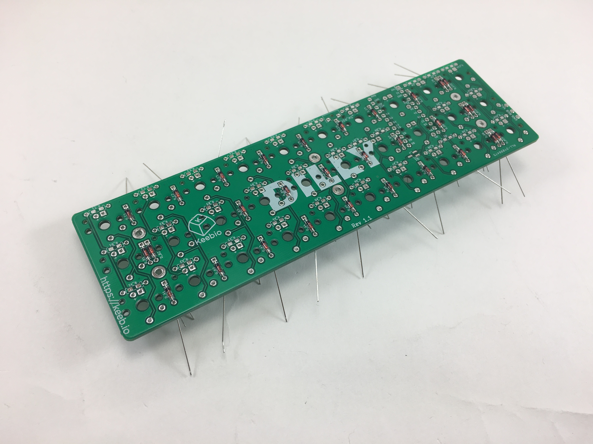
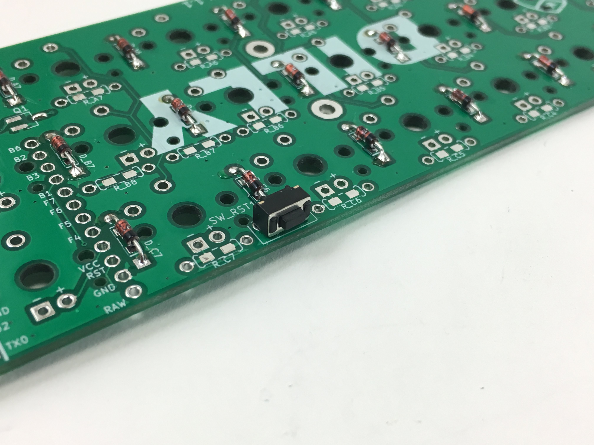
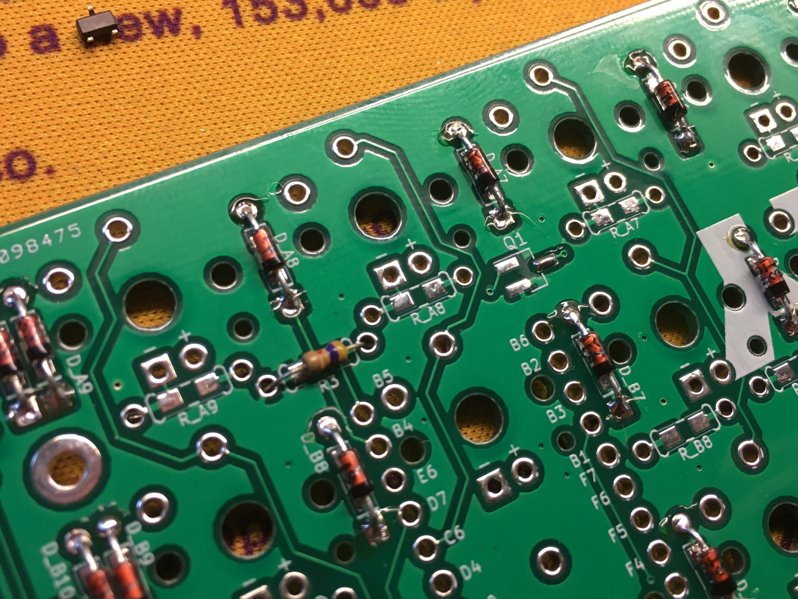
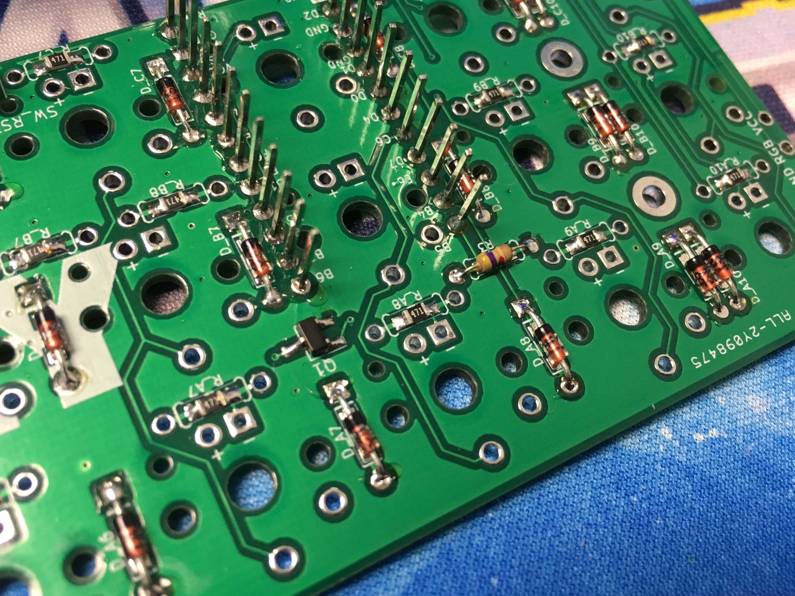
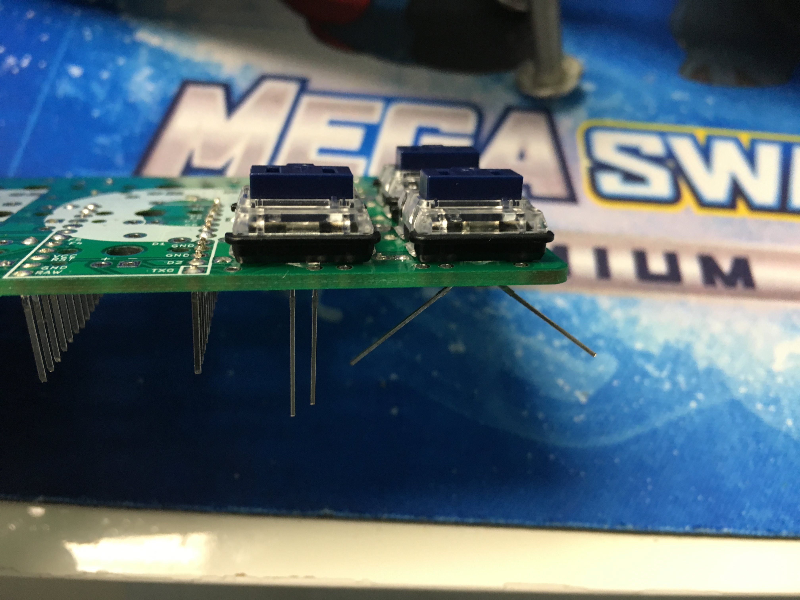
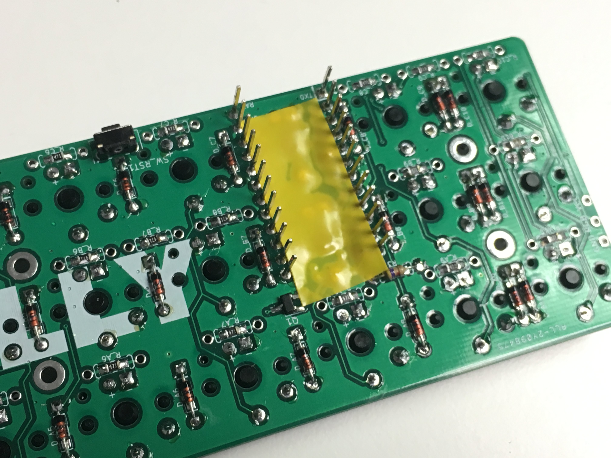

# Dilly Build Guide

## Video of Build

Here's a build video someone has created:

* [TaeKeyboards - DILLY Choc/olate Mechanical Keyboard Build](https://youtu.be/1yP-3AFCBWg)

## Parts List

Here's a list of parts needed for the build:

* 1 [Dilly PCB & Bottom PCB Plate with M2 screws and standoffs](https://keeb.io/collections/frontpage/products/dilly-3x10-ortholinear-keyboard-for-kailh-choc-low-profile-switches)
* 1 Reset Switch
* 1 4.7kΩ resistor
* 1 AO3416 MOSFET \(optional, for LED control\)
* 30 1N4148 diodes - through hole \(shown\) and [SMD diodes](https://keeb.io/products/1n4148-diodes) supported
* 30 470Ω resistors \(optional, for LED backlight\)
* 30 LEDs \(optional, for LED backlight\)
* WS2812B RGB LED strip \(optional, for underglow\)
* 1 [Arduino Pro Micro](https://keeb.io/products/pro-micro-5v-16mhz-arduino-compatible-atmega32u4)
* 30 Kailh "Choc" Low Profile Switches - [Available at Novelkeys](https://www.novelkeys.xyz/product-category/switches/)
* 30 Kailh "Chow" Low Profile Keycaps - [Available at Novelkeys](https://www.novelkeys.xyz/product-category/keycaps/)

## Build Steps

Here's a summary of the build steps:

1. Prepare components
2. Solder components
  1. Solder diodes
  2. Solder push button
  3. Solder 4.7kΩ resistor \(for LEDs, optional\)
  4. Solder LED components \(MOSFET and resistors\) \(optional\)
  5. Solder Pro Micro header pins
3. Solder switches
4. Solder LEDs \(optional\)
5. Flash Pro Micro
6. Solder Pro Micro
7. Solder RGB strip \(optional\)

## Prepare components

Bending the diodes. Here, I'm just bending it around my finger

Another way to do it, resistors shown here

Strip of diodes bent

Ripping off the paper holding all the resistors together. Grip the diodes tightly so they don't bend as you're ripping the paper off.

All separated from the paper

## Solder Components

The diodes, resistors, MOSFET, push button, and Pro Micro header pins can be soldered in any order.

### Solder Diodes

On the bottom side of the PCB, inser the diodes with the black line towards the top. The square line should run to the square hole. All of the diodes are oriented vertically on the PCB, facing the same direction.

NOTE you do not want the diodes top side on this board, as they will not be hidden by a plate. The "Choc" Low Profile switches are PCB mount and will be mounted directly to the board. While some prefer to mount their diodes top side on plate mount builds, this will only make expose the diodes to potential damage. I would highly recommend you follow the build log and mount them to the underside of the PCB.

Bend the legs out to hole the diodes in place when you solder them in:

### Solder the reset button

Add the reset switch and solder it in:

### Solder the Resistors & MOSFET \(optional\)

If adding LEDs, add the 4.7k Ohm resistor to the R3 slot:

Add a bit of solder to one leg of the MOSFET pad Q1. Solder one leg of the MOSFET first and once that is aligned, solder the other two legs. Also add 470 Ohm resistors to all the resistor slots (all horizontally oriented):

### Solder Pro Micro header pins

Prepare the Pro Micro header pins \(optional)\. If needed, you can use some tape to hold the header pins in place while soldering:

NOTE if your header pins are not soldered flush to the board, you'll need trim them. Do this very carefully as not to damage any traces with your flush cutter.

Solder the Pro Micro header pins:

### Add and solder LEDs \(optional)\ and switches

Add LEDs and then place the switch on top of it. Make sure the LED does not get in the way of the switch clickbar if it is a clicky switch:

After soldering the LEDs and switches, use some flush cutters to clip the switch legs and plastic pieces of the 2 switches that sit on top of the Pro Micro, so they don't interfere with the Pro Micro:

### Prepare and solder the Pro Micro

Put some electrical or Kapton tape on top of the area the Pro Micro will be:

Insert Pro Micro over the header pins and solder. But only do this after you've flashed your Pro Micro to ensure that it works:

