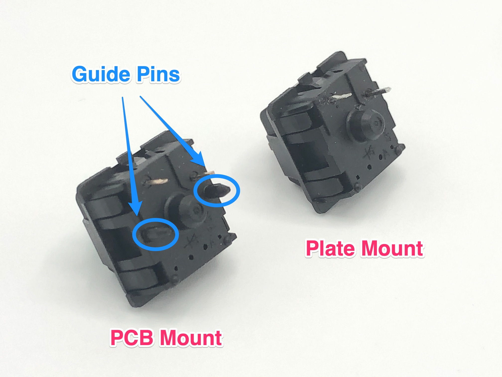
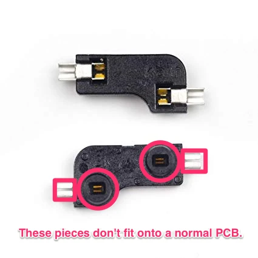

### Which type of switches do I have to use, PCB-mount or Plate-mount ones?

The only difference between the two is that PCB mount has two additional plastic legs for better alignment on a PCB. Either type is compatible with Keebio PCBs, and if given the choice, PCB mount is preferable to keep switches aligned better.

### Can I use hotswap sockets?

Depends on the type of hotswap socket. Here's some info on each type:

+ Holtites: Not recommended, they suck, use them if you want to have a bad time
+ Mill-Max: We use the [3305](https://keeb.io/products/mill-max-hotswap-sockets?variant=39460312023134), [7305](https://keeb.io/products/mill-max-hotswap-sockets?variant=32377091096670), and [0305](https://keeb.io/products/mill-max-hotswap-sockets?variant=32377167511646) Mill-Max sockets for [our](https://keeb.io/products/mill-max-hotswap-sockets?_pos=1&_sid=9beee6bc3&_ss=r) hotswap [boards](https://keeb.io/products/iris-keyboard-pre-built?_pos=2&_sid=9beee6bc3&_ss=r), and they work well.
    + Also check the [Mill-Max Switch Compatibility Chart](https://docs.google.com/spreadsheets/d/1NhrXy6k88eY9bBqVuPWTAGW2q3GzszJ1JH-zuuGQ-iU/edit#gid=0) for the switches you'd like to use
    + Note: The chart above shows that Kailh Box Jades are difficult to use with the sockets, but we've found that they work just fine with them
+ Outemu sockets: Yes, but they only fit Outemu switches or Pandas
+ Kailh hotswap sockets: No, PCBs have to specifically be designed for them, and typically, if it was designed to use Kailh hotswap sockets, they will already be pre-installed. See the image below that shows the parts that can't fit onto the PCB.

