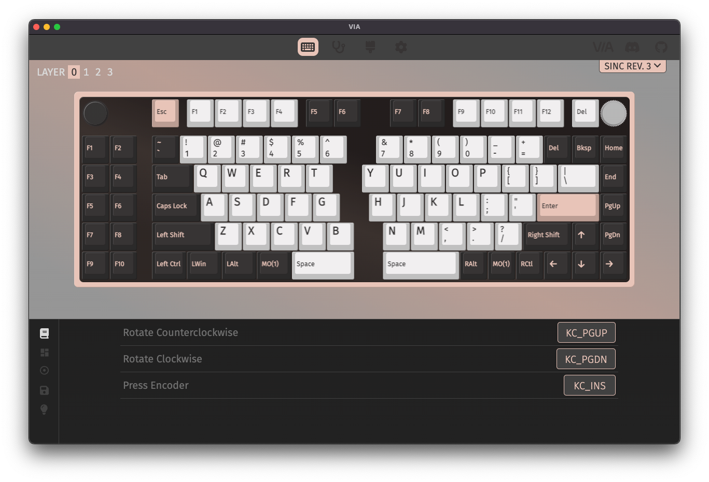

The VIA firmware for various Keebio keyboards has been updated to support the new rotary encoder mapping feature. After following this upgrade procedure, you'll be able to easily change the functionality of the rotary encoders on your board.

## Prerequisites
- QMK Toolbox
- Updated firmware .hex/.bin downloaded
- If using desktop app, the [latest VIA Release](https://github.com/the-via/releases/releases)

## Firmware Downloads
Here's the links to the updated firmware for your board.

- [BDN9 Rev. 1](https://docs.keeb.io/firmware.html?path=bdn9/keebio_bdn9_rev1_via.hex)
- [BDN9 Rev. 2](https://docs.keeb.io/firmware.html?path=bdn9/keebio_bdn9_rev2_via.bin)
- [Iris Rev. 5](https://docs.keeb.io/firmware.html?path=iris/keebio_iris_rev5a_via.hex)
- [Iris Rev. 6](https://docs.keeb.io/firmware.html?path=iris/keebio_iris_rev6b_via.hex)
- [KBO-5000 Rev. 1](https://docs.keeb.io/firmware.html?path=kbo-5000/keebio_kbo5000_rev1a_via.hex)
- [Quefrency Rev. 2](https://docs.keeb.io/firmware.html?path=quefrency/keebio_quefrency_rev3_via.hex) (Rev. 3 firmware can be flashed to Rev. 2)
- [Quefrency Rev. 3](https://docs.keeb.io/firmware.html?path=quefrency/keebio_quefrency_rev3_via.hex)
- [Quefrency Rev. 4](https://docs.keeb.io/firmware.html?path=quefrency/keebio_quefrency_rev4_via.hex)
- [Quefrency Rev. 5](https://docs.keeb.io/firmware.html?path=quefrency/keebio_quefrency_rev5_via.hex)
- [Sinc Rev. 1](https://docs.keeb.io/firmware.html?path=sinc/keebio_sinc_rev1_via.hex)
- [Sinc Rev. 2](https://docs.keeb.io/firmware.html?path=sinc/keebio_sinc_rev2_via.hex)

## Upgrading the Firmware on the Keyboard

Make sure you do this individually for each half, as just doing one half is not sufficient and flashing does not transfer over the cable connecting the two halves.

### Step 1 - Clear EEPROM

First you will need to clear the EEPROM on each half of the board. Here's the prodcedure for that: [Resetting/Clearing EEPROM](https://docs.keeb.io/reset-eeprom)

### Step 2 - Flash new firmware

After clearing the EEPROM, go ahead and flash each half with the new firmware file you've downloaded: [Flashing Firmware](https://docs.keeb.io/flashing-firmware)

## Remapping Encoders

### Step 1 - Change layout to show encoder

Now that you've updated the firmware, if you want your encoders to show up for remapping, click on `Layouts` on the left side of the window and then set the options to show the encoders. The encoder spots will show up as circles where the switch used to be.

### Step 2 - Click on encoder

To edit the mapping of the encoder, click on it, and the bottom half of the window will show the mappings for clockwise and counter-clockwise rotation, as well as pressing the encoder (if the encoder can be pressed).

