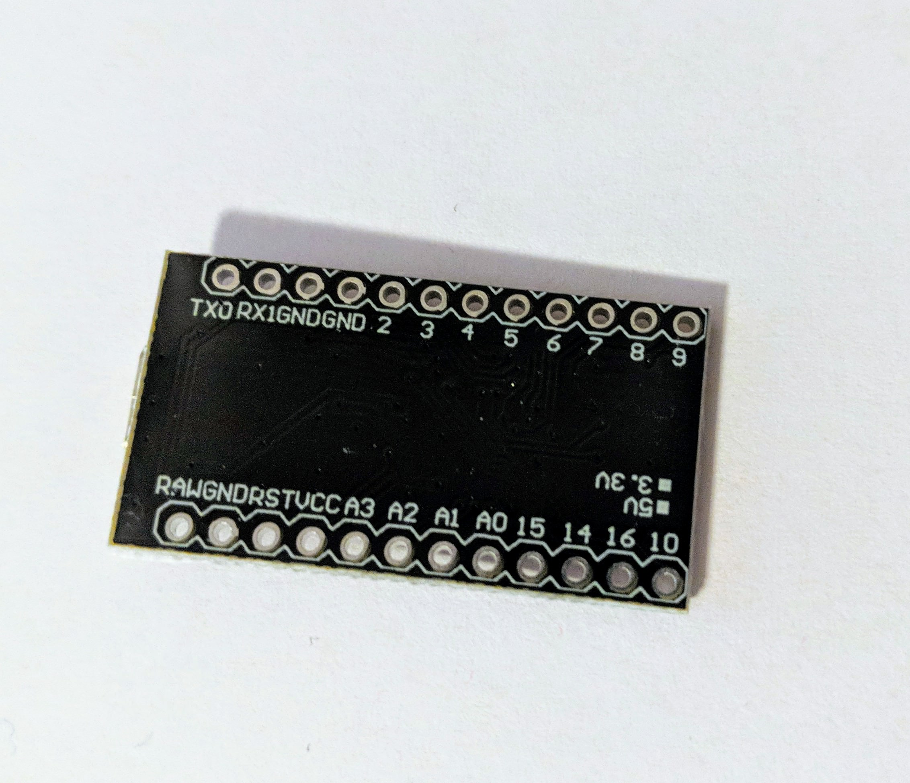
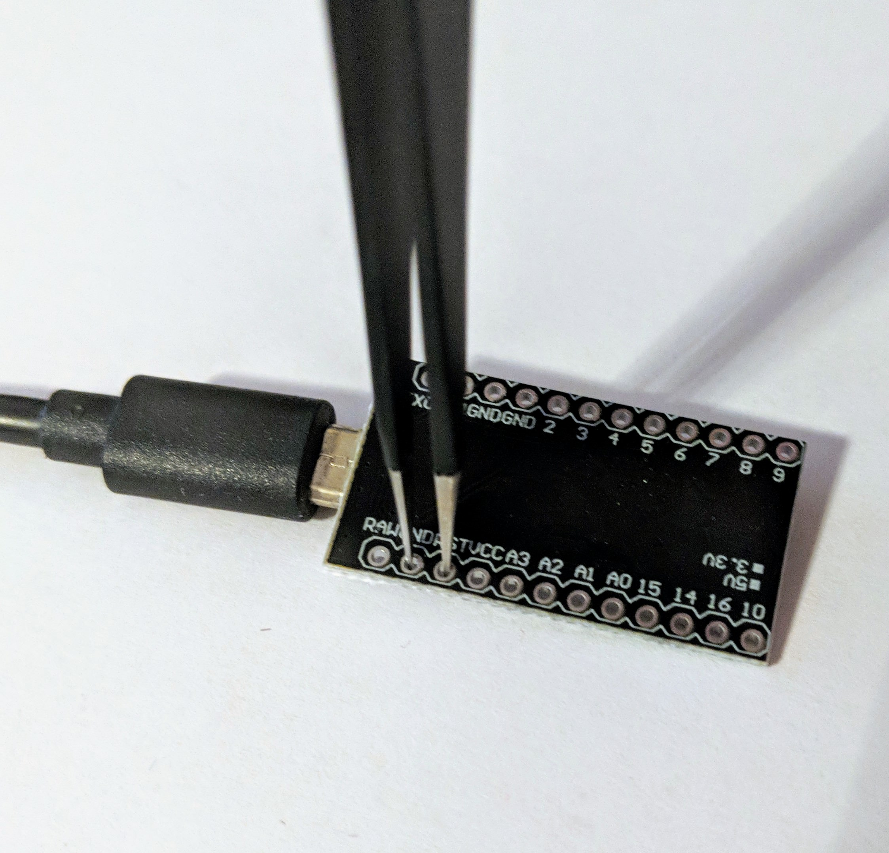

# Flashing Firmware

Still in progress...

A couple of notes:

* Initially, you do need to have both sides flashed, as that allows both sides to talk to each other using the same communication protocol
* Once both sides are flashed, you only need to flash the master side if you are just updating the keymap

In the meantime, checkout the resources and information about test flashing below.

## Resources

* [The Complete Newbs Guide for QMK](https://docs.qmk.fm/#/newbs)
* [Chokkan's QMK Guide | Your First Steps to an All Powerful Keyboard](https://www.youtube.com/watch?v=-HLV6mUxNnU&list=PLYEUsdlqPD2a3kzQgnF98Prj-4IzZJGYG) Video Series
* [Flashing guide for the Let's Split](https://github.com/nicinabox/lets-split-guide/blob/master/flashing.md)


## Creating your own layout

Please follow the [QMK Documentation](https://docs.qmk.fm/) for the most up-to-date instructions for setting up QMK and creating your own layout.

## Performing an initial test flash on Windows

You can flash the microcontrollers in your kit prior to building your keyboard to ensure that they are undamaged and functioning normally. To do so, you will need to have QMK setup on your computer. We recommend following [the Complete Newbs Guide for QMK](https://docs.qmk.fm/#/newbs) to get setup.

The Complete Newbs Guide has a section for [Flashing Firmware](https://docs.qmk.fm/#/newbs), but it can be unclear as to how to do so for a microcontroller that isn't yet installed in a board.

The steps below assume your are using Windows and you have completed the QMK setup as outlined in the Complete Newbs Guide [Getting Started](https://docs.qmk.fm/#/newbs_getting_started), have built your first firmware with [Building Your First Firmware](https://docs.qmk.fm/#/newbs_building_firmware), and have installed [QMK Toolbox](https://github.com/qmk/qmk_toolbox/releases).

1. First, attach a USB cable into the controller and plug it into a USB port on your computer and let any drivers install that need to install. You should see LEDs light on your controller.
2. Once any drivers have finished installing, unplug from the USB port on the computer.
3. Start working through the steps in [Flashing Firmware](https://docs.qmk.fm/#/newbs) from the Newb Guide.
4. To place your microcontroller into bootloader mode, you will need to short the `BOOT0` or `RESET` or `RST` pins/holes to ground.
    1. Ensure the USB cable is unplugged from the computer.
    2. Ensure the QMK Toolbox is open and your firmware file has been opened.
    3. Using a pair of tweezers, a jumper wire, or a bent paperclip, short the `BOOT0` or `RESET` or `RST` to the ground or `GND`.
    
    
    4. Plug the USB cable into the computer, and then quickly remove the short (i.e. pull out tweezers/jumper/paperclip).
    5. If successful, you will see a message similar to this in QMK Toolbox:
    ```
    *** Caterina device connected
    ```
    or if you've ISP flashed your Pro Micro with the DFU bootloader:
    ```  
    *** DFU device connected
    ```

5. Complete the remaining steps in [Flashing Firmware](https://docs.qmk.fm/#/newbs) from the Newb Guide.


## Flashing the Elite-C 

If you've bought the [Elite-C](https://keeb.io/products/elite-c-usb-c-pro-micro-replacement-arduino-compatible-atmega32u4) you're in luck, since it has a reset button right on the chip. Just like in the instructions above, you will need a [working setup of QMK](https://docs.qmk.fm/#/newbs).

1. Plug in the microcontroller into your computer using a USB-C to USB-A cable.
2. Reset the microcontoller by pressing the reset button on the chip (it's white). If you've already soldered it onto the PCB, use the reset switch provided. If it's not present, you will need to short the pins. See the above section for instructions.
3. To flash your firmware, run `make keebio/levinson/rev2:default:dfu` from the root of the QMK checkout. 

**MAKE SURE you pick the right keyboard!!** The command provided is for the "levinson" board. It's not the same as a "Let's Split", and if you flash the "let's split" firmware your rows will be all messed up. Double check that you are flashing the correct keyboard firmware! In order to avoid an additional level of potential bugs, it's recommended to use the default firmware for each board for testing purposes. Once you get a clean a clean flash and confirm the wiring works, you can start experimenting with layouts.

If you would like to run the flashing commands manually instead of the make `:dfu` rule, use this:
```
make keebio/levinson/rev2:default # compile firmware
dfu-programmer atmega32u4 erase --force
dfu-programmer atmega32u4 flash lets_split_rev2_default.hex
dfu-programmer atmega32u4 reset # needed to reboot the controller into a working state
```

If all goes well, your computer should inform you that a new keyboard has been connected and ask you to identify it. Refer to the standard [detection](https://ergodox-ez.com/pages/configuring-the-keyboard-type-on-os-x) workflow to get your keyboard up and running.

If you would like to test the microcontroller before soldering it on, simply short the pins for the relevant column and row. For example, on a [Viterbi Schematic](https://docs.keeb.io/schematics/Viterbi%20Rev%201%20Schematic.pdf) we can see that shorting the `A0` and `B4` pins will simulate a keypress of the 4th row 3rd switch. 
