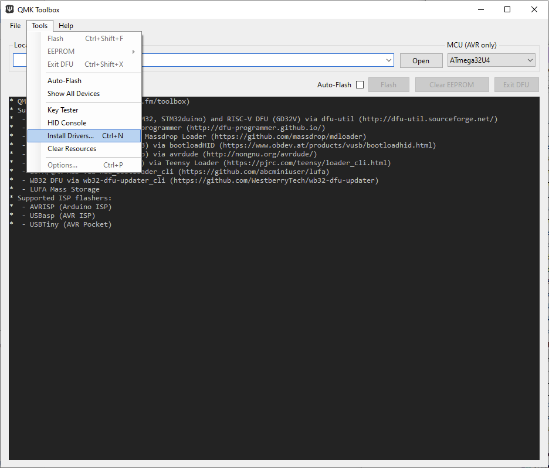

## Flashing - why?
You can flash the microcontrollers (ATmega32u4, Pro Micro, Elite-C, etc) in your kit prior to building your keyboard to ensure that they are undamaged and functioning normally.

This might be a good practice to be sure you're starting out with gear that will perform as desired. While there are multiple methods of flashing, this guide with only address the usage of QMK Toolbox to perform flashing.

<!-- ## Customizing your keymap (rename)

TODO: Link to keymap document
-->

## Determining Bootloader

Before flashing, you'll need to know what bootloader is present on the microcontroller that's on your PCB. A bootloader is a program on the microcontroller that allows firmware to be uploaded to the microcontroller via USB. It's important to know what bootloader is present on your board, as the flashing procedure varies based on what you have.

Here's the different possible bootloaders in use for Keebio boards:

- ATmega32u4 DFU Bootloader (most common)
    - This bootloader is the one present on most Keebio PCBs that already have a microcontroller pre-soldered onto it
    - Also present on Elite-C
- STM32 DFU Bootloader
    - This bootloader is on STM32-based keyboards
    - Currently, STM32 is used on the following Keebio PCBs:
        - DSP40 Rev. 1
        - BDN9 Rev. 2
    - Also present on the Proton C
- Caterina Bootloader
    - Found on Arduino Pro Micro controllers, so if you've built a board with a Pro Micro, you have the Caterina Bootloader
- UF2 Bootloader
    - Found on RP2040-based keyboards/controllers, such as the Elite-Pi and Sinc Rev. 3
    - Currently, RP2040 is used on the following Keebio PCBs:
        - Sinc Rev. 3
        - Stampy
        - Cepstrum

## Split Keyboards
### Do I need to have the TRRS cable (or USB-C to USB-C cable) plugged in while trying to flash both halves?

Having the interconnect cable plugged in between the halves while flashing has zero effect on flashing. Having it plugged in will not flash both halves at the same time.

Flashing does not does not send any signals over the interconnect cable, so it does not matter if the interconnect cable is plugged in or not while flashing. Each half needs to be plugged in individually one at a time to the USB port to be flashed.

### Do I need to flash both halves of a split keyboard?

This depends on the difference of how old the firmware is on each half of the board. Due to occaisional protocol changes in QMK of how both halves communicate with each other, if it's been a while (2 or more months) since you flashed your keyboard, go ahead and flash both halves individually with the same firmware file.

If both halves have been flashed recently, and you're only updating a keymap and not adding features, then you will only need to flash the half that will have the USB cable from the computer plugged into it.

When in doubt, flash both halves.

## Flashing Options

### Using QMK Toolbox

[QMK Toolbox](https://github.com/qmk/qmk_toolbox) contains various flashing tools into one app, and has been designed to make the flashing process easier.

Make sure you download the [latest release here](https://github.com/qmk/qmk_toolbox/releases). For this guide, make sure you have Version 0.0.21 or higher installed, as the most recent versions have better device detection methods for more reliable flashing.

### Using QMK Environment

One way to flash is using the command-line via a QMK environment setup. Here's a couple of links on how to do that from the QMK documentation:

- [QMK - Flashing](https://docs.qmk.fm/#/flashing)
- [QMK - Flashing Firmware](https://docs.qmk.fm/#/newbs_flashing)

Setting up the QMK build environment is beyond the scope of this guide, so if you need assistance with that, consult the [QMK Introductory Tutorial](https://docs.qmk.fm/#/newbs) and/or join the [QMK Discord Server](https://discord.gg/Uq7gcHh).

## Flashing ATmega32u4 (DFU Bootloader)

### One-time Setup (Windows only)

This section only applies to Windows, skip this if you are on a Mac, as there are no drivers needed for Mac.

If you open up QMK Toolbox, press the reset button on your ATmega32u4-based board, and see `(NO DRIVER)` on the line for `Atmel DFU device connected`, then you'll need to install the bootloader driver on Windows.

To install the DFU Bootloader driver, right-click anywhere in the top part of the QMK Toolbox window as shown below and click on `Install Drivers...`. The ATmega32u4 DFU Bootloader driver along with other bootloader drivers will be installed.

If you are having issues with driver installation, see [Driver Installation with Zadig](https://beta.docs.qmk.fm/using-qmk/guides/driver_installation_zadig).

### Flashing
If you're on Windows or Mac, you can follow the procedure below.

### For QMK
- Open up the QMK Toolbox application
  - Plug in your PCB
- Open the file you downloaded.
- For most Keebio items, the MCU field will be pre-filled with ATmega32u4.
- With your keyboard connected to the computer hold the reset button for a second and then let go.
  - You should see a line in yellow that tells you it is connected.
- Now that your keymap file is loaded and your PCB is connected, click Flash
- After flashing, your PCB will disconnect and it will exit bootloader 
  - This will give you another yellow line. 
#### Mac

#### Windows

## Flashing the Pro Micro (Caterina Bootloader)

- Download [QMK Toolbox](https://github.com/qmk/qmk_toolbox/releases)
- Open QMK Toolbox
    - Make sure you are using QMK Toolbox version 0.0.21 or higher.
- Open your firmware file you want in your Pro Micro
- Plug in your Pro Micro
  - QMK will detect it but ignore that. But, if it does not, you need to verify you are on version 0.0.21.
- Checkmark `Auto-Flash`
- Double-tap the RST and GND pins with tweezers/paperclip or reset button

- You'll know it's finished and functioning keyboard if you have seen the second yellow line indicating that the bootloader device has disconnected.
- Small caution: If you receive the line `butterfly_recv(): programmer is not responding` you need to make sure that you reset your Pro Micro by double-tapping

## STM32 Chip

### One-time Setup (Windows only)

This section only applies to Windows, skip this if you are on a Mac, as there are no drivers needed for Mac.

If you open up QMK Toolbox, press the reset button on your STM32-based board, and see `(NO DRIVER)` as shown below, then you'll need to install the bootloader driver on Windows.

To install the STM32 Bootloader driver, right-click anywhere in the top part of the QMK Toolbox window as shown below and click on `Install Drivers...`. The STM32 Bootloader driver along with other bootloader drivers will be installed.

If you are having issues with driver installation, see [Driver Installation with Zadig](https://beta.docs.qmk.fm/using-qmk/guides/driver_installation_zadig).

### Flashing

- Open up the .bin file for your board
- Ignore the `MCU (AVR only)` box 
- Hold the reset button for one second and let go
- You should now see the yellow connected line
- Add/open your firmware file for your device
- Click Flash
- You'll see many lines in gray, but then the second yellow line that has the word *disconnected* will confirm that your keyboard is now functioning.

#### Mac

#### Windows

<!--
## HID Console (TODO: rename section)

TODO: add info on HID console appearing in Toolbox output, and how it'll appear based on rules.mk settings

## Glossary

- stuff

-->

## RP2040 Board (UF2 Bootloader)

If you're using an Elite-Pi, please see the directions here: [Elite-Pi Flashing](elite-pi-guide#flashing).

Otherwise, if you're using a Keebio PCB with the RP2040 controller integrated in, here's the flashing steps:

1. Enter bootloader mode (use one of the following methods):
   - Double-tap the `Reset` button
   - Hold the `Reset` button for at least 1 second and then let go
2. Wait for OS to detect the board in bootloader mode
    - It will show up as a USB mass-storage device named `RPI-RP2`
3. Copy the `.uf2` file to the `RPI-RP2` USB drive
