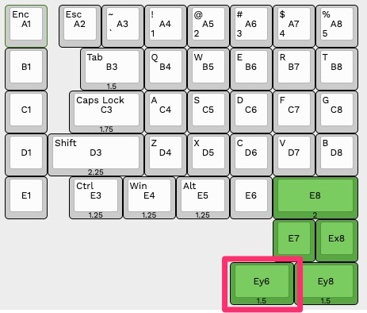
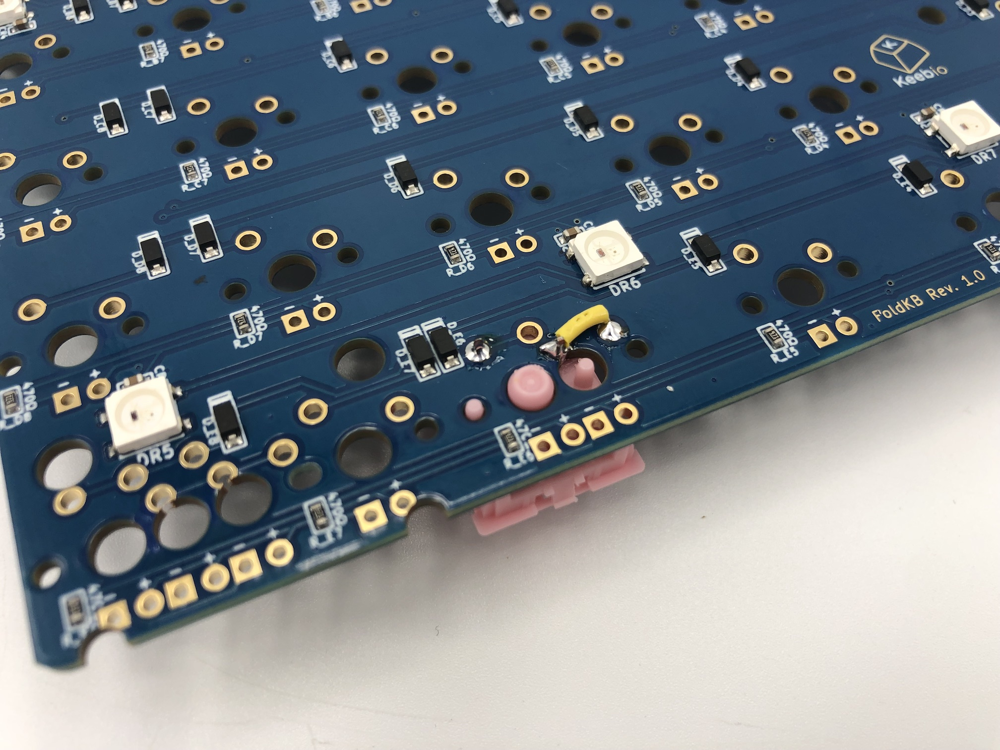

Due to the similarity of the FoldKB build to the Quefrency/Sinc/KBO-5000, see the build guide for that instead: [Quefrency/Sinc/KBO-5000  Build Guide](quefrency-rev2-sinc-build-guide.md).

A specific build guide for the FoldKB will be provided later here.

### Build Tutorial Video by Keebio

<iframe width="560" height="315" src="https://www.youtube.com/embed/fFBcpQkd0kk" title="YouTube video player" frameborder="0" allow="accelerometer; autoplay; clipboard-write; encrypted-media; gyroscope; picture-in-picture" allowfullscreen></iframe>

## Note on Left 1.5u Thumb Key on Left Half

For the Rev. 1.0 PCB, a trace is missing on the left 1.5u thumb key for the left half as marked here:

To fix this, after solder all of the switches, add a jumper wire between these two pins as shown below:

