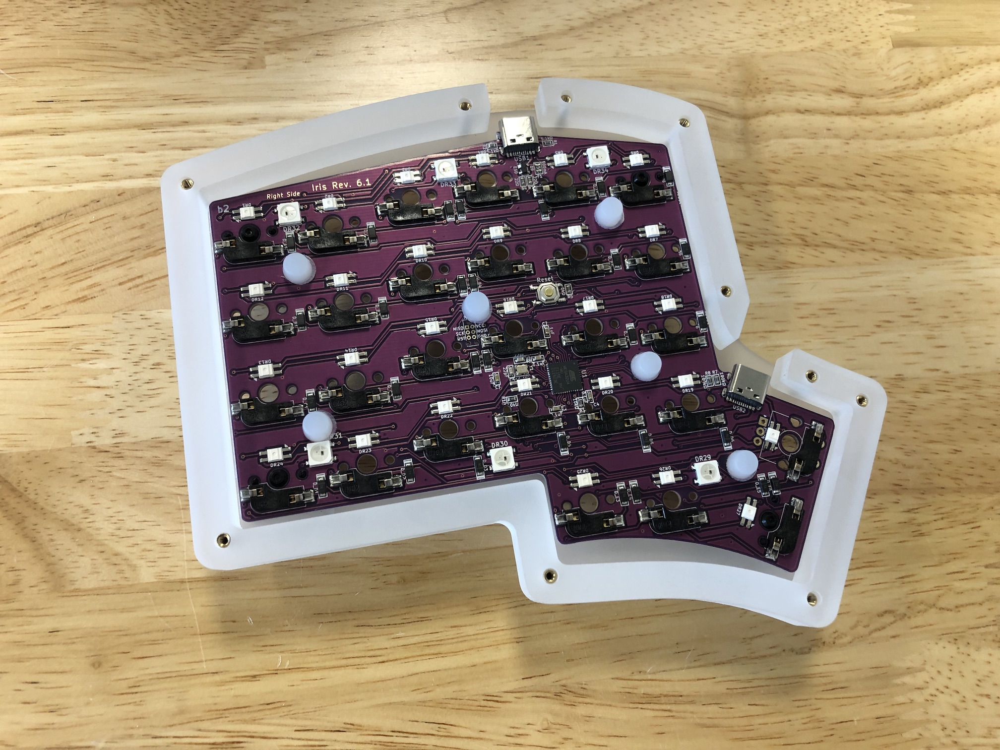
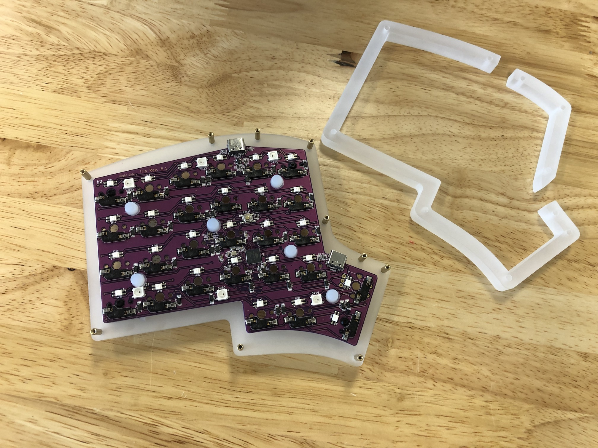
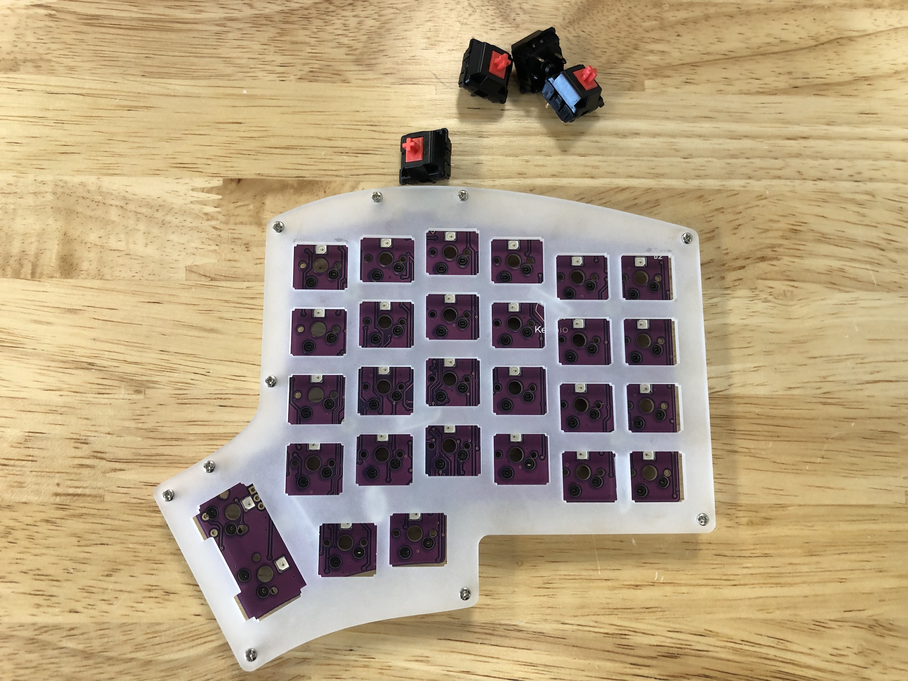
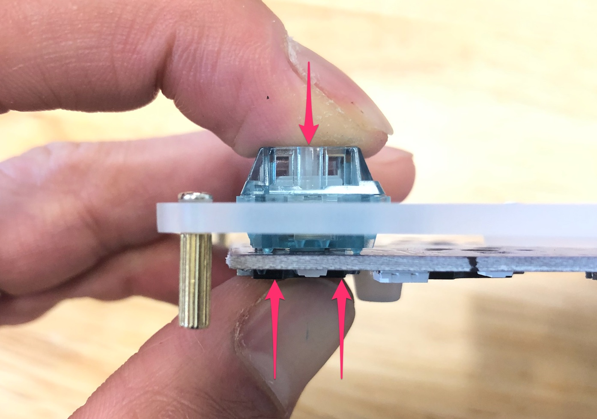
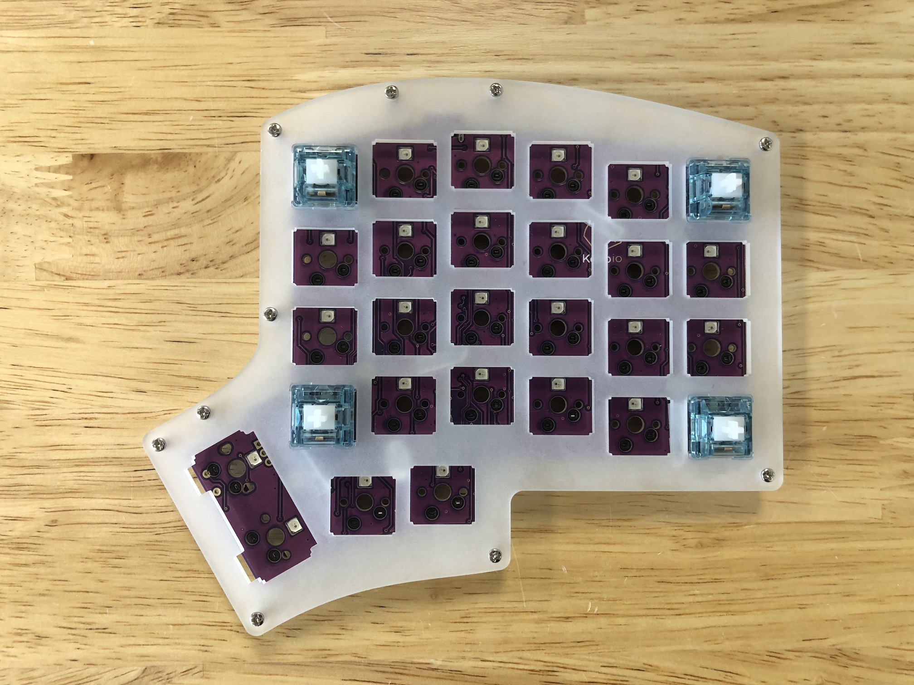
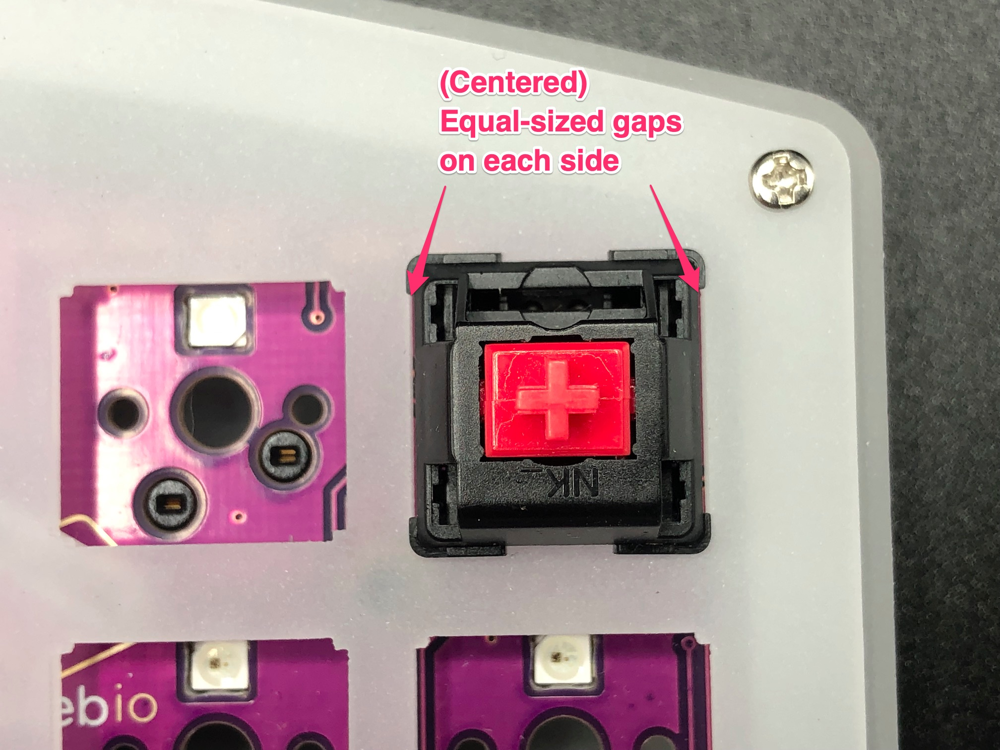
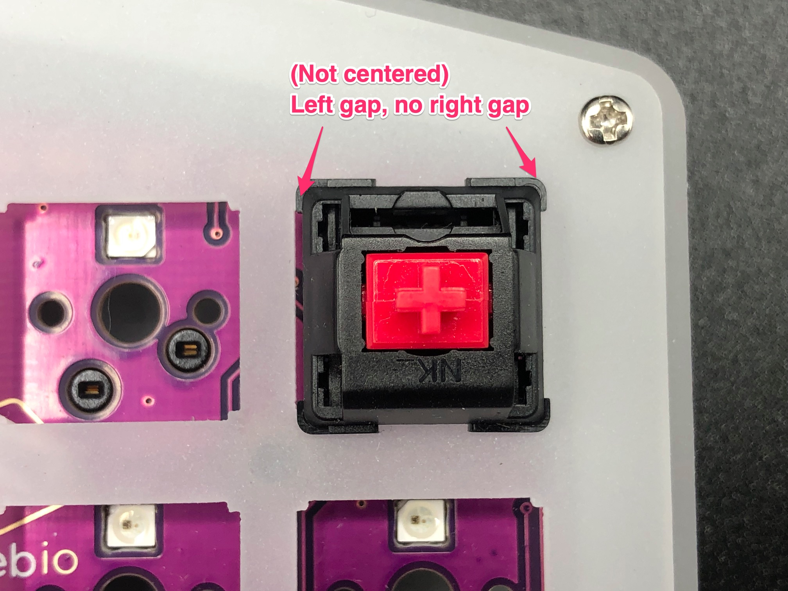
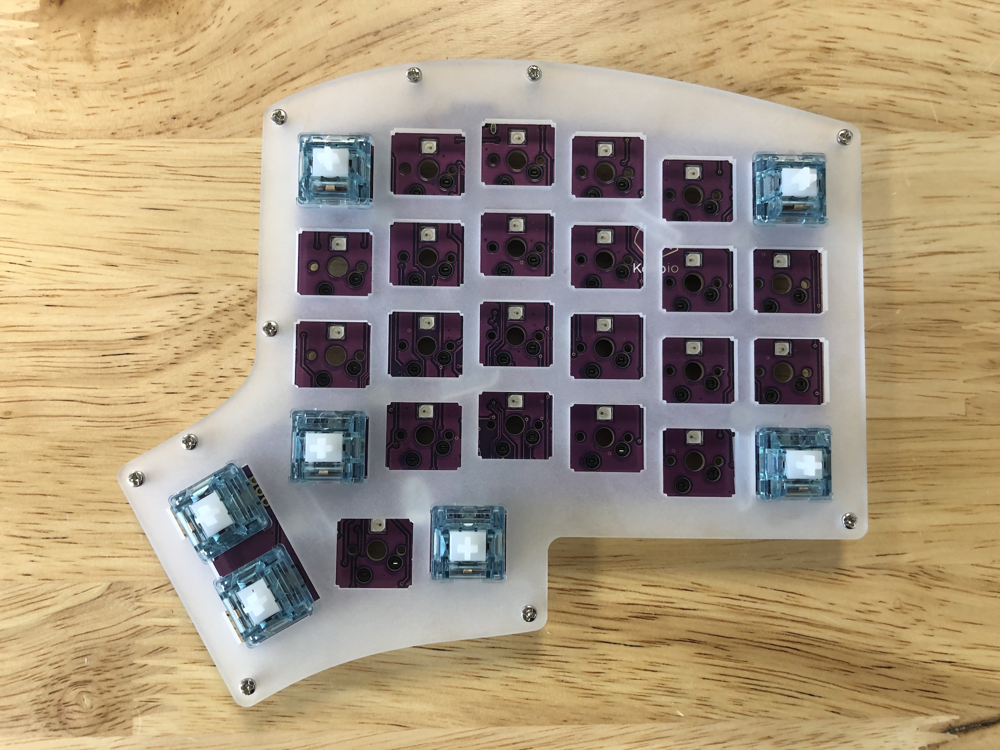
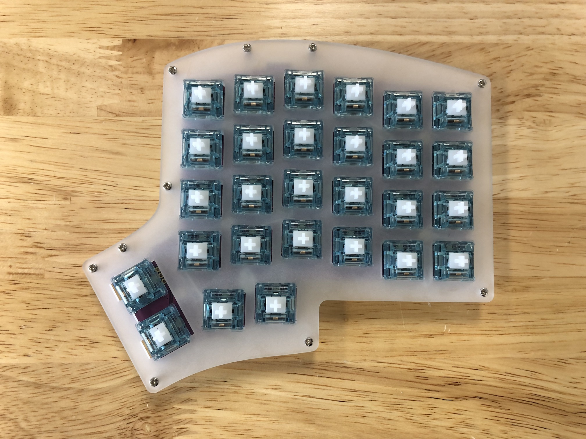
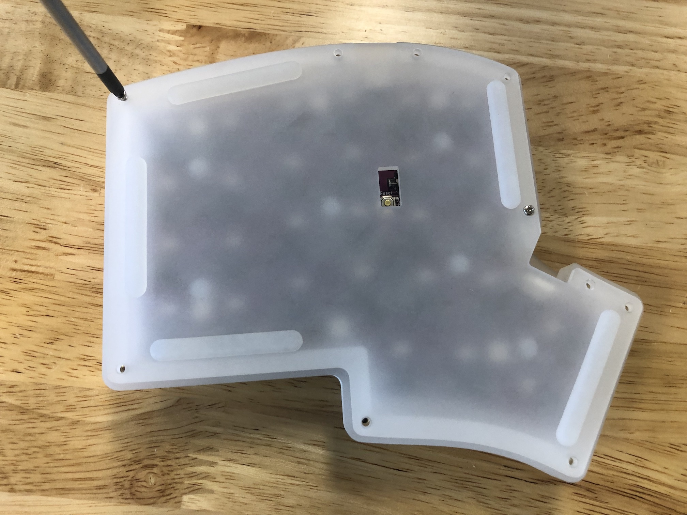

If you've purchased a keyboard from us without switches and has hotswap sockets, this guide will explain what you need to do to install your own switches into them.

While it is possible sometimes to stick the switches into the board as is, you might cause the hotswap PCB to shift downwards out of place by doing this. Instead we suggest that you follow the procedure below to install your switches.

## Parts Needed

- Screwdriver
- Switches
- Your pre-built hotswap board

## Installation Steps Summary

1. Unscrew bottom plate
2. Insert switches

## Unscrew Bottom Plate

The first thing that you'll need to do is unscrew the bottom plate. Flip your board over and unscrew all the screws.

If a middle layer was installed, slide it off of the standoffs and set it aside, as you'll find it easier to have it out of the way.

## Insert Switches

### Placeholder switches

Typically, we have inserted 4-5 placeholder switches into the corners of the keyboard to hold the PCB in place. Go ahead and remove these.

### Inserting a switch

:::danger

Because a hotswap socket can be damaged by inserting a switch incorrectly, don't attempt to insert switches with bent pins into the hotswap socket, as that can push the socket off of the PCB and damage it.

:::

If you have a switch with a bent pin, unbend the pin. Sometimes it helps to have something like a pair of tweezers to straighten out the pin.

Once you've ensured that the legs of the switch are straight, insert it through the switch plate and into the hotswap socket on the PCB. While doing so, make sure the bottom of the socket is supported by your thumb so the socket is not accidentally pushed out of place.

Also make sure the switch is fully seated and is level with the top of the switch plate.

If you find that you need to apply too much force, recheck that the switch pins are straight.

Install switches in the corners first.

If you're using an acrylic plate, make sure the switches are centered properly within the cutout. If they're not centered, then this will cause issues with putting in the switches for the thumb keys.

#### Good (Centered)

#### Bad (Not centered)

After you've installed the first few switches successfully, insert the ones for the thumb area in to make sure they'll fit in properly. As before, make sure you are supporting the the bottom of the socket while pressing the switches in.

If you find that the thumb switches are crooked in the plate, recheck the that other switches are centered as mentioned above.

After that, go ahead and install the rest of the switches.

## Reassemble Case

Slip the middle layer pieces back over the standoffs.

Put on the bottom plate and screw it back in again.

