### Build Tutorial Videos by Keebio

Coming soon!

## Parts List

First up, time to get your parts ready:

* [Iris Aluminum Case](https://keeb.io/products/iris-aluminum-case) which includes the these parts:
  * 10 [SKUF Silicone Feet](https://keeb.io/products/skuf-silicone-rubber-keyboard-feet)
  * Switch plates (FR4 and Stainsteel versions)
  * 1.5mm and 2.5mm Hex keys
  * 16 O-rings
  * 16 M3 12mm screws
  * 8 M2 6mm screw
* Set of Iris PCBs (Rev. 5-7 are compatible)
  * [Iris Rev. 7 PCBs](https://keeb.io/products/iris-rev-7-keyboard-hotswap-pcbs-for-split-ergonomic-keyboard)
  * [Iris Rev. 5 PCBs](https://keeb.io/products/iris-rev-5-keyboard-pcbs-for-split-ergonomic-keyboard)
* [USB-C to USB-C cable](https://keeb.io/products/usb-c-to-usb-c-cable)
* Switches (MX-compatible ones)
* [FLAHNS Hotswap Bumpers](https://keeb.io/products/flahns-5mm-hotswap-silicone-bumpers) (recommended)
* [Rotary Encoder](https://keeb.io/products/rotary-encoder-ec11) and [Knob](https://keeb.io/products/rotary-encoder-knob-ec11) (optional)
* [2u PCB mount MX stabilizers](https://keeb.io/products/cherry-mx-stabilizer) if using 2u keys (optional)

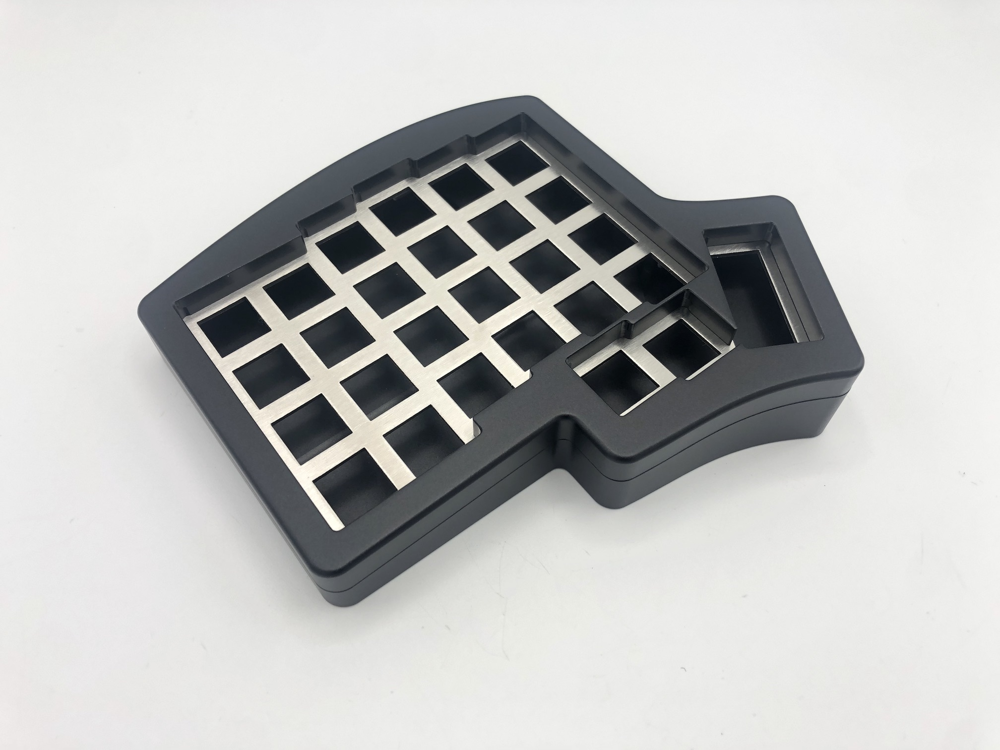

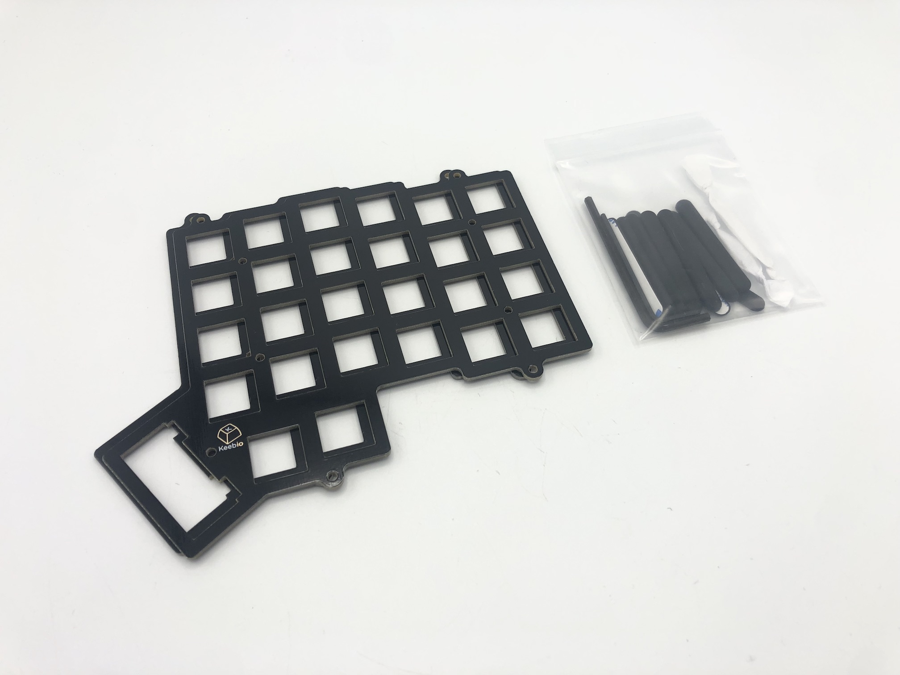

## Build Steps Summary

1. Disassemble case
2. Solder [rotary encoder](glossary#rotary-encoder) (optional)
3. Add stabilizers (optional)
4. Add switches
5. Add bumpers (optional)
6. Add o-rings
7. Reassemble Case

## Disassemble case

First, flip the board over and remove the 8 M3 12mm screws holding the top and bottom parts of the case together.

Next, unscrew the 4 M2 6mm screws that hold the switch plate to the top part of the case.

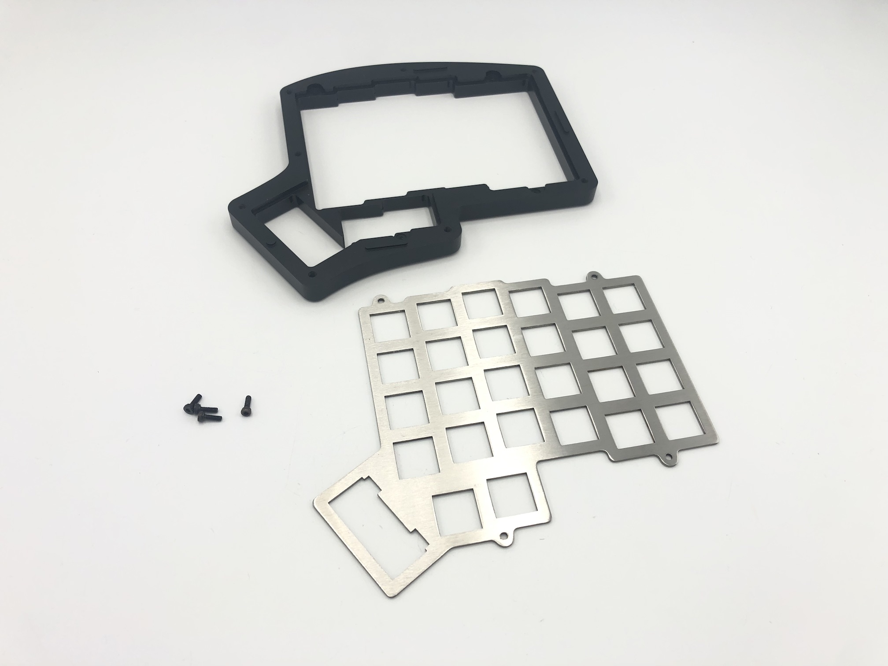

## Solder Rotary Encoder

:::info

If you have the Iris Rev. 6.1 PCBs, you do not need to clip the two larger mounting pins on the encoder as mentioned below, since the PCB now has slots for it.

If you have the Iris Rev. 6.0 or 7 PCBs, you will need to do this procedure.

:::

If adding a rotary encoder, clip the two larger mounting pins on the encoder so it can fit onto the PCB:

It should look like this after clipping:

Insert the encoder onto the PCB and solder the 3 pins at the top side of the encoder and the 2 pins at the bottom side.

Then flip the board over and solder all 5 pins. Make sure that they remain pushed in all the way through the board while soldering. Also be careful to not come in contact with the hotswap socket while soldering the side of the encoder that has 2 pins. Accidental contact with the black portion is okay, but try to avoid doing so.

### Rev. 7

If you have the Rev. 7, when installing the encoders, you will need to bend the legs of the rotary encoder slightly inwards, outwards, and/or to the side (depending on the pads on the PCB) in order for the encoders to fit onto the PCB.

Once you've pushed the encoder pins through the PCB, make sure the encoder is flat against the top of the PCB.

## Add 2u stabilizers to PCB (Rev. 7 only)

Add the 2u stabilizer if you have the Iris Rev. 7 PCBs and want a 2u key at the thumb. Do this before installing the switch plate and switches.

## Add Switches

Next, you'll need to decide which set of switch plates you want to use.

The stainless steel plates are heavier and stiffer, which provide a sturdy but stiffer feel.

The FR4 plates are lighter and have more flex, which can provide a more bouncier feel.

In this guide, we'll be using the stainless steel ones.

Insert a few switches into the switch plate at the corners and at the middle. Make sure the switches are oriented so that they are south-facing (pins at the bottom).

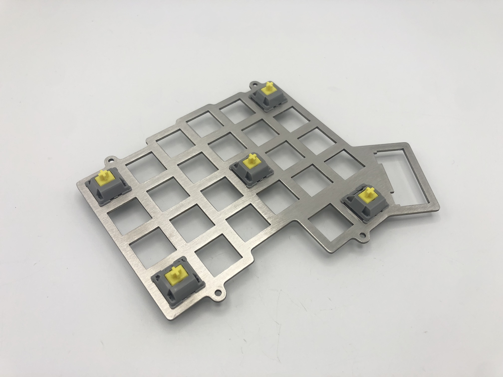

Align the pins of the switches into the hotswap sockets.

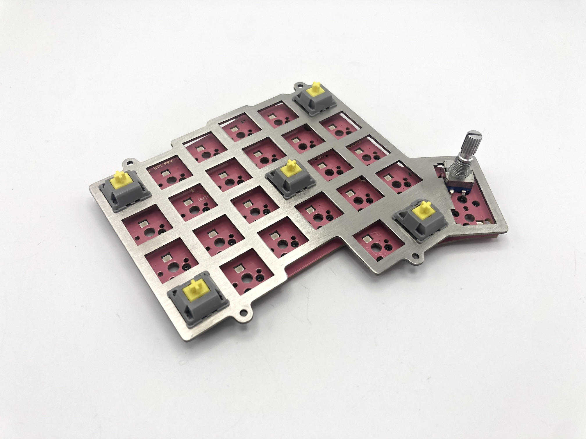

Then push down the PCB onto the bottom of the switch, while pressing on the top of the switch, so basically, you are squeezing the PCB and the switch together.

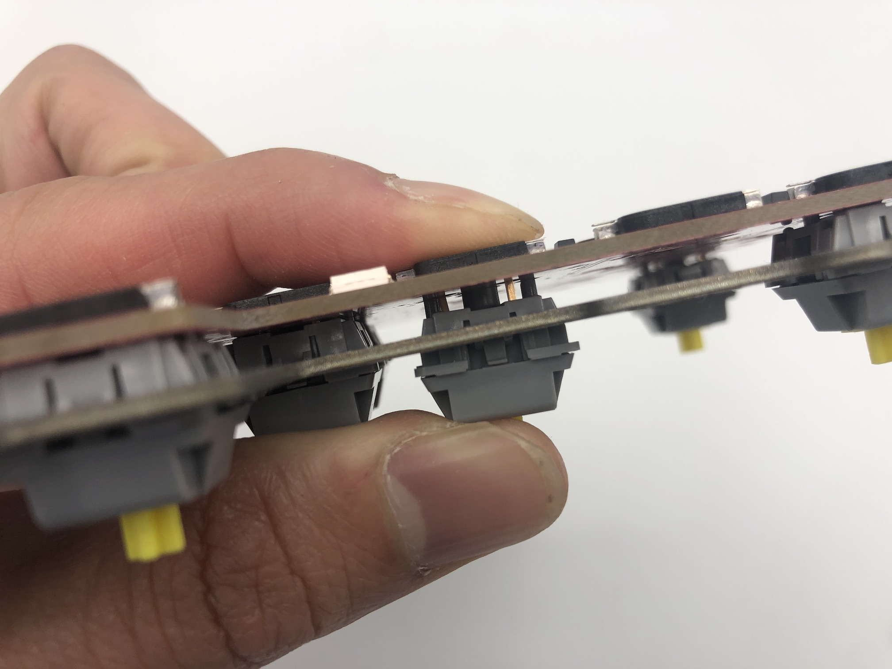

Make sure that the switch remains flush with the plate.

:::danger

Don't attempt to insert switches with bent pins into the hotswap socket, as that can push the socket off of the PCB and damage it.

:::

If you have a switch with a bent pin, unbend the pin. Sometimes it helps to have something like a pair of tweezers to straighten out the pin.

Insert the rest of the switches into the plate and PCB.

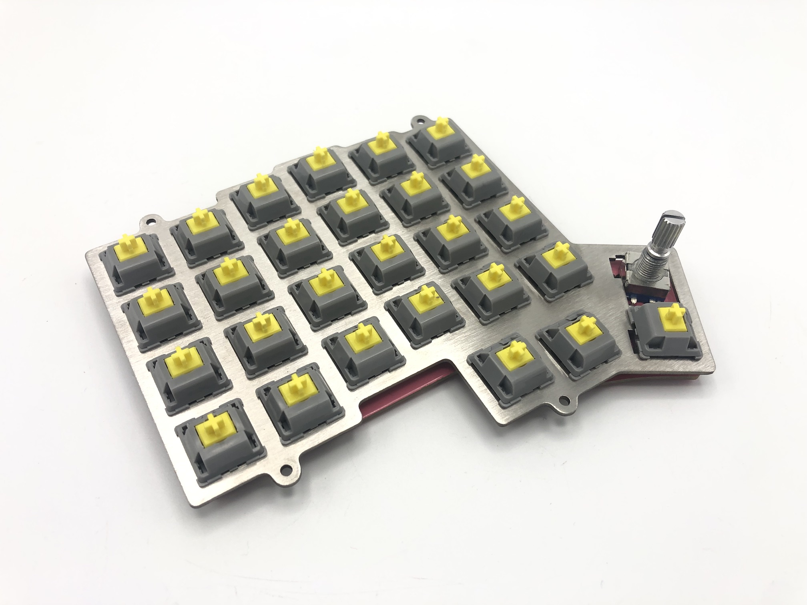

## Add o-ring bumpers

To isolate the switch plate from the top part of the case for a softer feel and better sound, you can use the included o-rings. First put an o-ring on each screw.

Next, insert the screw/o-ring combo through the switch plate mounting hole and add another o-ring to the other side of the plate.

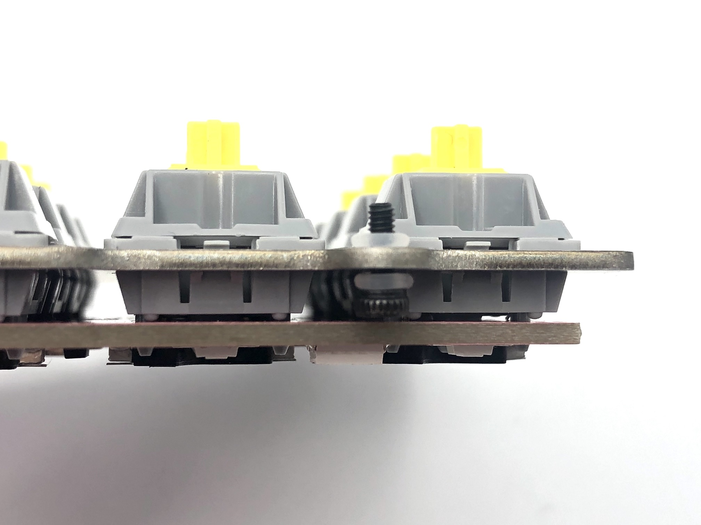

## Ressemble Case

Place the switch plate into the top part of the case and screw it in. If using the o-ring bumpers for burger mounting, you don't have to screw it in fully tight, as you can leave it a bit loose to allow for some flex while typing.

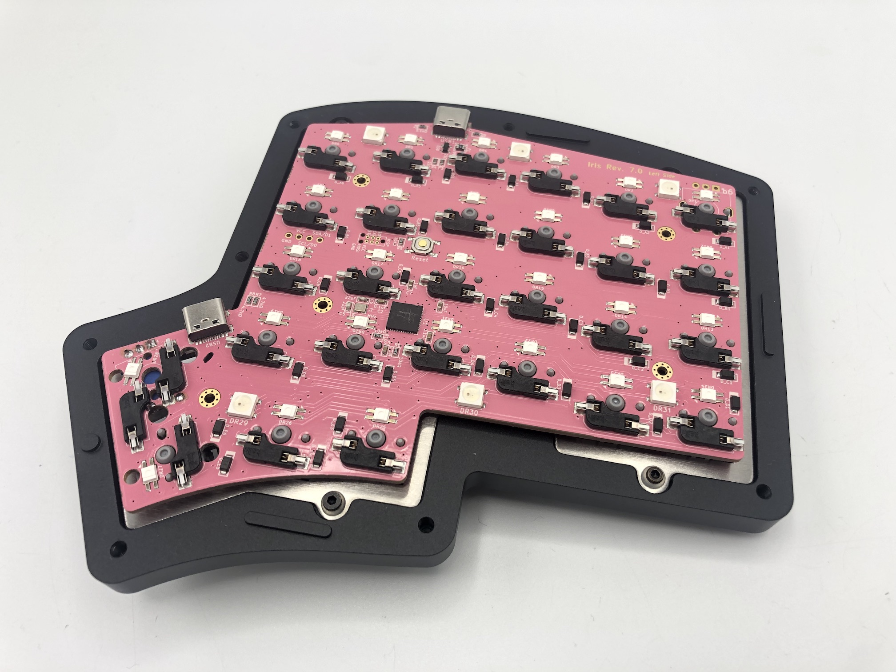

(Optional) Add FLAHNS bumpers to underside of PCB to help support it up. About 4-6 for each half with work fine.

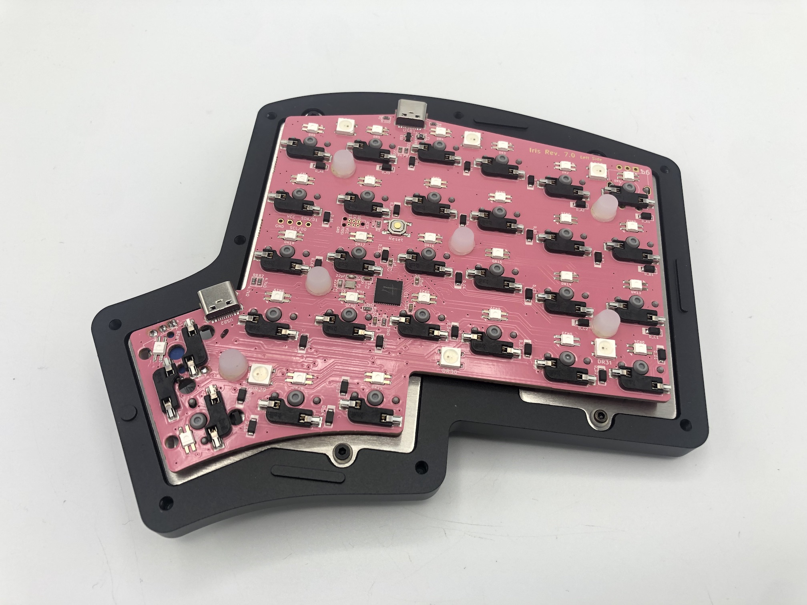

:::info
In the future, we do plan on providing standoffs/screws to hold hotswap PCBs to the switch plate, which will remove the need for adding FLAHNS.
:::

### Add Rubber Feet

Remove the adhesive backing of the SKUF feet and add them to the bottom of the board to prevent the board from sliding around.

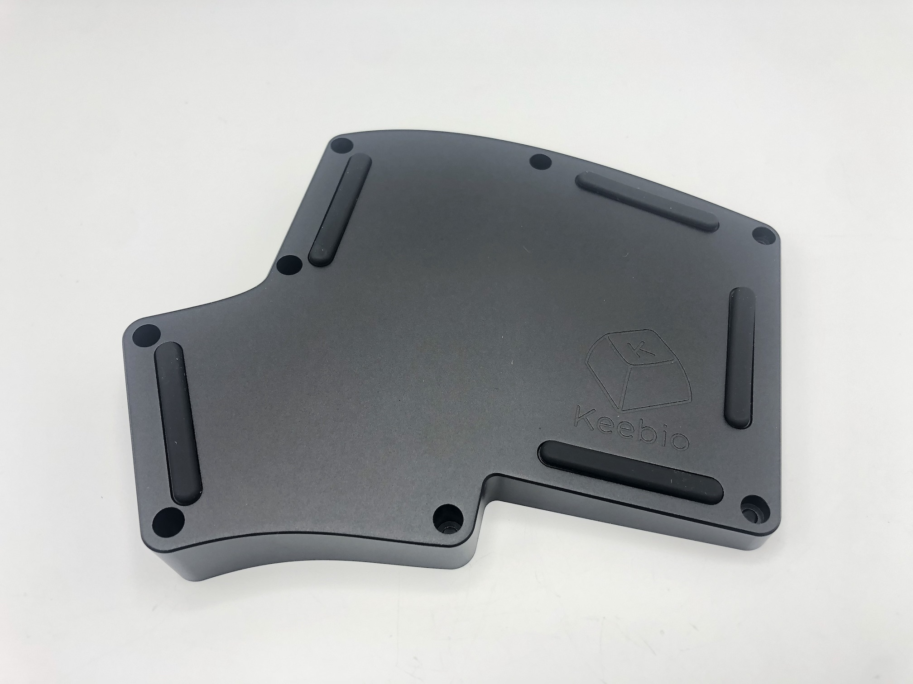

### Screw on bottom

Put the bottom part of the case on and then screw it to the top half.

### Add keycaps and knob

Add your keycaps and knob (if you have a rotary encoder)!

## Remapping/reprogramming Board

Looking to remap/reprogram your board? Check out our guide for [remapping your keyboard](remapping-keyboard).
