## Build Compatibility

This build guide is exclusively for the Iris CE (Compact Edition), which only uses Kailh Choc switches.

## Parts List

Get your parts ready:

* [Iris CE Rev. 1 PCBs](https://keeb.io/products/iris-ce-keyboard-kit)
* Iris CE Case
  * [Aluminum version](https://keeb.io/products/iris-ce-aluminum-case)
  * [Polycarbonate version](https://keeb.io/products/iris-ce-polycarbonate-case)
* [USB-C to USB-C cable](https://keeb.io/products/usb-c-to-usb-c-cable)
* [56 Kailh Choc Switches](https://keeb.io/products/kailh-choc-low-profile-switches-v1)

TODO: Image here

## Build Steps Summary

1. Inspect/Test Parts
2. Add switches
3. Assemble Case
4. Board Notes

## Inspect/Test Parts

Before starting assembly of the board, check if there's any issues with the parts in the keyboard kit.

See if silicone bumpers are installed on the bottom of the case trays.

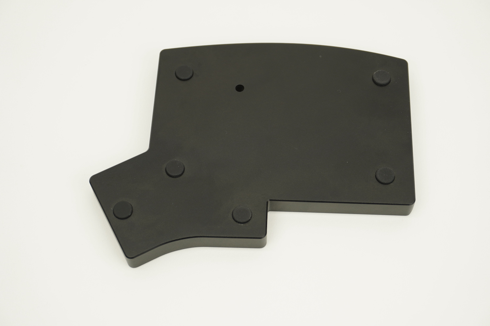

Check for any major cracks. For the PC version of the case, you may see weld/knit lines near the holes, and that is normal.

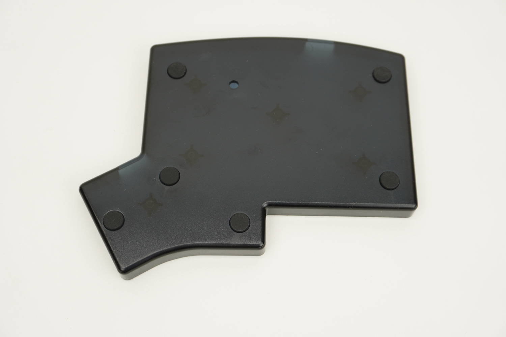

Plug in the PCBs and make sure all the LEDs are working.

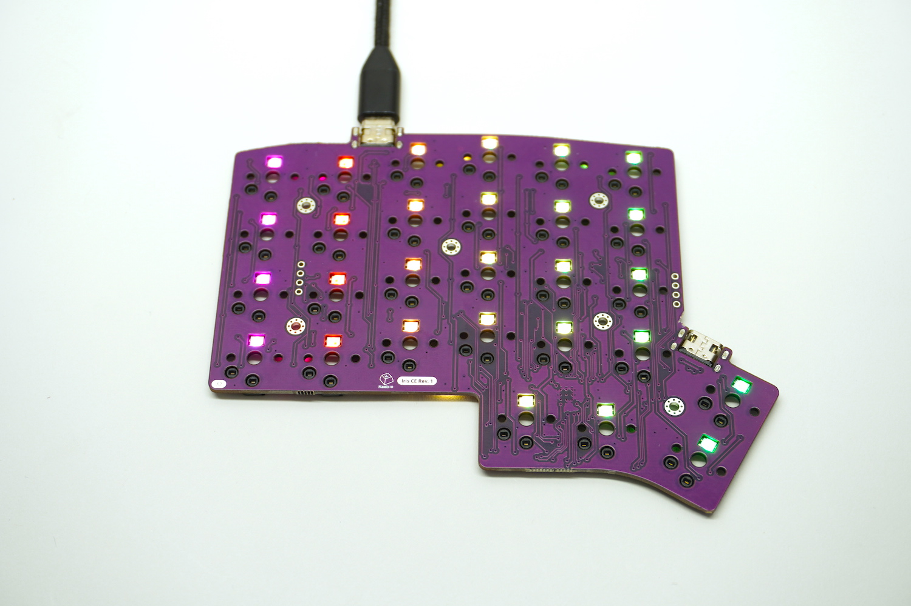

## Add switches

First overlay the poron piece over the PCB. Line up the screw holes with the holes in the piece.

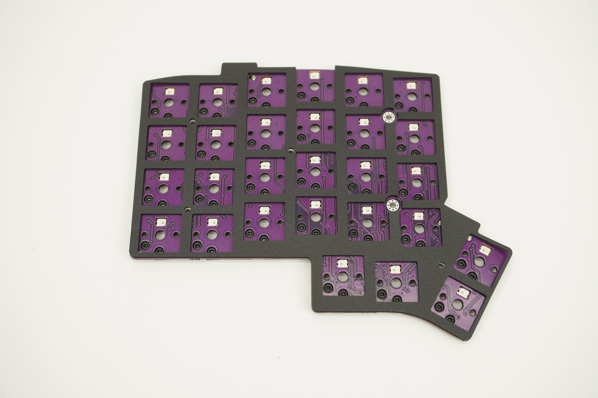

Add the switch plate on top of the poron piece, checking alignment of the screw holes again with the PCB.

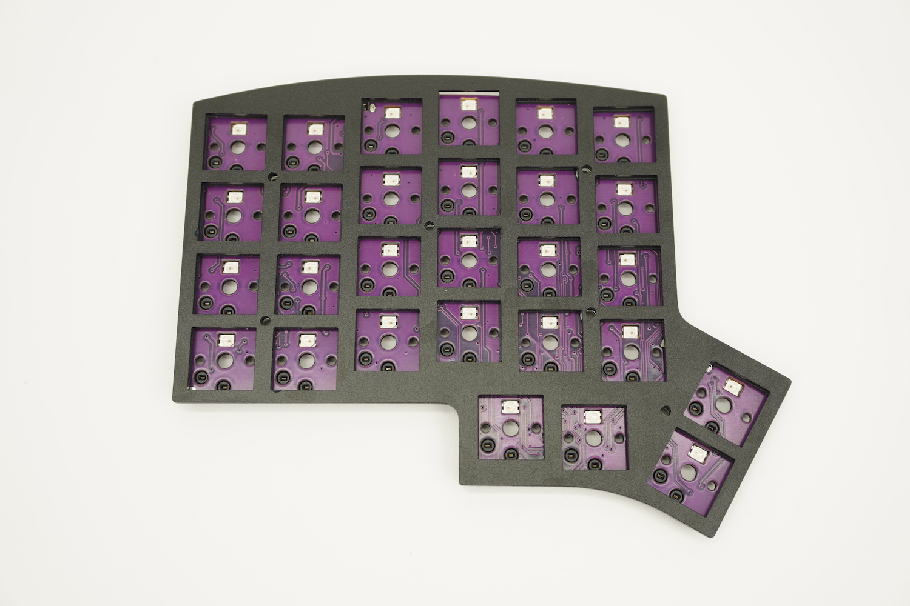

Insert some switches are the corners and at the middle and check that things are still lined up correctly. The switches should be flush with the plate. If a couple of the switches don't sit flat on the plate, remove the plate, reposition the poron piece, and try again.

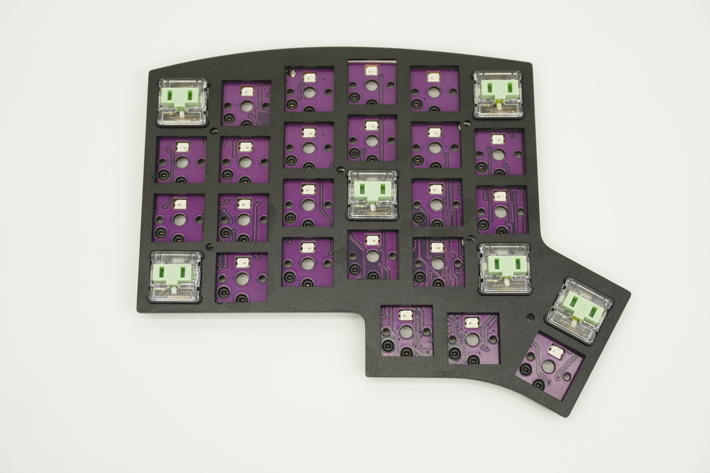

Add the rest of the switches.

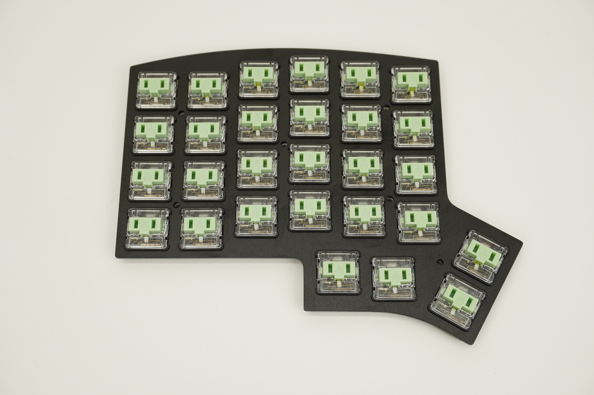

## Assemble Case

Now that all of the switches have been inserted, it's time to assemble the case.

First place the plate assembly into the tray.

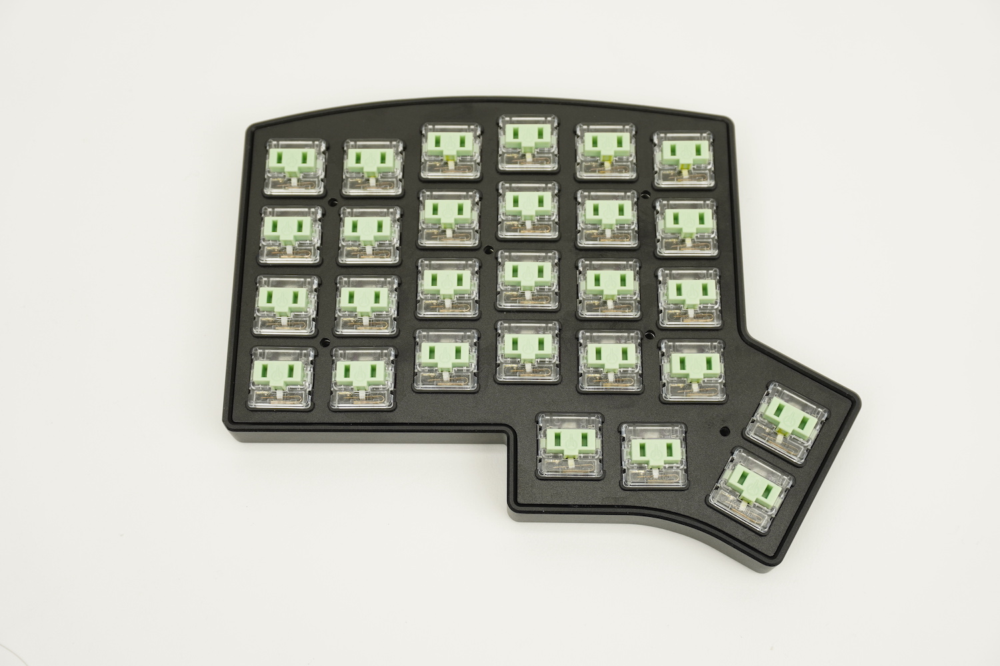

Add screws to each of the holes and screw them in.

:::info

Do not overtighten the screws, as this will cause the plate to bend, which will make the switches pop out.

:::

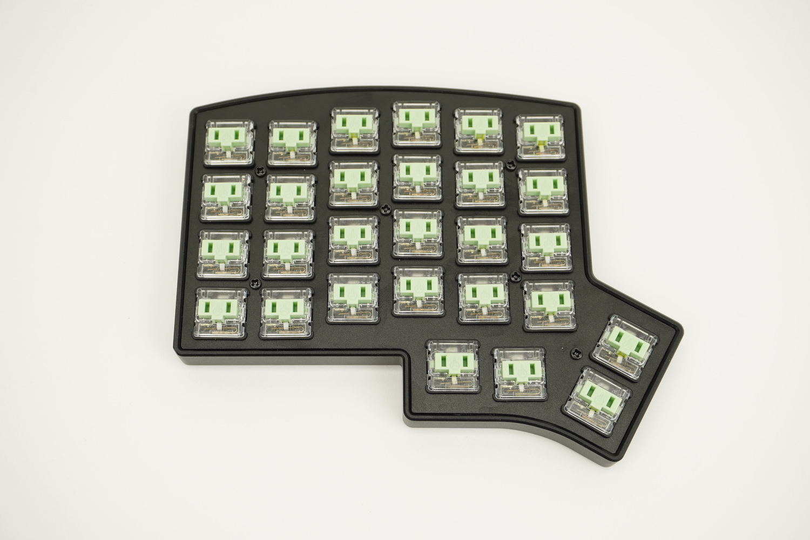

Add keycaps to all of the switches.

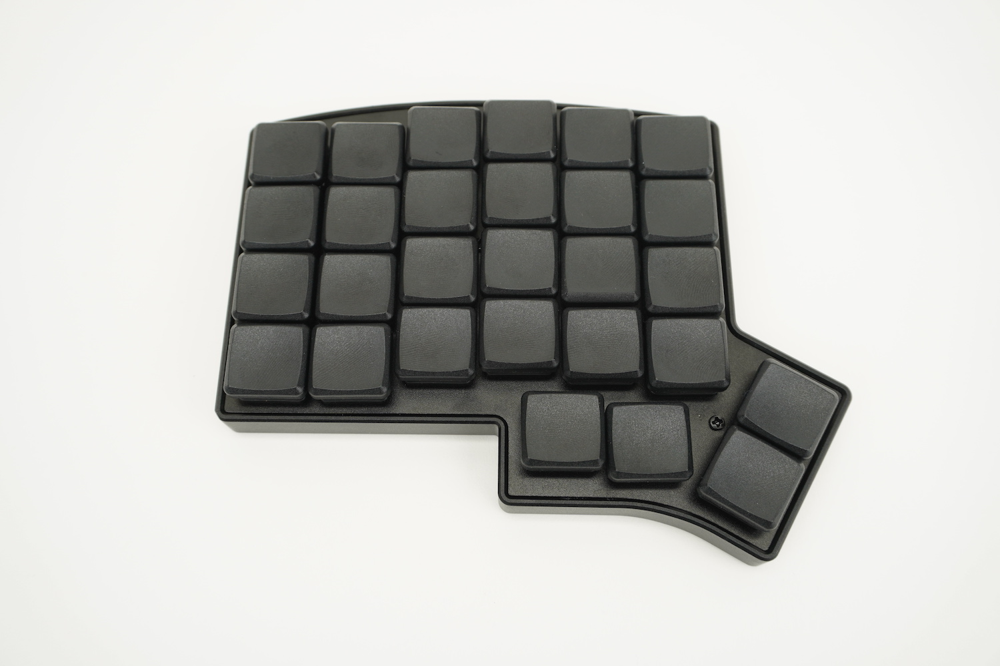

Repeat the same process for the other half of the keyboard.

## Remapping/reprogramming Board

Looking to remap/reprogram your board? Check out our guide for [remapping your keyboard](remapping-keyboard).

While the bottom plates have a hole at the bottom to allow you to access the reset button to allow your Iris to be reflashed, if you don't want to be flipping your board over to press reset, you can also use one of the following options when remapping your Iris:

1. Use [VIA](via.md) to remap your keys. The stock firmware on the Iris CE already has VIA support enabled. This allows you to remap the keyboard without having to reflash the board.
2. Use the `QK_BOOT` keycode to reset the keyboard to allow it to be reflashed without needing to physically press the reset button on the PCB. The default way of using `QK_BOOT` is by pressing `Lower` + `R` on the left half or `Raise` + `Del` on the right half as shown below:

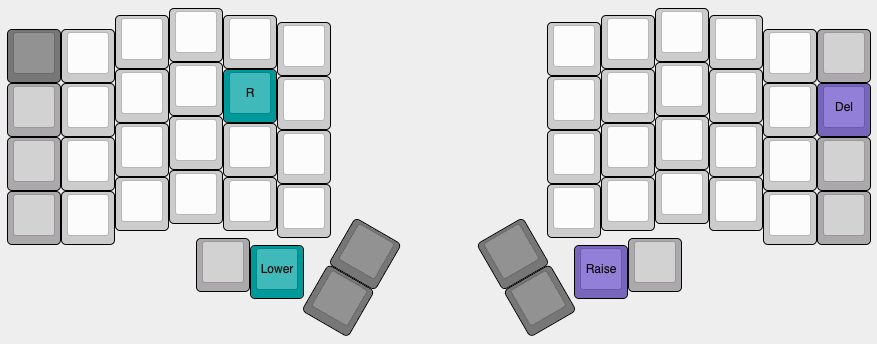

## Turning off RGB LEDs

If you'd like to turn the RGB LEDs off, you can control the [RGB settings in VIA](via#lighting).

If you still have the default keymapping, you can also hold the `Lower` key and then press `Left Shift` as highlighted below:

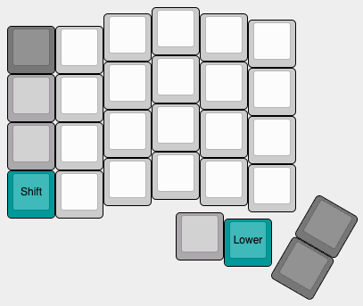
