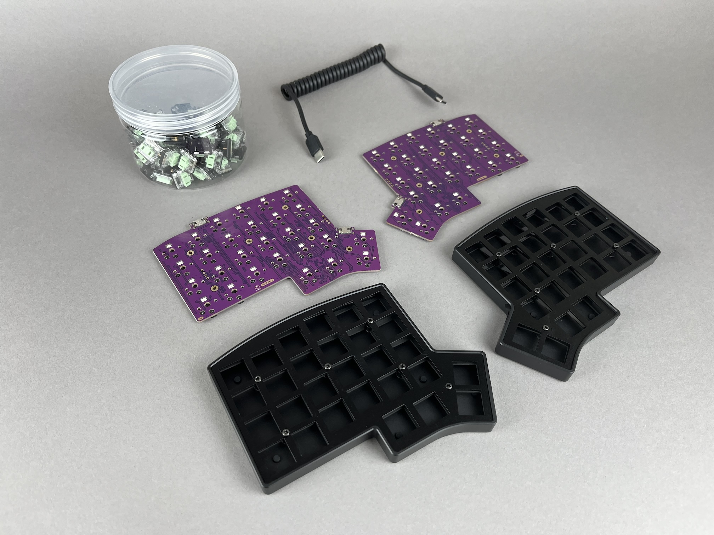
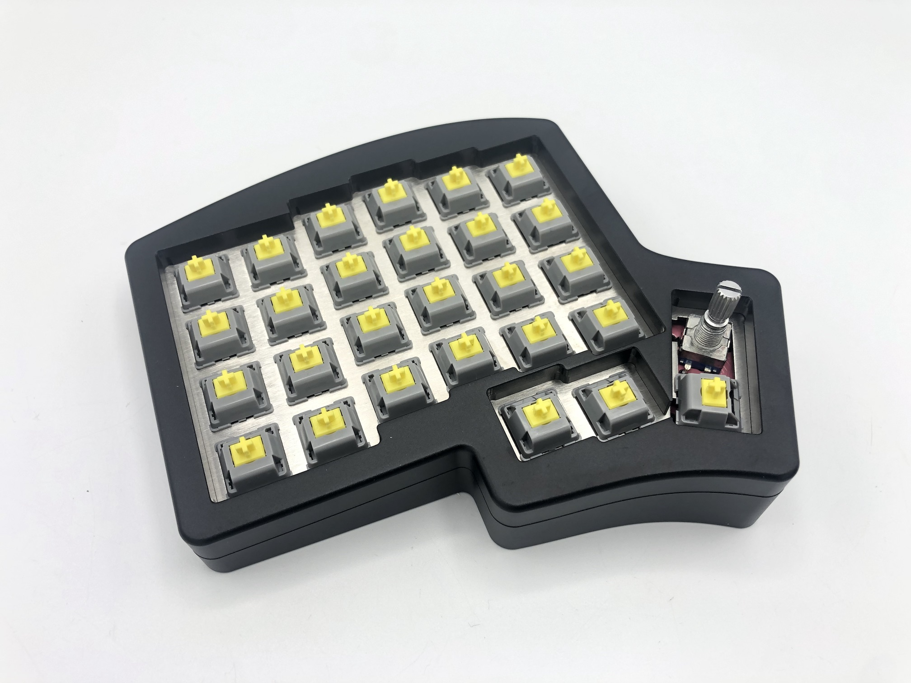

## Select Your Keyboard

There's a few different versions of the Iris, so select the build guide below for the case that you have.

## Iris CE

The Iris CE is the low-profile version that exclusively uses Kailh Choc V1 switches.

[Iris CE Build Guide](iris-ce-build-guide)

## Iris SE

The Iris SE is also an aluminum case, but is a simpler, tray-mount case for the Iris PCB.

[Iris SE Build Guide](iris-se-build-guide)

## Iris PE

The Iris PE has a sandwich-style case and has options to use a hotswap version of the PCB (Rev. 6-8) or a solderable version (Rev. 5)

[Iris PE Rev. 6-8 Hotswap Build Guide](iris-rev6-build-guide)

[Iris PE Rev. 3-5 Build Guide](iris-rev3-build-guide)

## Iris AE (Aluminum Case)

The Iris AE (Aluminum Case) is a premium, aluminum CNC'd case for the Iris PCB.

[Iris AE Build Guide](iris-aluminum-case-build-guide)

