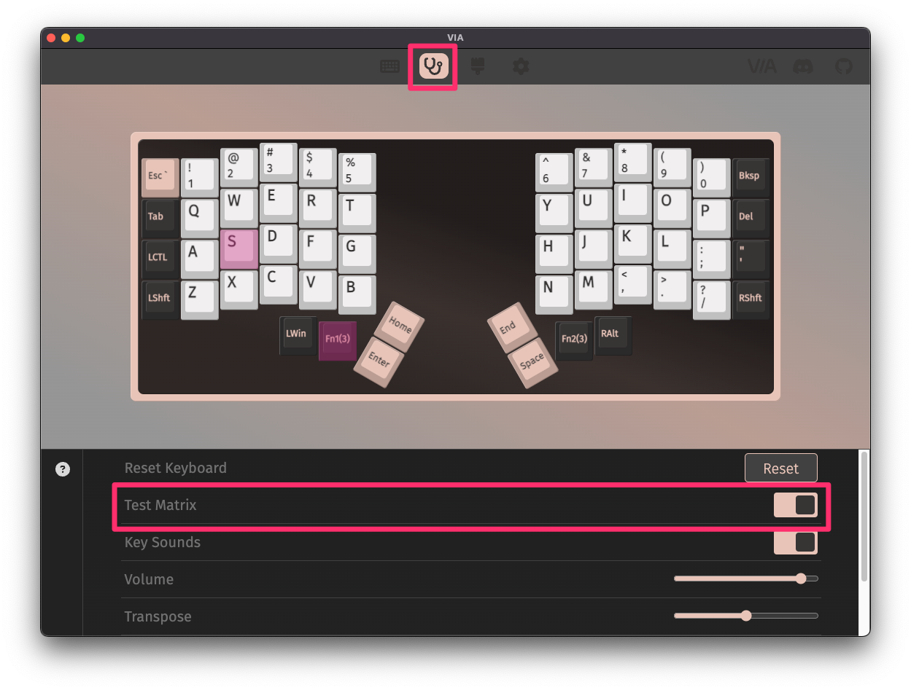

## Build Compatibility

This build guide is exclusively for the Iris LM, which supports Kailh Choc switches (V1 & V2) when using the Iris LM-K PCBs, or Gateron LP KS-33 switches when using the Iris LM-G PCBs.

## Parts List

Get your parts ready:

* Iris LM PCB Kit
  * [Iris LM-K Rev. 1 PCBs](https://keeb.io/products/iris-lm-k-pcb-kit) or
  * [Iris LM-G Rev. 1 PCBs](https://keeb.io/products/iris-lm-g-pcb-kit)
* Iris LM Case
  * [Aluminum version](https://keeb.io/products/iris-lm-aluminum-case)
* [USB-C to USB-C cable](https://keeb.io/products/usb-c-to-usb-c-cable)
* [56 Low-Profile Switches](https://keeb.io/collections/switches?filter.p.m.keyboard.switch_compatibility=Choc+V1+Low-Profile&filter.p.m.keyboard.switch_compatibility=Choc+V2+Low-Profile&filter.p.m.keyboard.switch_compatibility=Gateron+Low-Profile&sort_by=best-selling)

<!--  -->

## Build Steps Summary

1. Inspect/Test Parts
2. Add switches
3. Assemble Case
4. Board Notes

## Inspect/Test Parts

Before starting assembly of the board, check if there's any issues with the parts in the keyboard kit.

First, unscrew the switch plate from the tray, and remove the foam piece from the tray.

See if silicone bumpers are installed on the bottom of the case trays.

<!--  -->

Plug in the PCBs and make sure all the LEDs are working.

<!--  -->

## Add switches

First overlay the foam piece over the PCB. Line up the screw holes with the holes in the piece.

Add the switch plate on top of the foam piece, checking alignment of the screw holes again with the PCB.

Insert a switch at one of the inner thumb keys and check that things are still lined up correctly.

Insert some switches are the corners and check again that things are still lined up correctly. The switches should be flush with the plate. If a couple of the switches don't sit flat on the plate, remove the plate, reposition the foam piece, and try again.

Add the rest of the switches.

## Test keys

Before reassembling the case, plug the USB cable into the PCB and test all of the keys to make sure everything is working, as it'll be easier to fix switch issues now than later.

It's best to test using the [Key Tester in VIA](via#key-tester-tab) with `Test Matrix` mode on, as this will let you test the Lower and Raise keys properly.

## Assemble Case

Now that all of the switches have been inserted, it's time to assemble the case.

First place the plate assembly into the tray.

Add screws to each of the holes and screw them in. You do not need to overly tighten them.

Add keycaps to all of the switches.

Repeat the same process for the other half of the keyboard.

## Default Keymap

Here's the default keymap if you need it: [Iris Default Keymap](../static/layouts/Iris%20Default%20Keymap.pdf)

## Remapping/reprogramming Board

Looking to remap/reprogram your board? Check out our guide for [remapping your keyboard](remapping-keyboard).

While the bottom plates have a hole at the bottom to allow you to access the reset button to allow your Iris to be reflashed if you are using QMK, if you don't want to be flipping your board over to press reset, you can also use one of the following options when remapping your Iris:

1. Use [VIA](via.md) to remap your keys. The stock firmware on the Iris LM already has VIA support enabled. This allows you to remap the keyboard without having to reflash the board.
2. If you are not using VIA and are using QMK instead, use the `QK_BOOT` keycode to reset the keyboard to allow it to be reflashed without needing to physically press the reset button on the PCB. The default way of using `QK_BOOT` is by pressing `Lower` + `R` on the left half or `Raise` + `Del` on the right half as shown below:

For reference, the Iris LM PCB uses a STM32G431 microcontroller.

## Turning off RGB LEDs

If you'd like to turn the RGB LEDs off, you can control the [RGB settings in VIA](via#lighting).

If you still have the default keymapping, you can also hold the `Lower` key and then press `Left Shift` as highlighted below:

