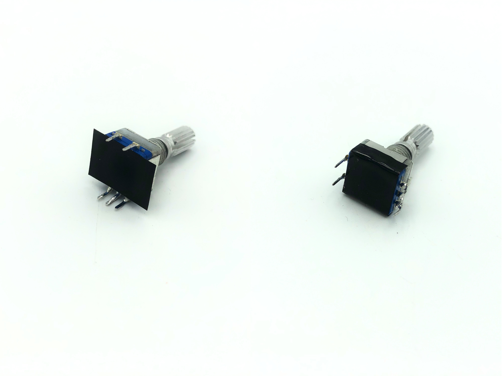

## Build Compatibility

This build guide is exclusively for Rev. 3 & 4 of the Iris, which features pre-soldered components. For Rev. 2 PCBs, see [Iris Rev. 2 Build Guide](iris-rev2-build-guide).

This guide can also be used for the Nyquist Rev. 3, as it has a very similar construction. 

## Videos of Builds

* [MechMerlin - Build Stream: Keebio Iris Rev 3 Build](https://www.youtube.com/watch?v=SZkzzIPx35o)
* [TaeKeyboards - Iris Split Ergonomic Mechanical Keyboard Build](https://www.youtube.com/watch?v=0P6oIOB-whM&t=219s)

## Parts List

Here's a list of parts needed for the build:

* [Set of Iris Rev. 4 PCBs](https://keeb.io/products/iris-keyboard-split-ergonomic-keyboard)
* [Iris Case/Plates](https://keeb.io/products/iris-keyboard-case-plates)
* 1 [TRRS cable](https://keeb.io/products/trrs-cable)
* 54-56 switches (MX-compatible and Alps switches are supported)
* Optional parts (not shown)
    * [2u PCB mount MX stabilizers](https://keeb.io/products/cherry-mx-stabilizer) if using 2u keys
    * [Rotary Encoder](https://keeb.io/products/rotary-encoder-ec11) and [Knob](https://keeb.io/products/rotary-encoder-knob-ec11)
    * [Iris Middle Layer](https://keeb.io/products/iris-keyboard-case-plates)

## Build Steps Summary

1. Prepare components
2. Optional additions! 
    * Solder [rotary encoder](glossary#rotary-encoder) (optional)
    * Solder in-switch [LEDs](glossary#led) (optional)
3. Add [stabilizers](glossary#stabilizers) to [PCB](glossary#pcb)
4. Add switches
5. Optional additions! Part 2
    * Solder in-switch LEDs 
6. Assemble! 
7. Re-Program Board Note
8. Rejoice!
9. Glossary

## Prepare Components

Have your soldering iron, solder and, if you feel accident prone with your soldering (it's ok! Happens to the best of us!), a solder sucker.

Some individuals may want to lubricate their switches. If you'd like to, go ahead and do that now before starting the process. For further details on that, go [here](https://www.maketecheasier.com/how-to-lubricate-keyboard-switches/).

<!-- TODO: make keebio version of the 'how to' on the aforementioned page. -->

Get a playlist of some jams you like and get started!

## Optional additions!

These items are optional additions, but if you *do* want them included in your board, the time to act is now. 

### Add 2u stabilizers to PCB 

Add the 2u stabilizer if desired. Do this before installing the switch plate and switches:

### Solder rotary encoder

If adding a rotary encoder, clip the two larger mounting pins on the encoder so it can fit onto the PCB:

Next, add a small piece of electrical tape to cover up the clipped off pins:

Install the encoder onto the PCB:

Solder the encoder onto the PCB:

## Add switches
:::note FOR KALIH BOX AND KAILH CHOC SWITCHES - INSTALL LEDS BEFORE THIS STEP
For Kailh Box and Kailh Choc switches, there is no cutout to insert in-switch LEDs through, so the LEDs must be added first. Skip to the [LED installation step](iris-rev3-build-guide#solder-in-switch-leds) and then come back to this step of switch installation.
:::

Add switches into the switch plate. It's a good idea to add switches to the corners first and then solder them before installing the rest of them:

Fit the switches and plate onto the PCB:

Solder the switches onto the PCB:

Add the rest of the switches:

Solder the rest of the switches onto the PCB:

## Optional additions! Part 2

### Solder in-switch LEDs

Polarity of the in-switch LEDs is important. Match up the longer leg of the LED to the `+` sign of the LED pins on the PCB:

Insert the LED through the switch and PCB:

Double check that the longer leg matches with the `+` sign:

Bend the LED legs out so it doesn't fall out while soldering the LED in:

Solder the LED legs and then clip the excess length on the legs:

## Assemble!

Insert a screw through the top of the switch plate and attach a standoff from the bottom side of the plate:

Repeat the process for the rest of the plate:

#### Assembly Option!

If you have an acrylic middle layer, insert it now around the standoffs:

Put the bottom plate on and add screws:

If you have an acrylic middle layer with tenting holes, here's a video on how to add bolts to it: [Tenting Your Iris with Bolts](https://youtu.be/kxwHtumvQmc)

If you have a 3D-printed middle layer, see this page on installing it: [Iris 3D-printed Middle Layer Installation](iris-middle-layer)

## Re-Program Board Note

Oh, looking to re-program your board? Never fear! Come look [here](flashing-firmware).

## Rejoice!

You have a keyboard! Savor this moment of victorious keyboard construction.

Care for [another](https://keeb.io/collections/all) build adventure? 
