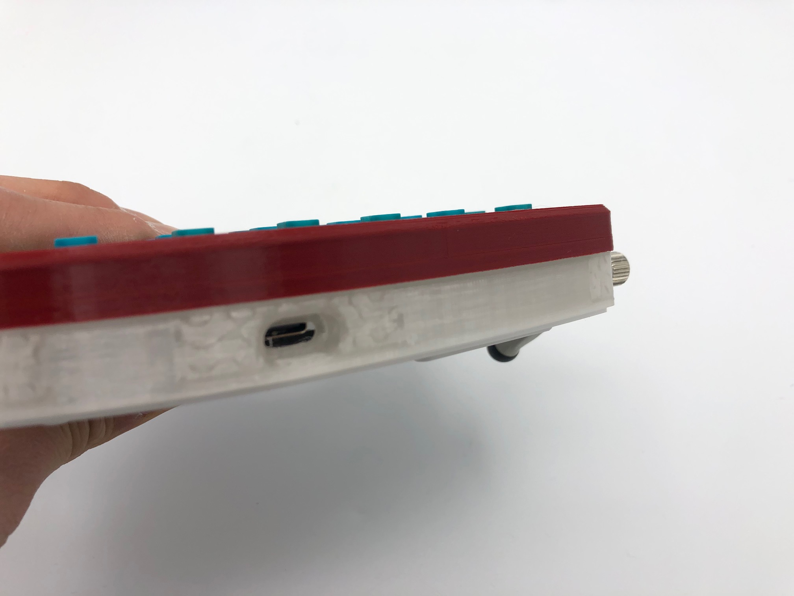

## Build Compatibility

This build guide is exclusively for the Rev. 6 PCB of the Iris, which features pre-soldered components, including Kailh hotswap sockets. For previous revisions, please see the [Iris Rev. 3-5 guide](iris-rev3-build-guide).

### Build Tutorial Videos by Keebio

Build video for the Iris Rev. 6 to be made and posted soon, but for now you can watch the video for the hotswap Quefrency board for reference.

<iframe width="560" height="315" src="https://www.youtube.com/embed/ONEaWsojIn0" title="YouTube video player" frameborder="0" allow="accelerometer; autoplay; clipboard-write; encrypted-media; gyroscope; picture-in-picture" allowfullscreen></iframe>

## Parts List

First up, time to get your parts:

* [Set of Iris Rev. 6 PCBs](https://keeb.io/products/iris-rev-6-keyboard-hotswap-pcbs-for-split-ergonomic-keyboard)
* [Iris PE Plates](https://keeb.io/products/iris-keyboard-case-plates-phoenix-edition)
* [USB-C to USB-C cable](https://keeb.io/products/usb-c-to-usb-c-cable)
* Switches (MX-compatible ones)
* [Rotary Encoder](https://keeb.io/products/rotary-encoder-ec11) and [Knob](https://keeb.io/products/rotary-encoder-knob-ec11) (optional)
* [3D-Printed Iris Case](https://treedogstudio.com/products/iris-3d-printed-case) (optional)

## Build Steps Summary

1. Solder [rotary encoder](glossary#rotary-encoder) (optional)
2. Prepare plates (if using acrylic ones)
3. Add switches
4. Assemble Case
5. Board Notes

## Solder Rotary Encoder

If adding a rotary encoder, clip the two larger mounting pins on the encoder so it can fit onto the PCB:

It should look like this after clipping:

Insert the encoder onto the PCB and solder the 3 pins at the top side of the encoder and the 2 pins at the bottom side.

Then flip the board over and solder all 5 pins. Make sure that they remain pushed in all the way through the board while soldering. Also be careful to not come in contact with the hotswap socket while soldering the side of the encoder that has 2 pins. Accidental contact with the black portion is okay, but try to avoid doing so.

## Prepare Acrylic Plates

:::info

You can skip this section if you are using FR4 plates or stainless steel plates. This section only applies if you are using the 3mm thick acrylic plates.

:::

Peel up a corner of the protective paper film of the acrylic plate. You can use your fingernail or any other kind of object. Be cafeful to not scratch up the plate while doing so.

Once the corner of the film is up, keep peeling the rest of the film off. It helps to peel it off diagonally as shown here.

One side complete, repeat the same process for the other side of the plate for all the plates in the set.

Because the acrylic plate is 3mm thick instead of 1.5mm, the switch will not fully click into the plate. To prevent the plate from slipping off of the switches and onto the PCB, add some material between the bottom of the plate and the top of the PCB. You will need something about 2mm thick, such as rubber bumpons or rolled up electrical tape.

Here, SKUF feet are being used to provide the buffer:

Here's the other option of using electrical tape:

## Add Switches

Insert a few switches into the switch plate at the corners.

Make sure the switches are oriented so that they are south-facing (pins at the bottom).

Align the pins of the switches into the hotswap sockets.

Then push down the PCB onto the bottom of the switch.

Make sure that the switch remains flush with the plate.

:::danger

Don't attempt to insert switches with bent pins into the hotswap socket, as that can push the socket off of the PCB and damage it.

:::

If you have a switch with a bent pin, unbend the pin. Sometimes it helps to have something like a pair of tweezers to straighten out the pin.

After you've installed the first few switches successfully, insert the rest of them in.

## Assemble Case

Now that all of the switches have been inserted, it's time to assemble the case.

First step is to add the screws and standoffs to the switch plate. For each hole, insert a screw through the top of the switch plate and attach a standoff from the bottom side of the plate.

(Optional) If you've got an acrylic middle layer, put it over the standoffs.

If you installed an encoder, you will need to add a piece of foam about 3-4mm thick that will sit in between the bottom of the PCB and the bottom plate. This will prevent the PCB from dislodging from the switches when pressing down on the encoder.

Put the bottom plate on top of the standoffs and screw it on.

### (Optional) Add Rubber Feet

If you've got [SKUF Feet](https://keeb.io/products/skuf-silicone-rubber-keyboard-feet), add them to the bottom of the board. Alternatively, you can use any kind of rubber bumpons of your choice.

A 3D-printed alignment guide is available if you'd like to place them in a more orderly fashion.

Flip the board over and you're done! Or if you've got other case parts, continue reading...

### 3D-Printed Middle Layer (w/Ergodox Leg support) Installation

### Install Top Shell

