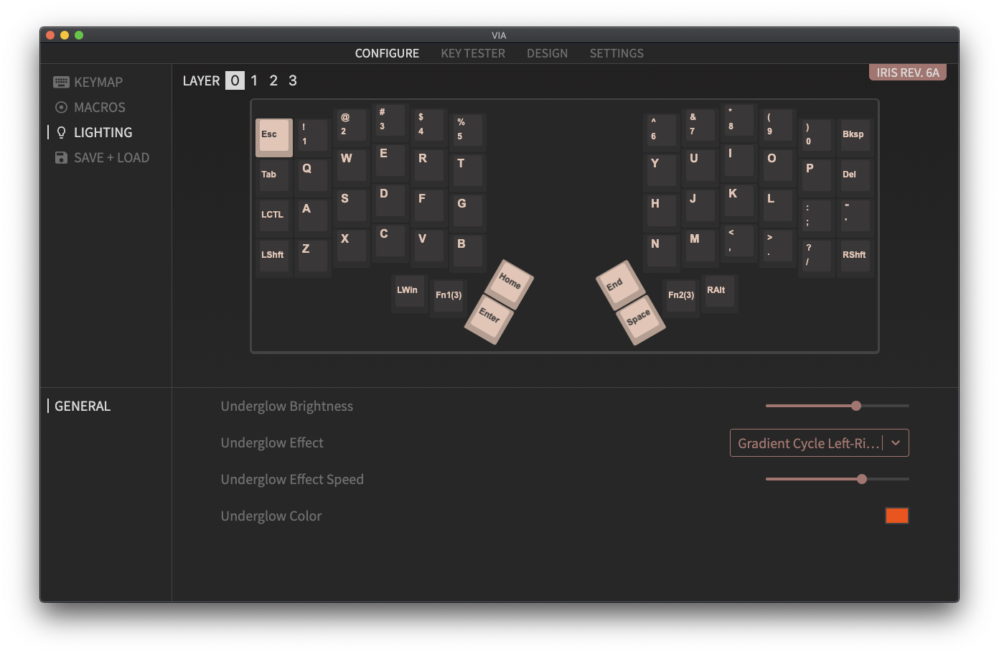
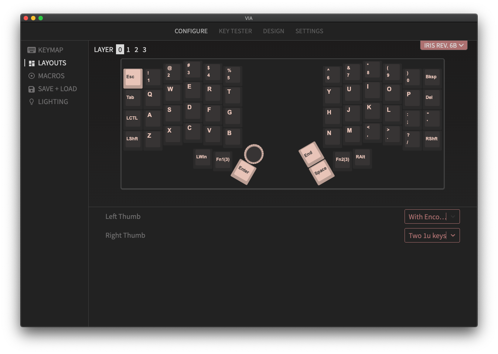
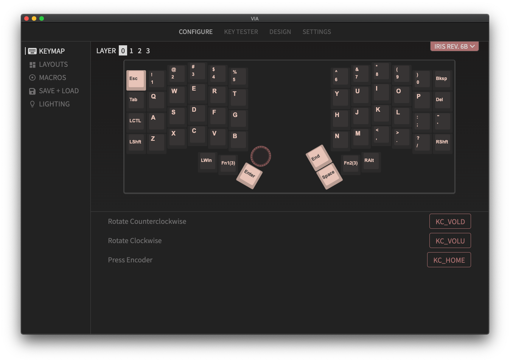

The stock firmware (`rev6`) for the Iris Rev. 6 has VIA support, but it does not have support for the Lighting controls in VIA due to the way RGB is implemented for QMK and VIA. One way to control the RGB lighting is by using the [RGB Lighting keycodes in QMK (`RGB_xxx`)](https://docs.qmk.fm/#/keycodes?id=rgb-lighting). It also does not have the ability to remap the rotary encoders.

If you'd like to use the Lighting controls in VIA Configurator and/or remap your encoders, it can be enabled by upgrading the firmware from `rev6` to `rev6b`, but there are a couple things to take note of.

- The `rev6` and `rev6b` firmwares are both compatible with any Iris Rev. 6.x PCB (i.e. Rev. 6 and Rev 6.1)
  - Using the original `rev6` VIA .hex file will have Lighting controls disabled and no layout options for encoders
  - Using the `rev6b` VIA .hex file will enable the Lighting controls and encoder remapping
  - The stock firmware on all Rev. 6 and 6.1 PCBs is `rev6`

## Upgrading to `rev6a` firmware

1. Download and flash this .hex file to each half: [Iris Rev. 6b VIA Firmware](https://docs.keeb.io/firmware.html?path=iris/keebio_iris_rev6b_via.hex)
2. [Flash](flashing-firmware#flashing-atmega32u4-dfu-bootloader) the `rev6b` VIA .hex file individually to each half

## Launch VIA

### Light Controls

RGB controls will then be enabled in the Configure tab.

### Encoder Remapping

To remap the encoders, go to Layouts on the left side panel and enable the Left Encoder and/or Right Encoder layout option depending if you have an encoder there or not.

Once you've enabled the encoder, you can remap the rotation and press functions by clicking on the circle that represents the encoder, and then changing the encoder mappings in the bottom panel.

