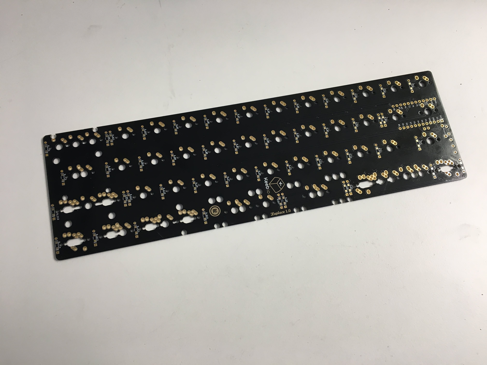

Oh look, it's a wild Laplace PCB! Time to fill it up.

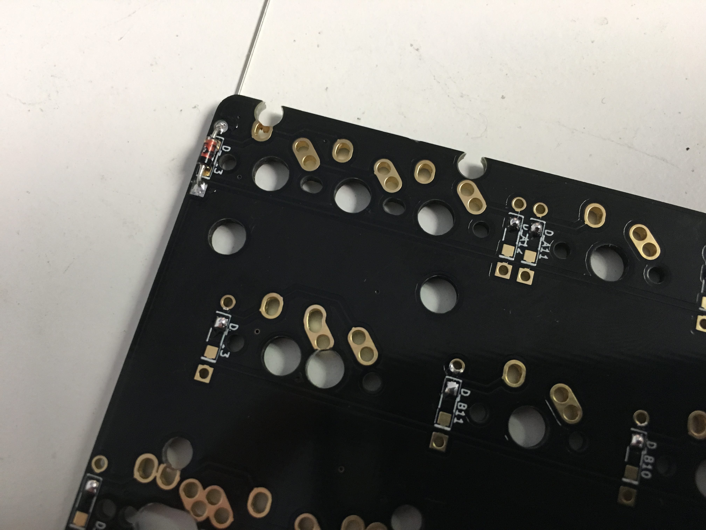

Add diodes. As always, square pad goes with the band on the diode.

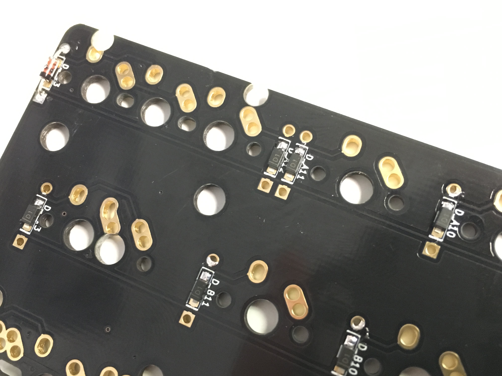

Same with SMD diodes if you're using those instead.

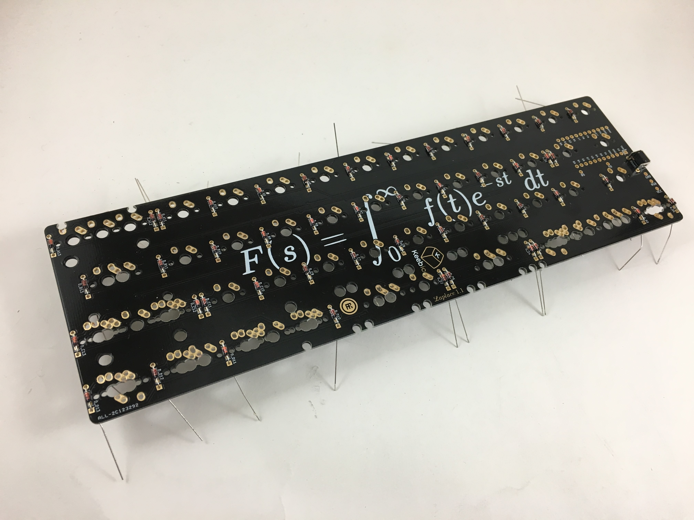

All the diodes installed.

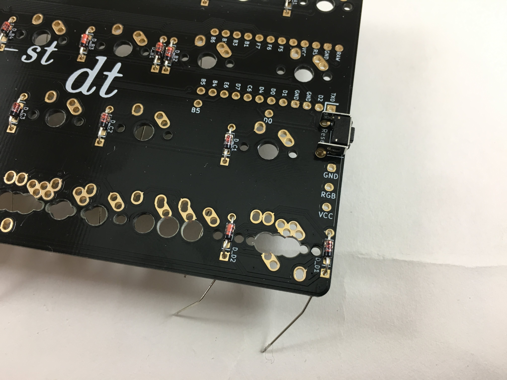

Add the reset switch and solder.

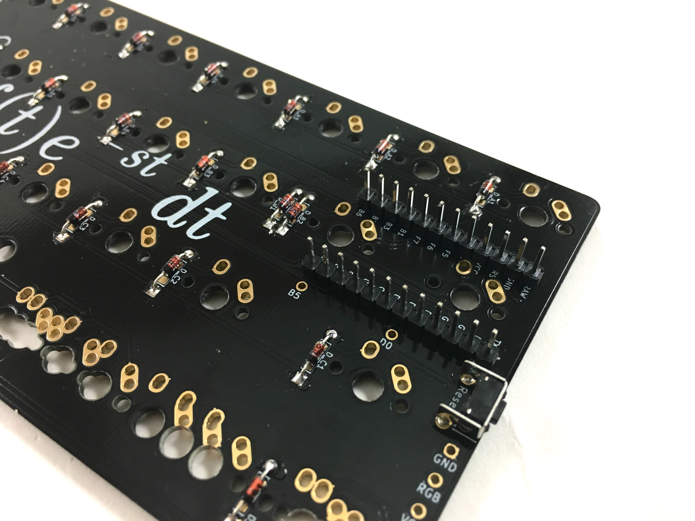

Add the Pro Micro header pins and solder.

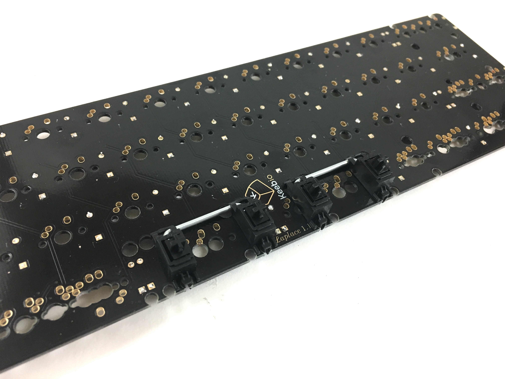

Add stabilizers.

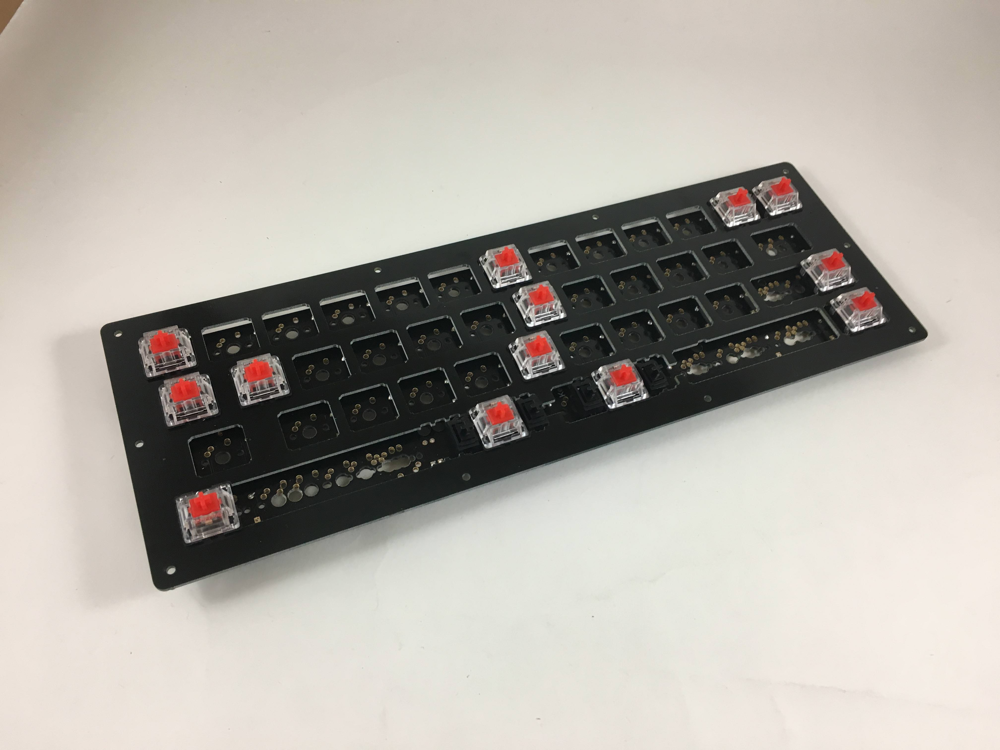

Add some switches to the switch plate at the corners and a few in the middle to make sure the plate aligns with the PCB.

It may be helpful to add keycaps to the switches to position them in the correct holes.

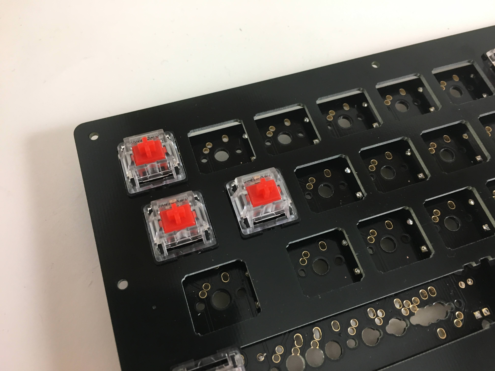

Make sure you add the two switches that sit above the Pro Micro, as those must be soldered on before soldering the Pro Micro.

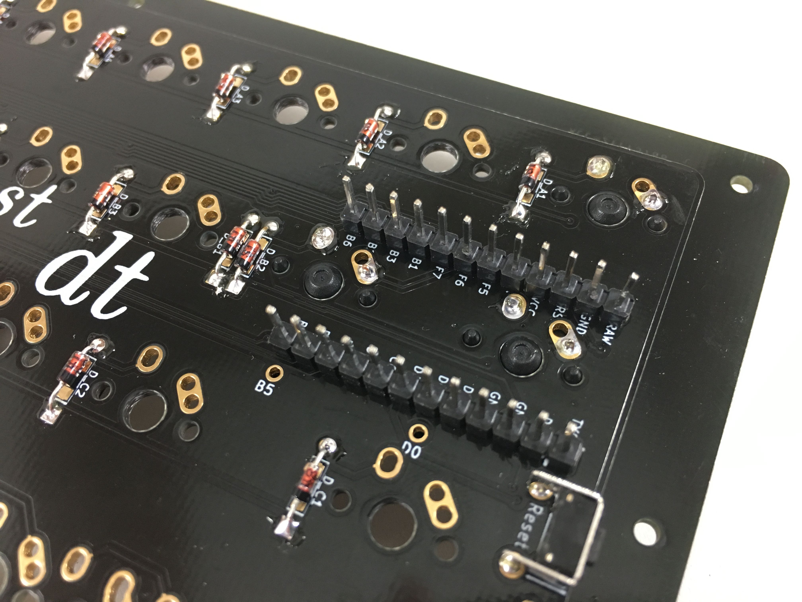

Solder the switch pins for the switches you added.

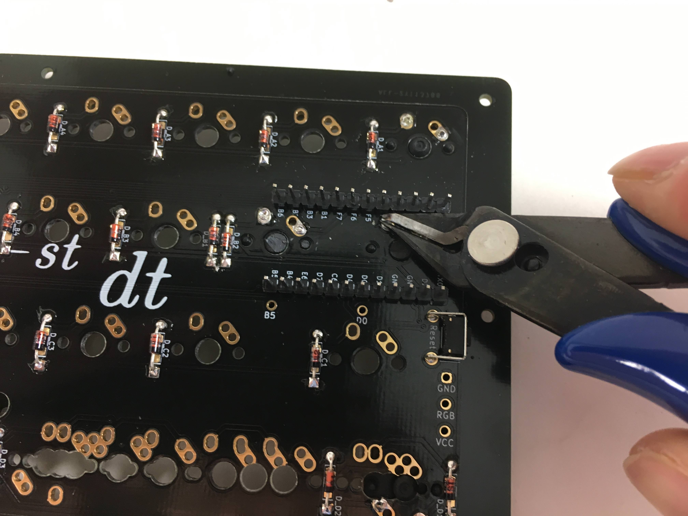

Clip the switch pins for the 2 switches that sit on top of the Pro Micro so that they won't come in contact with the Pro Micro components.

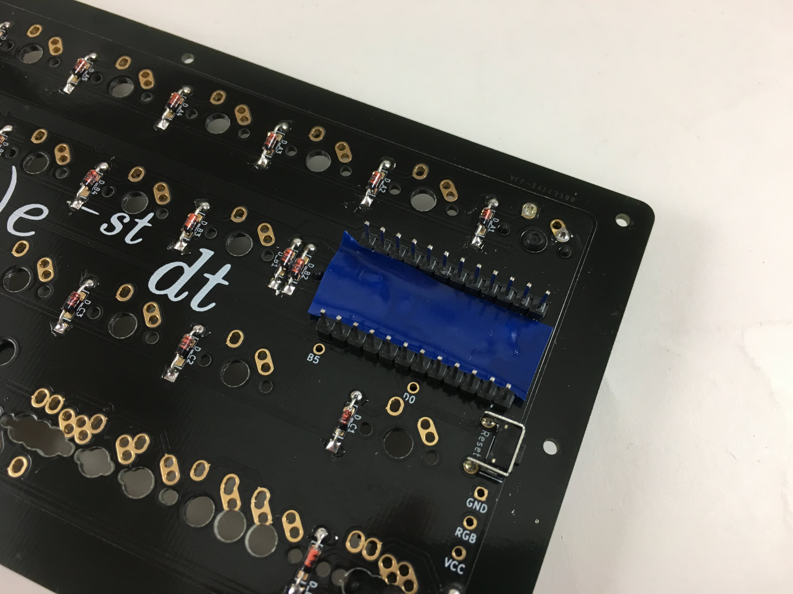

You may want to add a piece of electrical or Kapton tape on top of the pins before putting the Pro Micro on.

Go flash your Pro Micro before adding it to the PCB to make sure that it works and can be flashed.

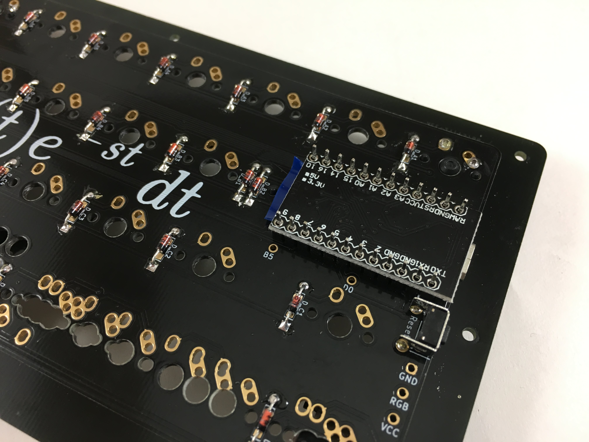

Put the tested Pro Micro on and solder.

The plug the board in and test the switches you added.

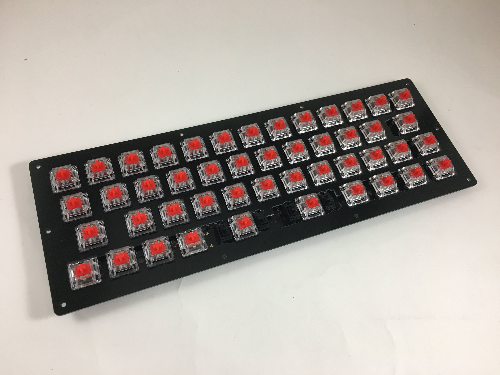

Add the rest of the switches and assemble the case by adding the screws, standoffs, and bottom plate. Enjoy the 40% life!
