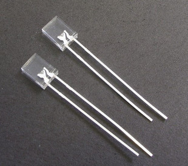
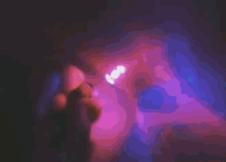

For keyboards, there are various lighting options available, and the different types of lighting can be difficult to understand. Hopefully, this will clear it up for you.

There are a few different factors for lighting:
- Lighting direction/location
- Single-color vs. RGB
- Group control vs. Individual control
- North-facing vs. South-facing switches

### Lighting location/direction

First, you can have light pointing in various directions. Here are the different options for that:

- In-Switch - An LED is placed inside or through the switch housing and faces upward
- Indicator light - An LED is placed somewhere on the board, not on a switch. Examples: Num Lock indicator, Caps Lock indicator
- Underglow - LED is pointing down towards the bottom of the keyboard

## Single-Color vs. RGB

An LED can be a single-color that can't be changed or an RGB LED that can change to a specific color that can be controlled.

### Single-Color LEDs

A single-color LED has two legs/pads on the LED. The two legs goes through the PCB as shown here and then are soldered in and legs clipped.

There are 2-pin LEDs that are called "RGB", but they are not true RGB LEDs in the sense that you can't select the color. Instead, they cycle through all the different colors.

### RGB LEDs

An RGB LED consists of 3 LEDs (red, green, and blue) in one package. These will have 4-pins/legs. There are two types of RGB LEDs, addressable and non-addressable.

Non-addressable RGB LEDs need a separate LED matrix driver chip (such as the IS31FL3731) in order to control the different colors.

Addressable RGB LEDs such as the WS2812 have a built-in LED driver that allows the LEDs to be chained together and individually controlled. These LEDs are called “addressable” because instead of using a wire per color, each LED contains a small microchip that understands a special protocol sent over a single wire. The chip passes on the remaining data to the next LED, allowing them to be chained together. In this way, you can easily control the color of the individual LEDs.

The downside of using these addressable LEDs compared to using the non-addressable LED with an LED driver is that they consume more power, since each LED has its own driver. This limits that number of RGB LEDs that can be used with your board to about 40 total. Reducing the maximum brightness level does allow for more LEDs to be used.

## Control options

LEDs can be controlled in the following manner:

- Group controlled (all on or all off only)
- Individually controlled

### Group controlled

LEDs controlled as a group means that either all of the LEDs are on or are all off. The brightness of them all are the same (unless varying resistor values are used). This control method is commonly used for single-color LEDs.

### Individually controlled

There are two ways that individually controlled LEDs can be used in QMK, as a strip/chain or as a matrix. Using them as a matrix has more interesting effects available, as you are using the LEDs in two dimensions instead of just one. There are also reactive effects in matrix mode, meaning that the LEDs will respond differently depending on which keys are pressed.

#### Strip/Chain

This is commonly used for when you have a strip of WS2812-compatible LEDs. One thing to note with using an LED strip is that if one LED along the strip is faulty, the rest of the LEDs following that one will not work, because it operates as a chain of LEDs. Lighting effects are limited to one-dimension.

Further Reference: <https://docs.qmk.fm/#/feature_rgblight>

#### Matrix

Lighting that uses an LED matrix driver chip will use this method. Addressable RGB LEDs can also use this method as well. Effects are in two-dimensions.

Below is a video demonstrating most of the effects available.

<iframe width="560" height="315" src="https://www.youtube.com/embed/7f3usatOIKM" title="YouTube video player" frameborder="0" allow="accelerometer; autoplay; clipboard-write; encrypted-media; gyroscope; picture-in-picture" allowfullscreen></iframe>

Further Reference: <https://docs.qmk.fm/#/feature_rgb_matrix>

## Additional References

[In-depth explanation of RGB lighting, in-switch vs. underglow, and how to purchase what you want.](https://www.reddit.com/r/MechanicalKeyboards/comments/ba8zgb/indepth_explanation_of_rgb_lighting_inswitch_vs/)
