## Build Compatibility

This build guide is exclusively for the Nyquist LM, which can be configured with either 4-rows or 5-rows.

## Parts List

Get your parts ready:

* [Nyquist LM Kit](https://keeb.io/products/nyquist-lm-keyboard-kit?utm_source=docs)
  * PCBs
  * Tray Case
  * Silicone liners
  * O-rings
  * Switch plates
  * Switch plate support foam
  * 8mm M2 screws
  * Shroomie feet
* [USB-C to USB-C cable](https://keeb.io/products/usb-c-to-usb-c-cable)
* [Low-Profile Kailh Choc Switches](https://keeb.io/collections/switches?filter.p.m.keyboard.switch_compatibility=Choc+V1+Low-Profile&filter.p.m.keyboard.switch_compatibility=Choc+V2+Low-Profile&sort_by=best-selling&utm_source=docs) - Choc V1 or V2

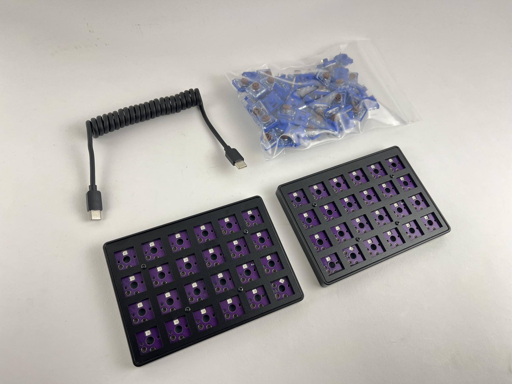

## Build Steps Summary

1. Inspect/Test Parts
2. Add switches
3. Assemble Case
4. Board Notes

## Inspect/Test Parts

The left and right halves of the Nyquist LM may look identical, but they are not interchangeable. Make sure to identify which is which before proceeding. The way to tell them apart is by looking at the underside of the case where the reset button is located. There, you will see either "L" or "R", indicating which side is left or right.

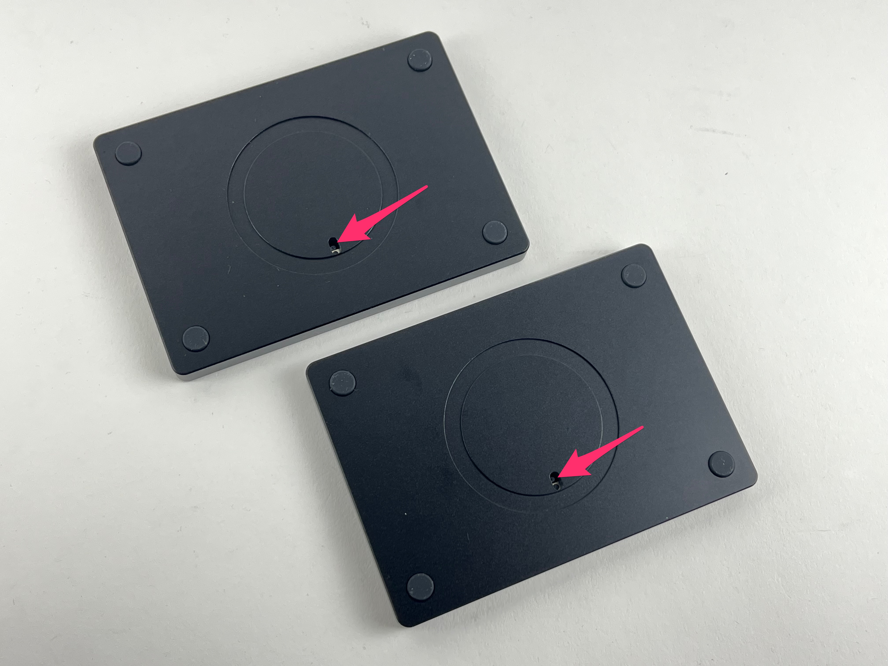

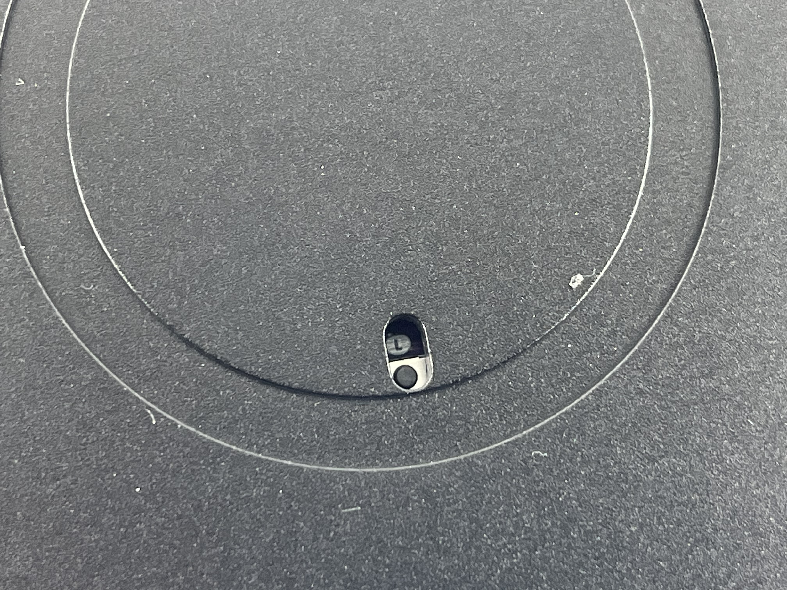

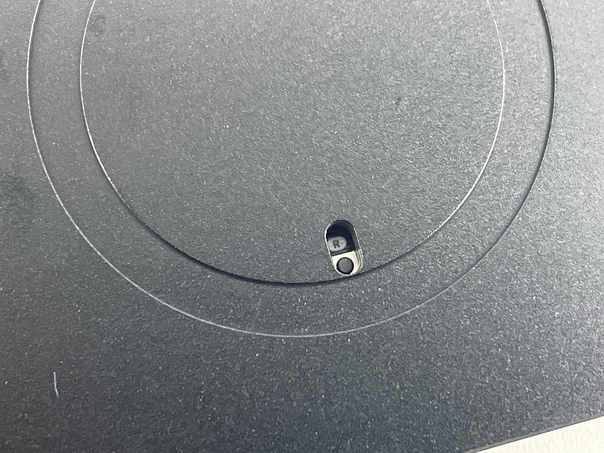

Before starting assembly of the board, check if there's any issues with the parts in the keyboard kit.

Plug in the USB-C link cable in between halves and plug in the USB-C cable from your computer to the left half. Both halves should light up. Do the same with plugging into the right half.

If both halves don't light up, check that you haven't mixed up the left and right halves and that you are not using a charging-only USB-C cable.

Optional: Unscrew the switch plate and inspect that there is switch plate support foam, silicone tray liners, and o-rings on the mounting points. See [Full Breakdown](#full-breakdown) for more information.

## Add switches

To insert a switch, make sure the pins line up with the hotswap socket on the PCB.

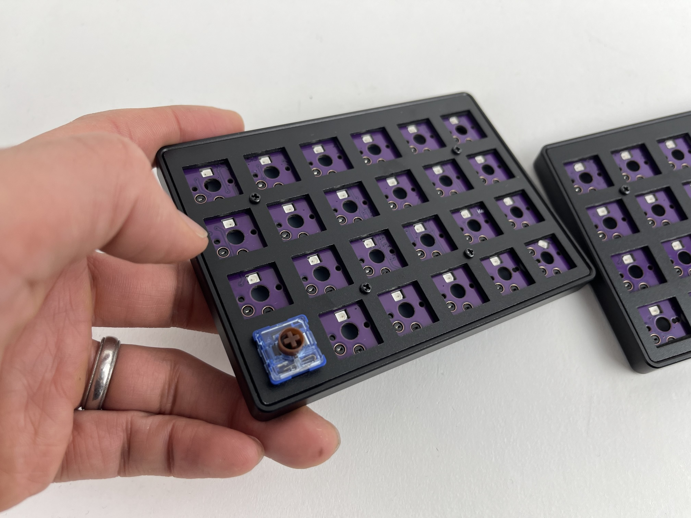

Then push down on the part of the switch that is above the pins until it clicks into place.

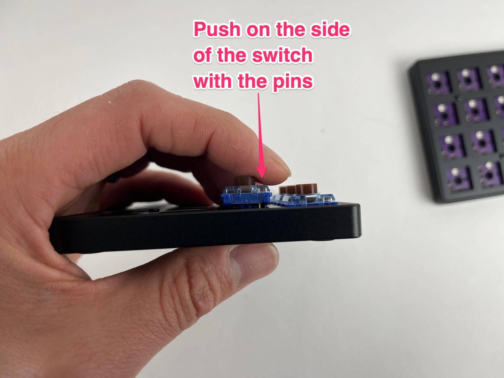

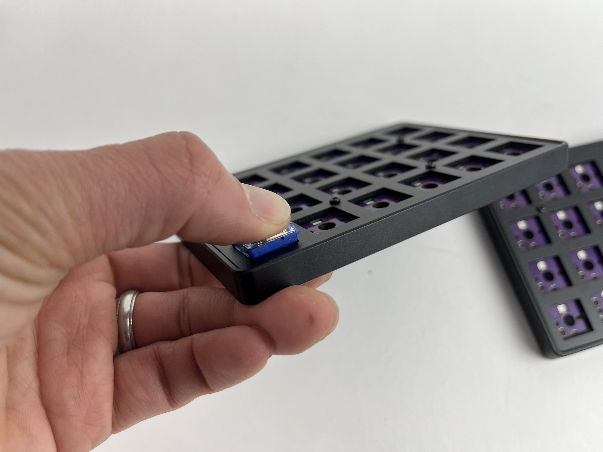

Add the rest of the switches.

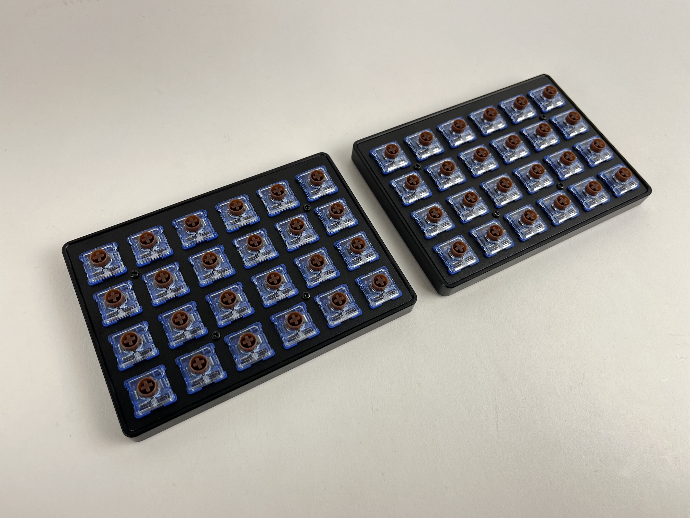

## Test keys

Before reassembling the case, plug the USB cable into the PCB and test all of the keys to make sure everything is working, as it'll be easier to fix switch issues now than later.

It's best to test using the [Key Tester in VIA](via#key-tester-tab) with `Test Matrix` mode on, as this will let you test the Lower and Raise keys properly.

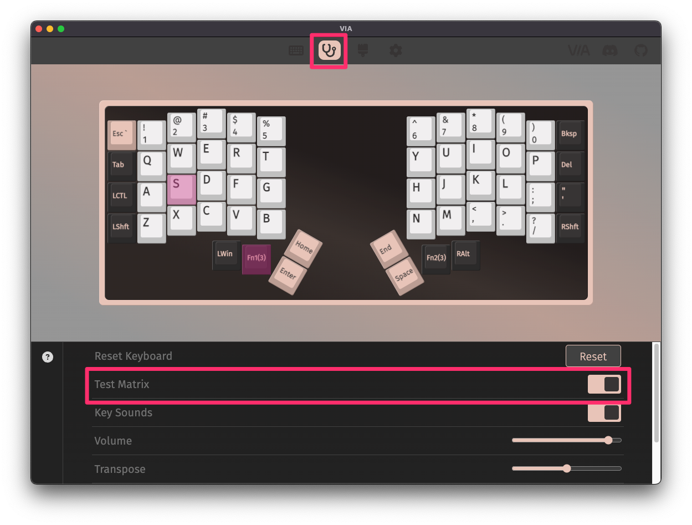

If a key is not working, check that the switch is inserted properly and that the pins are aligned with the hotswap socket. Sometimes, a pin can get bent during insertion, which can cause the switch to not work.

## Add Keycaps

Add keycaps to all of the switches.

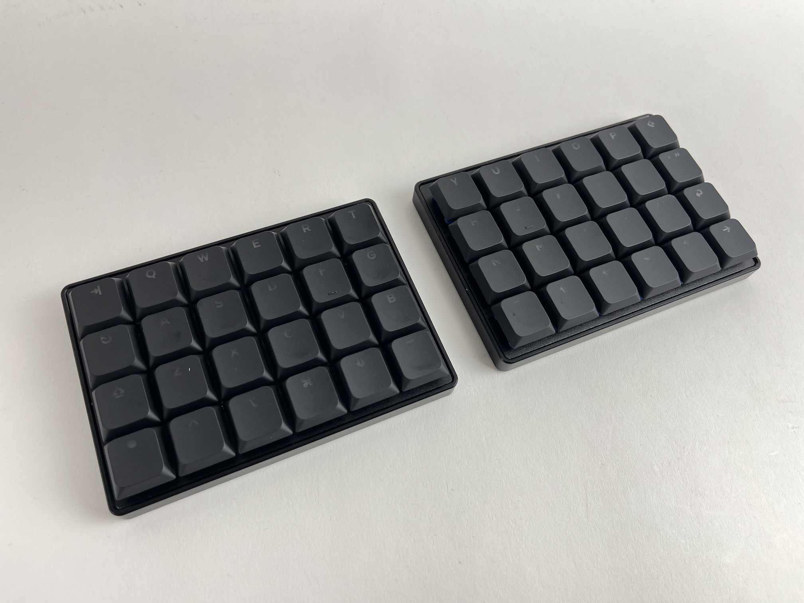

Plug it in and type away!

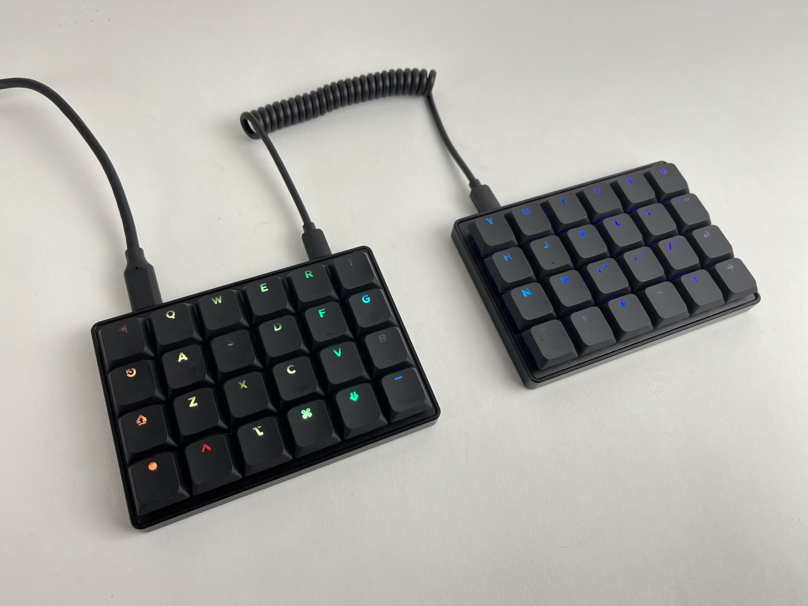

## Default Keymap

Here's the default keymap if you need it: [Nyquist LM Default Keymap](https://github.com/nooges/qmk_userspace_via/blob/main/keyboards/keebio/nyquist_lm/keymaps/via/keymap.c)

## Remapping/reprogramming Board

Looking to remap/reprogram your board? Check out our guide for [remapping your keyboard](remapping-keyboard).

While the bottom plates have a hole at the bottom to allow you to access the reset button to allow your Nyquist LM to be reflashed if you are using QMK, if you don't want to be flipping your board over to press reset, you can also use one of the following options when remapping your Iris:

1. Use [VIA](via.md) to remap your keys. The stock firmware on the Nyquist LM already has VIA support enabled. This allows you to remap the keyboard without having to reflash the board.
2. If you are not using VIA and are using QMK instead, use the `QK_BOOT` keycode to reset the keyboard to allow it to be reflashed without needing to physically press the reset button on the PCB. The default way of using `QK_BOOT` is by pressing `Lower` + `Raise` + `1`.

For reference, the Nyquist LM PCB uses a STM32G431 microcontroller.

## Turning off RGB LEDs

If you'd like to turn the RGB LEDs off, you can control the [RGB settings in VIA](via#lighting).

## Full Breakdown

(Images coming soon)

If you want to fully unscrew the case to check the parts inside, you can unscrew the switch plate and inspect that there is switch plate support foam, silicone tray liners, and o-rings on the mounting points.