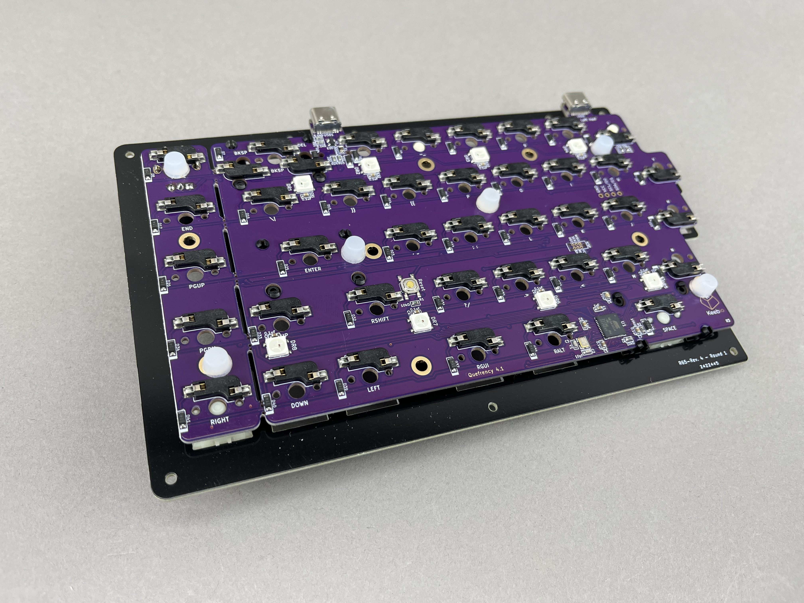

## Build Compatibility

This build guide is for the Quefrency Rev. 4-6, which has Kailh hotswap sockets. If you have the Quefrency Rev. 2 or 3 PCBs, see [Quefrency/Sinc/KBO-5000 Build Guide](quefrency-rev2-sinc-build-guide.md).

### Build Tutorial Videos by Keebio

<iframe width="560" height="315" src="https://www.youtube.com/embed/ONEaWsojIn0" title="YouTube video player" frameborder="0" allow="accelerometer; autoplay; clipboard-write; encrypted-media; gyroscope; picture-in-picture" allowfullscreen></iframe>

## Parts List

Now you've watched some cool videos and feel inspired! Get your parts:

* Set of Quefrency PCBs
  * [Rev. 4 PCB Kit](https://keeb.io/products/quefrency-rev-4-65-split-staggered-keyboard?utm_source=docs)
  * [Rev. 5 PCB Kit](https://keeb.io/products/quefrency-rev-5-pcbs-hotswap-65-65xt-split-staggered-keyboard?utm_source=docs)
  * [Rev. 6 PCB Kit](https://keeb.io/products/quefrency-rev-6-pcbs-hotswap-65-65xt-split-staggered-keyboard?utm_source=docs)
* Plates for Quefrency
  * [FR4 Plates](https://keeb.io/products/quefrency-fr4-plates)
  * Aluminum Plates - Coming soon
* [USB-C to USB-C cable](https://keeb.io/products/usb-c-to-usb-c-cable) (for boards that use USB-C for interconnect)
* Switches (MX-compatible ones)
* [2u PCB mount MX stabilizers](https://keeb.io/products/cherry-mx-stabilizer) if using 2u/2.25u/2.75u keys
* [Rotary Encoder](https://keeb.io/products/rotary-encoder-ec11) and [Knob](https://keeb.io/products/rotary-encoder-knob-ec11)
* [FLAHNS Hotswap Bumpers](https://keeb.io/products/flahns-5mm-hotswap-silicone-bumpers) (recommended)

## Build Steps Summary

1. Break off PCB sections
2. ANSI to ISO Enter Conversion (optional)
3. Solder [rotary encoder](glossary#rotary-encoder) (optional)
4. Add 2u [stabilizers](glossary#stabilizers) to [PCB](glossary#pcb)
5. Add switches
6. Assemble!
    * Screw [standoffs](glossary#standoffs) into switch plate
    * Attach bottom plate using screws
7. Re-Programing Board Note
8. Rejoice!

## Break Off PCB Sections

If you're going to go with a layout without the left macro section or right macro column, then break off those portions of the PCB. No special tools or methods are required, you can just break it off with your hands as shown below:

<video width="100%" controls muted loop>
  <source src="/videos/pcb-break.mp4" type="video/mp4" />
</video>

## ANSI to ISO Enter Hotswap Conversion

If you are using a regular Enter key, then skip ahead: [Skip to Next Step](#solder-rotary-encoder)

Because of the limitations of where the hotswap sockets could be placed, only the ANSI Enter layout is supported out of the box.

To convert the right half of the board to support ISO Enter, you'll need to desolder 2 of the hotswap sockets and relocate them to the appropriate locations for ISO Enter support.

### Tools Needed

- Soldering iron
- Solder
- Tweezers, pen, or some other pointy object

### Desolder Sockets

Below is the location of the two sockets that will need to be moved.

#### Step 1 - Add solder to sockets

The first thing you'll need to do is add solder to both pins of the socket. This will make the socket easier to desolder, as the temperature needed to melt the solder on the socket will be less, which makes it easier to work with. Be careful to not touch the iron to the plastic of the socket, but it's not a big deal if it accidentally happens.

#### Step 2 - Heat pads and remove sockets

You'll want to be careful here and not use too much force when removing the socket, as you might damage the pads. Heat up one pad with your soldering iron while putting a slight bit of force to start lifting it away from the PCB, try for about 1mm. Do the same for the other pad.

Option 1: You can push up the socket from the top side of the PCB using something like a pen as shown here: 

Option 2: Or, you can use a pair of tweezers to pry up the socket as you're heating it up:

Repeat the process between the two pads until the socket is free.

### Resolder Sockets

Here's where the desoldered sockets should be moved to:

To solder the sockets on, add solder to the top part and bottom parts of the socket pins.

### Update Layout in VIA

If you've using VIA for remapping your Sinc, update the layout selector for ISO Enter support.

Since the ANSI Enter and ISO Enter are not connected together, make you update the keymapping for the ISO Enter key.

#### Step 1 - Adjust layout

First, you'll need to adjust the layout to be ISO Enter. Click on `Layouts` on the left side bar, and then toggle on `ISO Enter`.

#### Step 2 - Adjust keymap

Next, click on `Keymap` on the left side bar, and then click on the ISO Enter key to select it. Then, click on `Enter` in the key selector at the bottom to change it to an Enter key.

## Solder Rotary Encoder

Install the encoder onto the PCB and solder the 2 pins at the top side of the encoder and the 3 pins at the bottom side. The 2 side legs do not need to be soldered to the PCB.

## Add 2u stabilizers to PCB

Add the 2u stabilizers into the PCB. The stab wire will be on the bottom side of the switch for everywhere except for the bottom row. On the bottom row, the stab wire will be above the switch. Do this before installing the switch plate and switches, as stabilizers can not be removed without needing to remove all of the switches.

If you've never put together stabilizers before, see this guide on how to do it: [Stabilizer Handbook](https://imgur.com/gallery/machineabuses-stabilizer-handbook-v1-1-pHK0vhz)

## Add Switches

Now on to the exciting part: putting the switches in the switch plate.

Add switches into the switch plate. It's a good idea to add switches to the corners **first** before installing the rest of them:

Make sure all of the switch pins are straight, or else they will not fit into the hotswap sockets properly and will bend the switch pins and/or damage the hotswap socket and PCB.

Align the PCB over the switch pins, checking again that everything is straight.

Squeeze the switches into the hotswap sockets, it should not take very much force at all.

If you encounter a bent switch pin like below, bend it back with your fingers or a tweezer.

After the first few switches have been inserted, add the rest of them.

## Assemble!

Now that all of the switches are in, install the standoffs. Insert a screw through the top of the switch plate and attach a standoff from the bottom side of the plate

### Add FLAHNS (optional)

Add FLAHNS bumpers to underside of PCB to help support it up (see video below). About 4-6 for each half with work fine.

<iframe width="560" height="315" src="https://www.youtube.com/embed/M0lVrFJ1gDc?si=m9i3LTHaR7cesAt4&amp;start=314" title="YouTube video player" frameborder="0" allow="accelerometer; autoplay; clipboard-write; encrypted-media; gyroscope; picture-in-picture; web-share" referrerpolicy="strict-origin-when-cross-origin" allowfullscreen></iframe>

### Supporting the Encoder

If you installed an encoder, you will need to add one of the FLAHNS or piece of foam about 3-4mm thick that will sit in between the bottom of the PCB and the bottom plate. This will prevent the PCB from dislodging from the switches when pressing down on the encoder.

Put the bottom plate on top of the standoffs and screw it on.

All done now, repeat for the other half of the board!

## Default Keymap

Here's the default keymap if you need it: [Quefrency Default Keymap](../static/layouts/keymap_Quefrency_rev3.pdf)

## Re-Programming Board Note

Oh, looking to re-program your board? Never fear! Come look [here](flashing-firmware).

## Rejoice!

You have a keyboard! Savor this moment of victorious keyboard construction.
