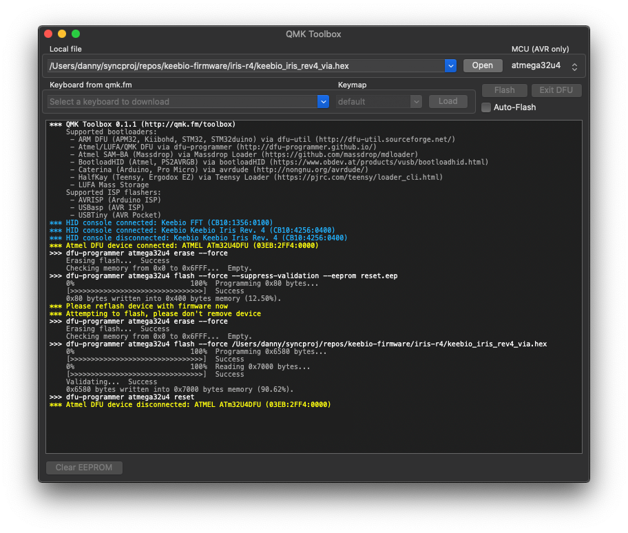
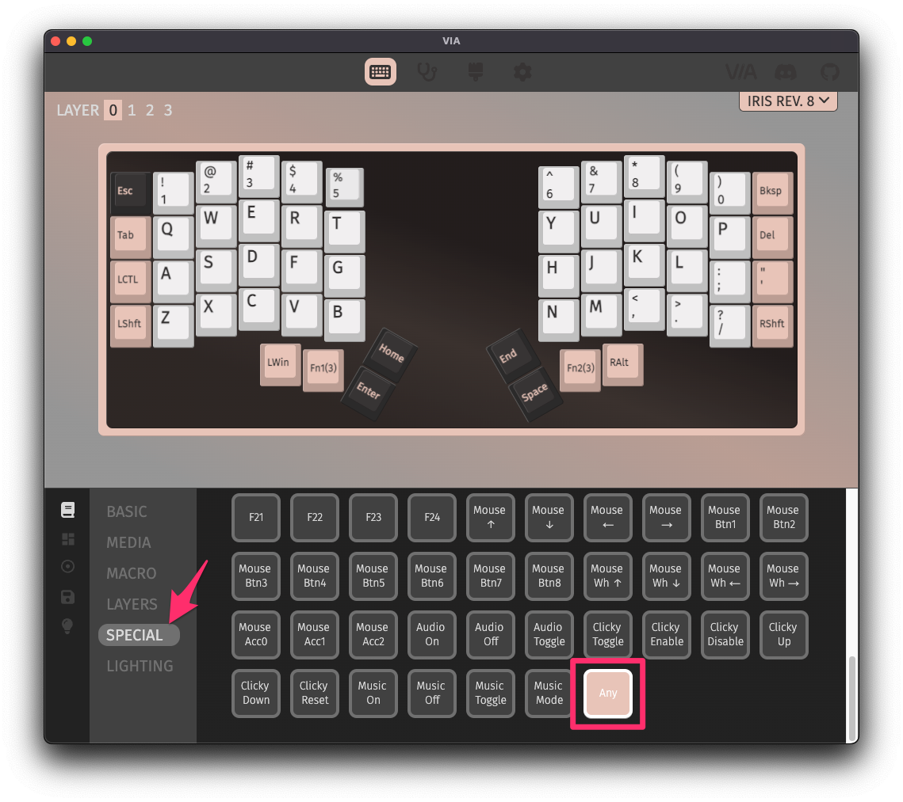
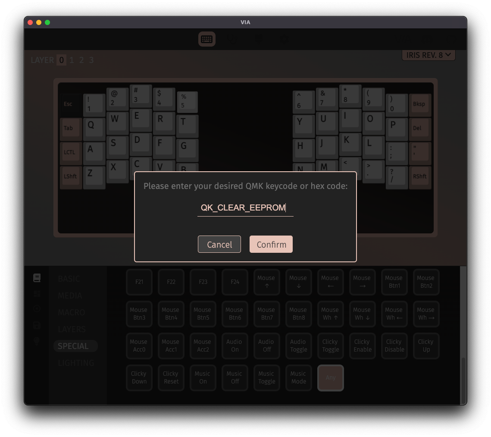
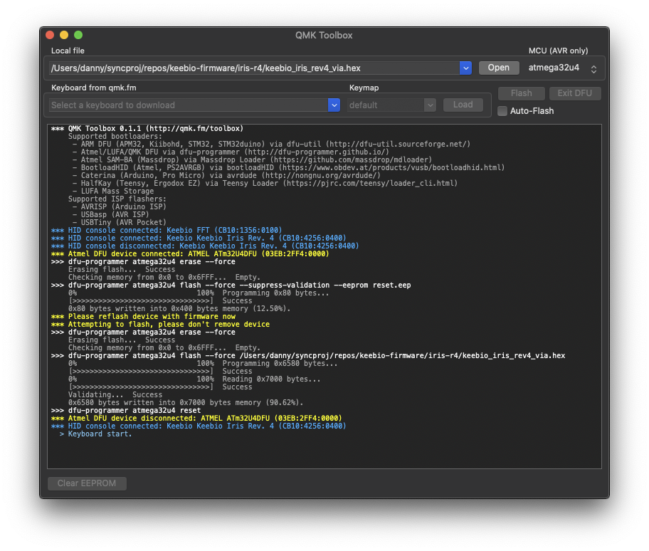

Sometimes you'll want to clear the EEPROM on your board to clear out all of the settings and start fresh. For example, you might have played around with RGB colors/settings and put it into a state you want to get out of. Or, your board is getting weird phantom presses of keys not even in your base layer keymap. Resetting EEPROM can help in these cases.

## What is EEPROM?

EEPROM stands for **E**lectrically **E**raseable **P**rogrammable **R**ead-**O**nly **M**emory. It stores settings for your keyboard that can be changed on-the-fly without reflshing your board. Some of the settings that it stores includes RGB configuration, persistent layers, backlight state, and VIA keymaps.

## How to clear/reset EEPROM

To clear the EEPROM on your board, first, you'll need to know which microcontroller is present on your board. Please see the section on [Determining Bootloader](flashing-firmware#determining-bootloader) for some more information on this.

### For ATmega32u4-based boards

First open up [QMK Toolbox](https://github.com/qmk/qmk_toolbox). Make sure you download the [latest release here](https://github.com/qmk/qmk_toolbox/releases).

Next, plug in your keyboard press the reset button on the bottom of your keyboard.

After your keyboard is in DFU mode, as indicated with the yellow text, click on `Clear EEPROM` at the lower-left.

Once the clearing process is complete, move on to the reflashing section of this page.

### For RP2040-based boards

#### Method 1

1. Unplug USB cable
2. Hold top-left key and insert USB cable
3. When `RPI-RP2` device appears, unplug and replug USB cable

#### Method 2

If the firmware on the board has VIA enabled you can assign the "Clear EEPROM" code to one of the keys on your board and then press it to activate it.

1. In the Keymap editor, select a key on the board to remap
2. Click on `Special`
3. Select the `Any` keycode
4. Type in `QK_CLEAR_EEPROM` and click `Confirm`
5. Press the key you just remapped

### For STM32F072-based boards

For keyboards using the STM32F072 like the BDN9 Rev. 2 and DSP40, the STM32F072 microcontroller doesn't actually have real EEPROM in it, so it is emulated instead using flash memory. To clear out the emulated EEPROM in this case, download the [STM32F072 Flash Clearing .bin file](https://raw.githubusercontent.com/keebio/keebio-firmware/master/stm32f072_clear_flash.bin) and open it up in QMK Toolbox. Then press the reset button on the PCB and then click the `Flash` button.

## Reflash after clearing EEPROM

Once the EEPROM has been cleared, you will need to reflash your board with the firmware again. For the firmware that comes stock with Keebio boards, you can download the original .hex files here: [Keebio Firmware](https://github.com/keebio/keebio-firmware). Note: Don't use the files that end with `_bootloader.hex` or `_production.hex`.

