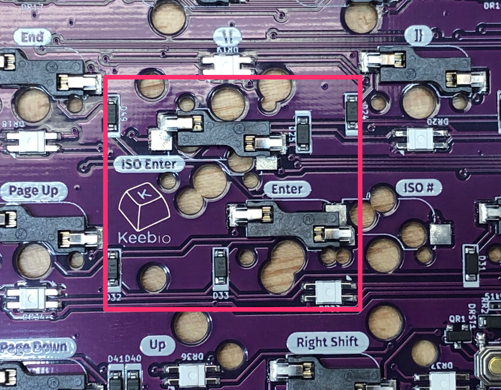
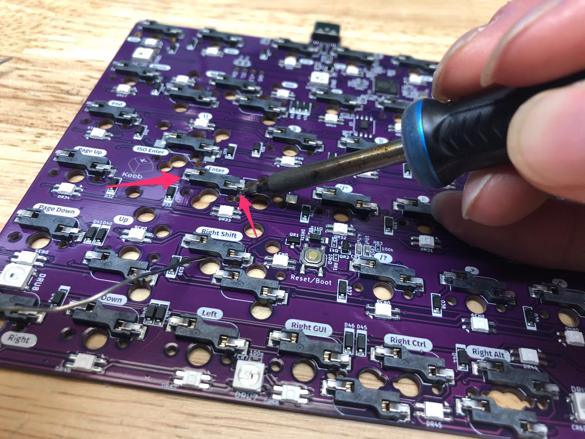
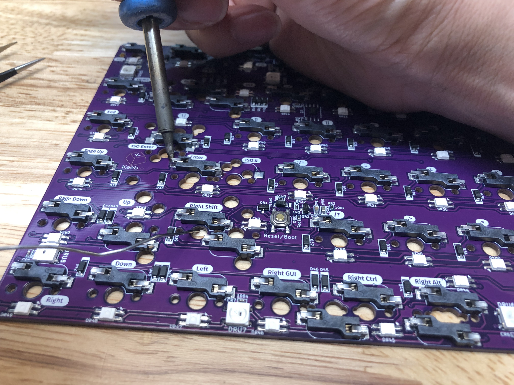
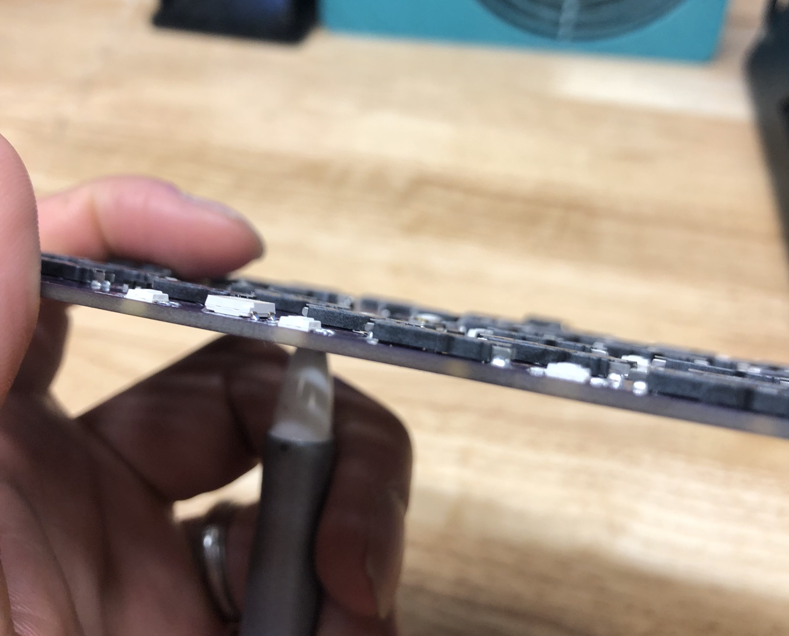
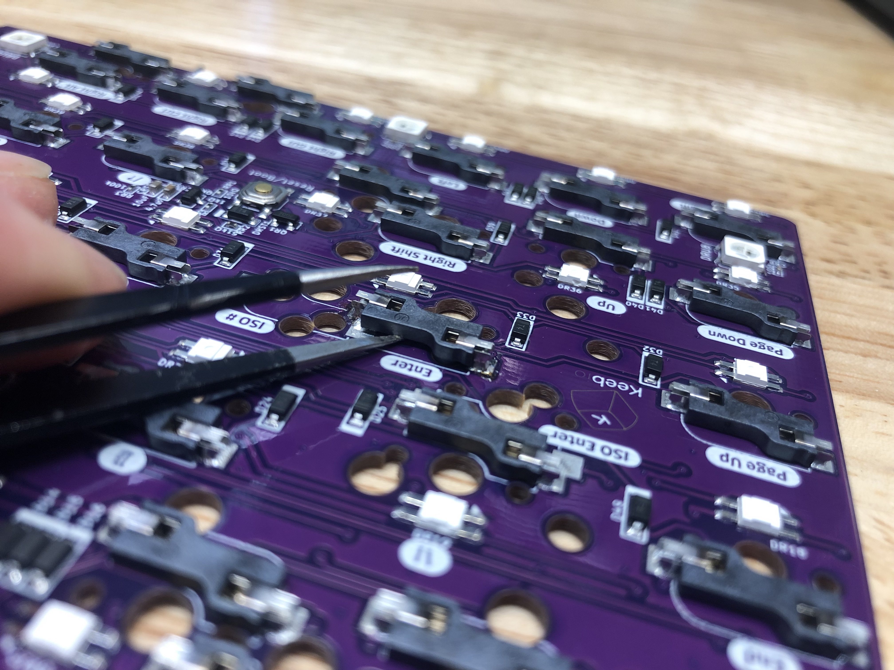
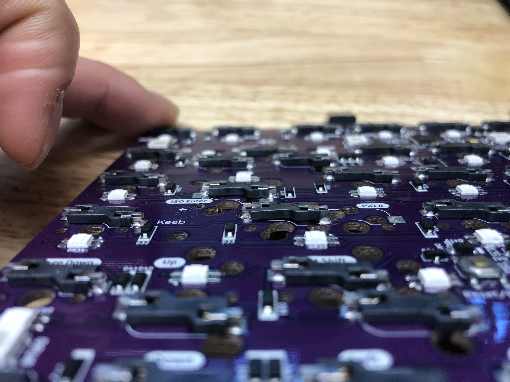
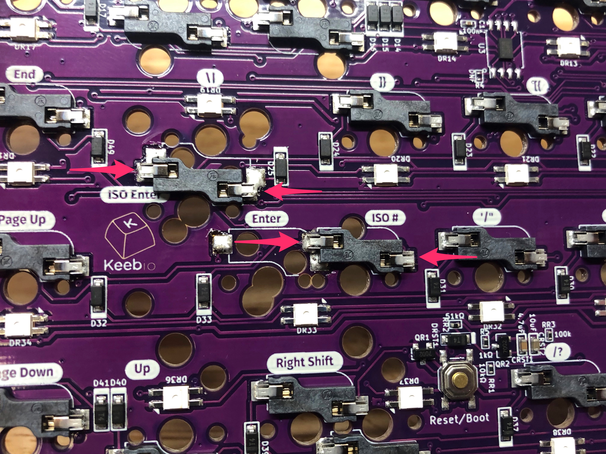
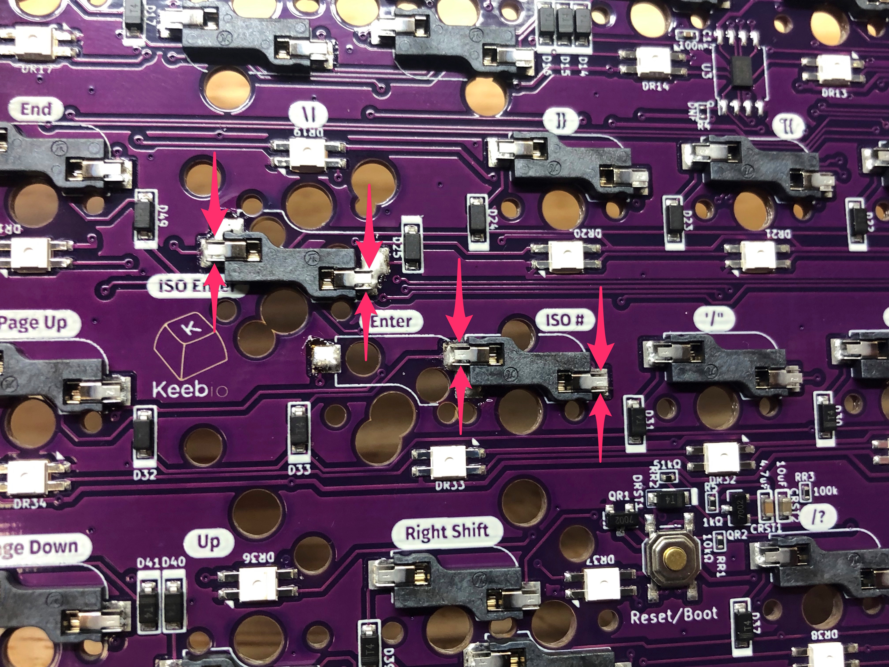
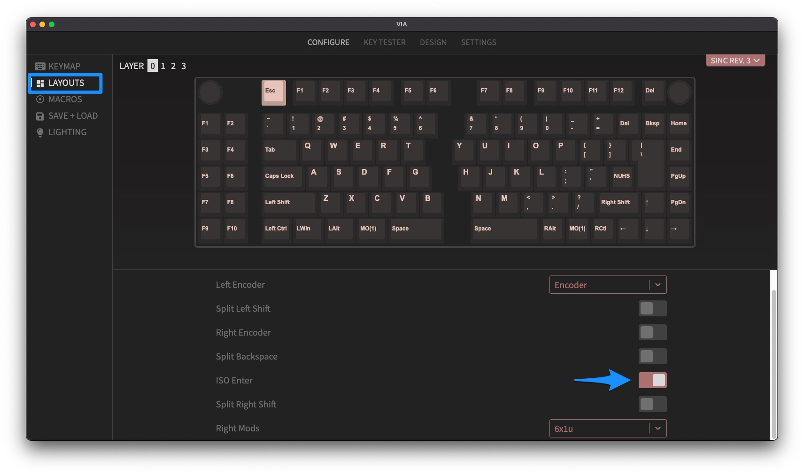
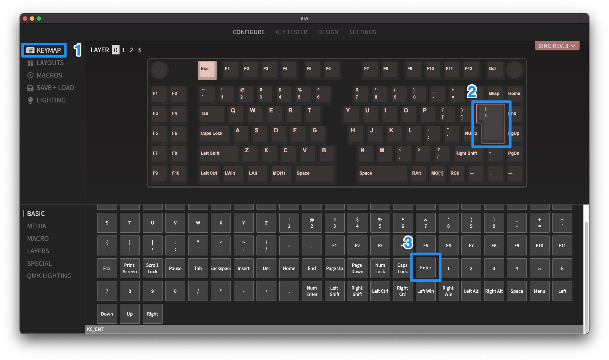

A build guide for the Sinc Rev. 3 is in progress, but due to the similarity of the Sinc Rev. 3 to the Quefrency Rev. 4-5, see the build guide for that instead: [Quefrency Rev. 4-5 Hotswap Build Guide](quefrency-hotswap-build-guide.md)

## ANSI to ISO Enter Hotswap Conversion

Because of the limitations of where the hotswap sockets could be placed, only the ANSI Enter layout is supported out of the box.

To convert the right half of the board to support ISO Enter, you'll need to desolder 2 of the hotswap sockets and relocated them to the appropriate locations for ISO Enter support.

### Tools Needed

- Soldering iron
- Solder
- Tweezers, pen, or some other pointy object

### Desolder Sockets

Below is the location of the two sockets that will need to be moved.

#### Step 1 - Add solder to sockets

The first thing you'll need to do is add solder to both pins of the socket. This will make the socket easier to desolder, as the temperature needed to melt the solder on the socket will be less, which makes it easier to work with. Be careful to not touch the iron to the plastic of the socket, but it's not a big deal if it accidentally happens.

#### Step 2 - Heat pads and remove sockets

You'll want to be careful here and not use too much force when removing the socket, as you might damage the pads. Heat up one pad with your soldering iron while putting a slight bit of force to start lifting it away from the PCB, try for about 1mm. Do the same for the other pad.

Option 1: You can push up the socket from the top side of the PCB using something like a pen as shown here: 

Option 2: Or, you can use a pair of tweezers to pry up the socket as you're heating it up:

Repeat the process between the two pads until the socket is free.

### Resolder Sockets

Here's where the desoldered sockets should be moved to:

To solder the sockets on, add solder to the top part and bottom parts of the socket pins.

### Update Layout in VIA

If you've using VIA for remapping your Sinc, update the layout selector for ISO Enter support.

Since the ANSI Enter and ISO Enter are not connected together, make you update the keymapping for the ISO Enter key.

#### Step 1 - Adjust layout

First, you'll need to adjust the layout to be ISO Enter. Click on `Layouts` on the left side bar, and then toggle on `ISO Enter`.

#### Step 2 - Adjust keymap

Next, click on `Keymap` on the left side bar, and then click on the ISO Enter key to select it. Then, click on `Enter` in the key selector at the bottom to change it to an Enter key.

## Reflashing Board

If you'd like to reflash your Sinc, since it has a RP2040 controller on board, follow these instructions: [Flashing RP2040 Board](flashing-firmware#rp2040-board-uf2-bootloader)