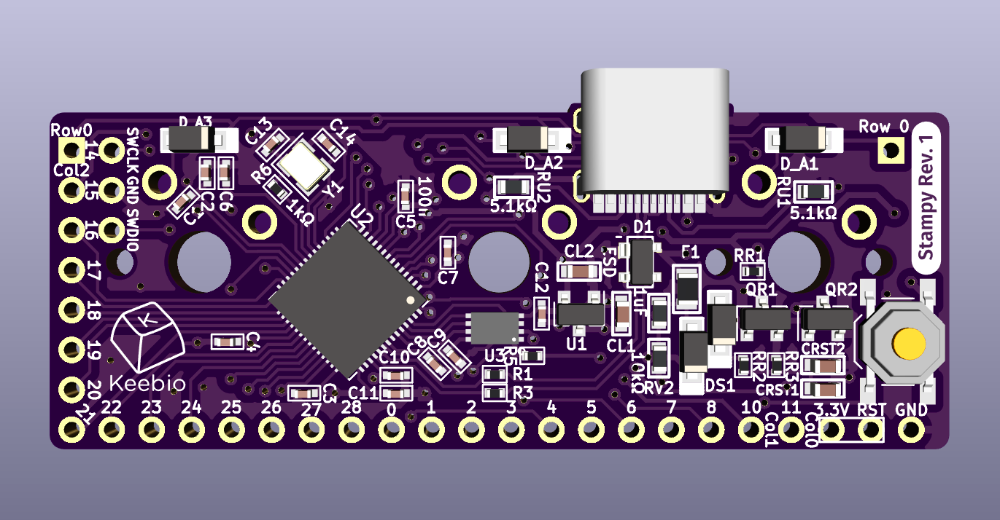

The Stampy is a controller board meant to assist with the construction of a handwired keyboard. Instead of using some other daughterboard like the Pro Micro, Elite-C, etc., Stampy gets soldered directly to 3 switches, meaning that no extra space below the controller is needed.

## Features

- RP2040 Microcontroller
- Compatible with both Cherry MX style switches.
- 26 I/O pins available for your rows and columns, or other IO functions such as LEDs and RGB strips
- 3 pins are preset for columns, and 1 pin is preset for a row
- Can cover well over 100 switches
- USB Type-C connector
- QMK-compatible


## Versions

- Rev. 1 Prototype
  - Black PCB
  - 16Mbit (2MB) of flash memory
  - No VBUS detection circuit
  - Has access to GPIO9 (production version loses this pin due to it being used for VBUS detection)
  - Lack breakout pin for RST (Reset)
- Rev. 1 Production
  - Purple PCB marked with `X3` on top-side of PCB
  - 8Mbit (1MB) of flash memory
  - Has VBUS detection pin on GPIO9

## Pinouts and Assignments



Stampy has the following GPIO pins available: 0-8, 10, 11, 14-28.

4 of the pins are connected to the 3 switch locations in the following way:

- Row 0 - GPIO14 (All 3 switches are connected to Row 0)
- Column 0 - GPIO11 (Left switch)
- Column 1 - GPIO10 (Center switch)
- Column 2 - GPIO15 (Right switch)
- The reset button is connected to RST and 3.3V (not GND)

GPIO9 is used for VBUS detection, so if you are using QMK, make sure you add the following line to your keyboard's `config.h`:

```c
#define USB_VBUS_PIN GP9
```

The rest of the pins (0-8, 16-28) can be used in whatever manner you'd like, such as additional rows/columns or devices like OLED screens and pointing devices.

## Switches

Due to the tight spacing of components, if you are using 5-pin switches, you will need to clip both of the plastic pins for the Center switch and the left plastic pin for the Right switch.
