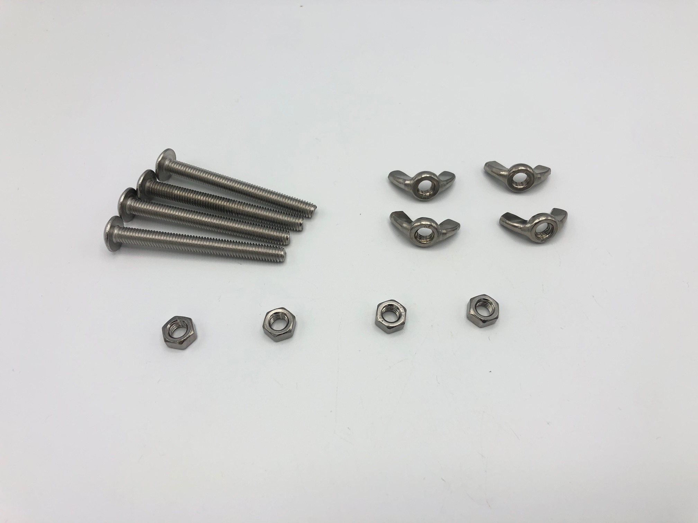
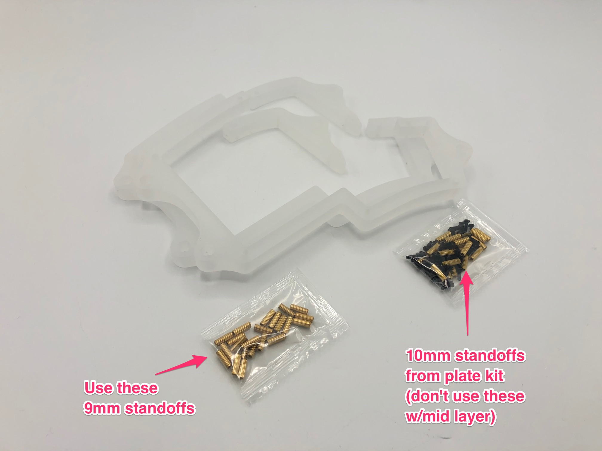
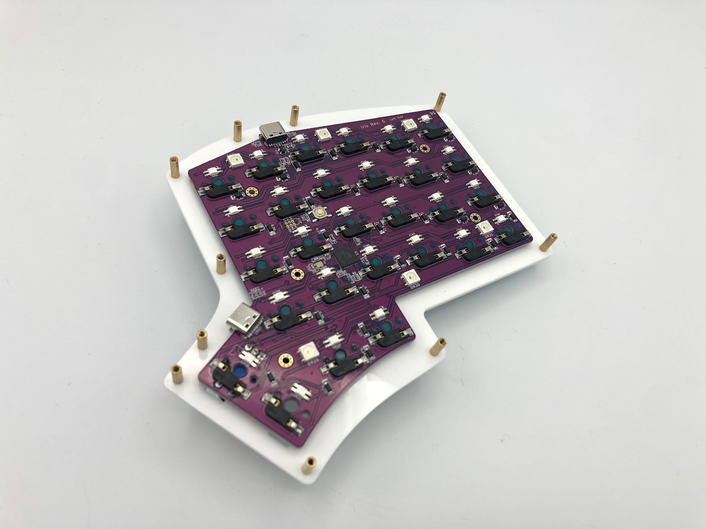
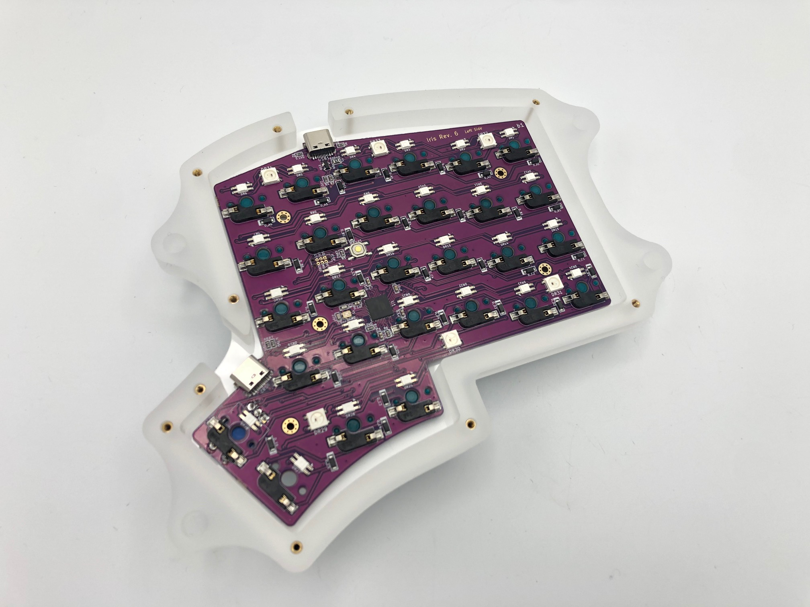
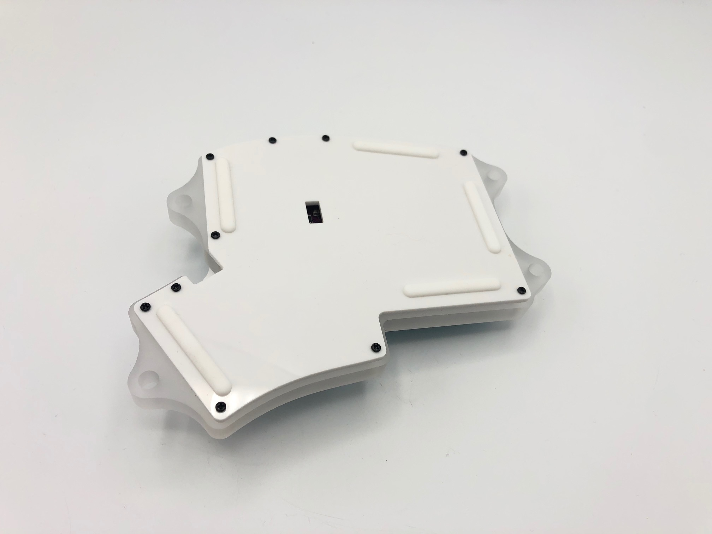
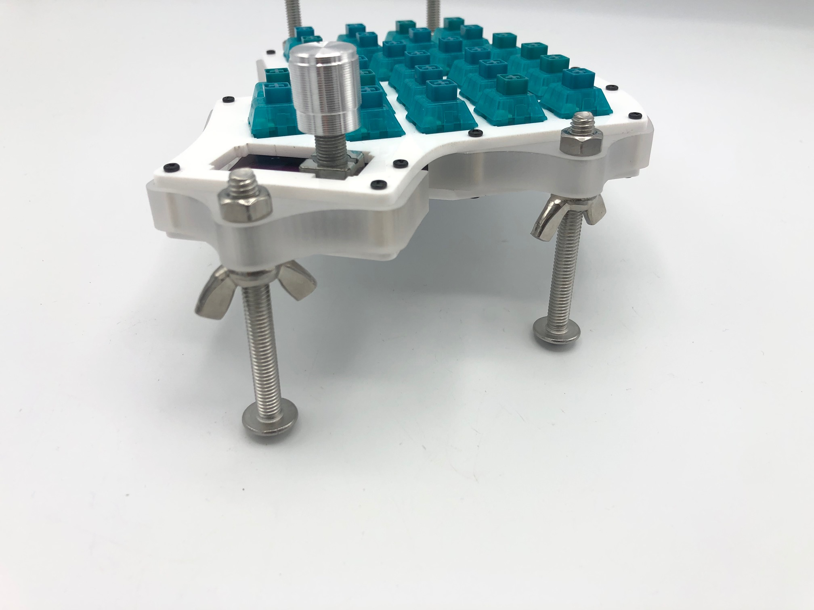
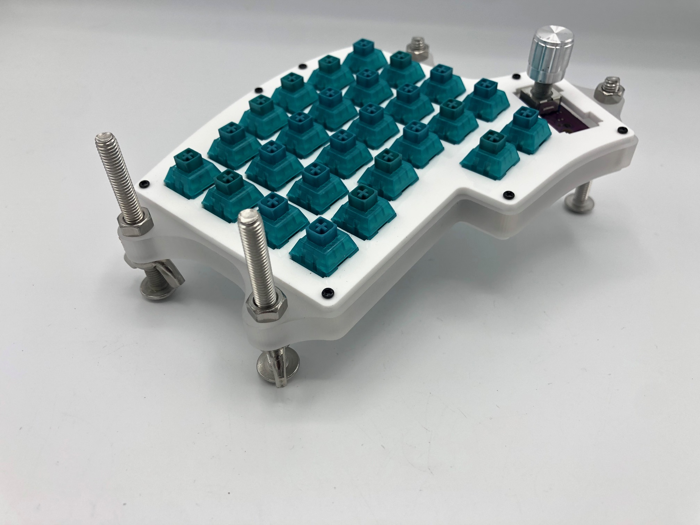
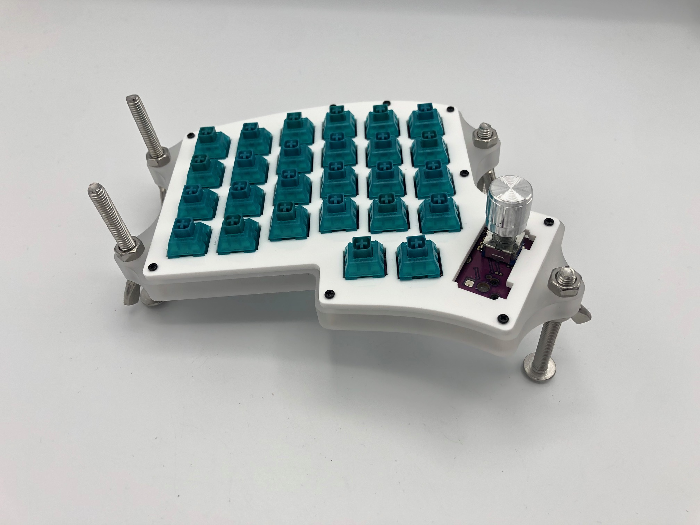

This guide is for the acrylic middle layers that have tenting holes on them.

## Parts List

- Acrylic Middle Layer w/Tenting Holes
    - [Iris](https://keeb.io/products/iris-keyboard-case-plates-phoenix-edition?variant=39471103180894)
    - [Nyquist](https://keeb.io/products/nyquist-case-plates?variant=31021811269726)
    - [Levinson](https://keeb.io/products/levinson-keyboard-case-plates?variant=2150275579934)
- Standoffs from acrylic middle layer kit
- M6 or 1/4" diameter [carriage bolts](https://www.homedepot.com/b/Hardware-Fasteners-Bolts-Carriage-Bolts/1-4-in/N-5yc1vZc2fjZ1z0sg15), nuts, and wingnuts

### Video Tutorial

<iframe width="560" height="315" src="https://www.youtube.com/embed/kxwHtumvQmc" title="YouTube video player" frameborder="0" allow="accelerometer; autoplay; clipboard-write; encrypted-media; gyroscope; picture-in-picture" allowfullscreen></iframe>

## Build Steps

1. Install middle layer
2. Add bolts
3. Adjust bolts

## Install Middle Layer

:::info

If you are using a 3D-printed top shell with your board, ignore this section and use the info about the top shell from the [Iris Rev. 6 build guide](iris-rev6-build-guide#install-top-shell) for instructions.

:::

Make sure that you use the short standoffs that are included with the middle layer kit. Normally, the plate kits will include 10mm standoffs. However, the acrylic middle layers are about 9.5mm thick, so if you use the longer standoffs from the plate kit, the middle layer will rattle. So, 9mm standoffs are included in the middle layer kit, which will prevent the pieces from shifting around.

Attach the standoffs to the switch plate using screws.

Put the middle layer over the standoffs.

Put the bottom plate on and screw it on.

## Add the bolts

First, add wingnuts or nuts to each bolt. Wingnuts are recommended for the underside of the middle layer, as it's easier to make adjustments with them.

Insert the end of the bolts through the middle layer tenting holes and add nuts to the topside of the middle layer to secure the bolts in.

## Adjust the bolts

Loosen or tighten the wingnuts on the bolts until you've got the tenting adjusted to the way you want.

Now you are done!
