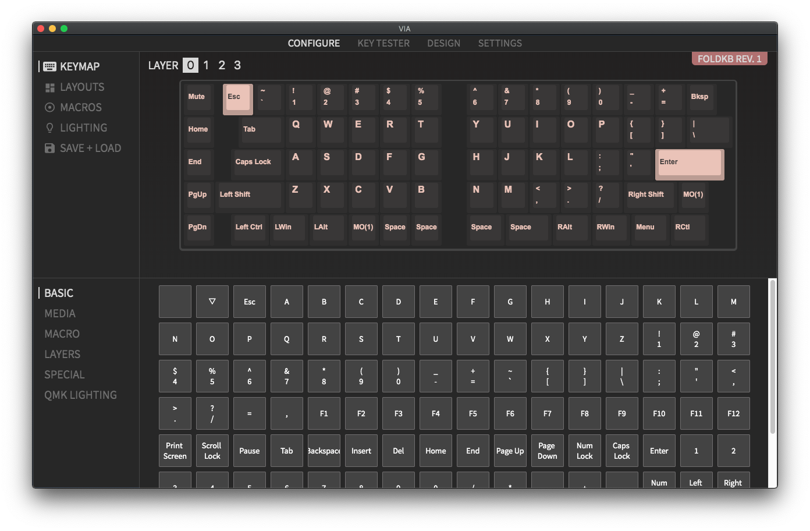

There's sometimes a bit of confusion about what is QMK and VIA, as well as how they relate to each other. Hopefully after reading through this, we'll get you sorted out on what's what and how it applies to your keyboard.

## What is QMK?

Before we dive into what VIA is, let's go over what QMK Firmware is first in case you're not sure. [QMK Firmware](https://qmk.fm) is an open-source keyboard firmware, and most keyboards within the mechanical keyboard community use QMK. QMK also encompasses a suite of other tools, such as [QMK Configurator](https://config.qmk.fm/) and [QMK Toolbox](https://github.com/qmk/qmk_toolbox).

QMK Firmware has a lots of features, like supporting multiple layers, macros, Mod-Tap, mouse keys, split keyboards, backlighting, RGB, etc., which makes is a popular choice for hobbyists.

All of the keyboards released by Keebio so far have QMK support, and Keebio is involved with the QMK organization as a collaborator.

## What is VIA, and how does it relate to QMK?

### Normal QMK Usage

So when dealing with QMK normally, if you want to update your keymap, you modify your keymap code within a QMK build environment and compile it or use something like [QMK Configurator](https://config.qmk.fm/). In either case a .hex/.bin file is generated that then needs to be flashed/reflashed to your keyboard. Setting up a QMK build environment can be a bit complicated for some people, and while the QMK Configurator helps make this process easier, sometimes [flashing a board with firmware](flashing-firmware) can be tricky as well.

### QMK with VIA

This is where VIA steps in. VIA is a feature in QMK that lets you change your keymap on your keyboard without needing to reflash firmware. The changes you make using VIA remain persistent on the keyboard, so even when you unplug and replug your keyboard back in, the keymap settings still remain.

### Parts of VIA

VIA consists of two parts: Firmware and VIA Configurator.

The firmware is for the most part QMK with the `VIA_ENABLE` feature enabled. Note that by default, most keyboards do not have the `VIA_ENABLE` feature enabled. See [below](via#keyboards-with-via-support) for a list of supported keyboards and the firmware files to use.

VIA Configurator is a desktop app that talks to your VIA-enabled keyboard and allows you to remap keys on-the-fly, as well as toggling layout options, programming macros, and controlling lighting.

### VIA Limitations

Do note that not all features of QMK are supported by the VIA Configurator, so if you want to use more advanced features of QMK like Tap Dance, then you'll need to setup a [QMK build environment](https://docs.qmk.fm/#/newbs_getting_started). By default on most VIA-supported keyboards, there is a limit of 4 layers. This can sometimes be increased, but once again, this requires setting up a QMK build environment.

The ability to change rotary encoder keycodes is also not currently present in VIA.

## Keyboards with VIA Support

Here's a list of keyboards with VIA support: [Supported Keyboards](https://caniusevia.com/docs/supported_keyboards). Note that just because your keyboard is listed there doesn't mean that you can immediately use VIA Configurator with it. The firmware flashed to the keyboard must have VIA support enabled, and you can find pre-compiled .hex/.bin firmware files with VIA support here: [VIA Firmware Downloads](https://caniusevia.com/docs/download_firmware).

## Adding VIA support to a keyboard

Adding VIA support to a keyboard is not particularly straight forward, but if you are interested in doing so and have good working knowledge of QMK, checkout [MechMerlin's videos](https://www.youtube.com/channel/UCdfrYMwAJ8LHvy8-j_WIxAw) on his efforts to [add VIA support to various boards](https://www.youtube.com/results?search_query=Porting+VIA+Ports).
