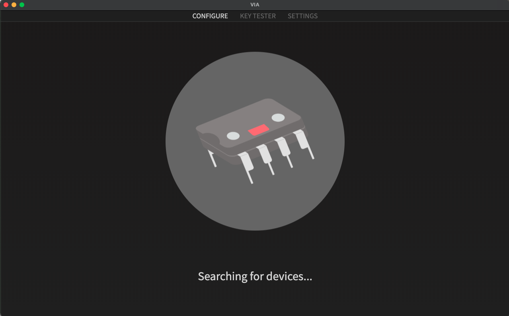
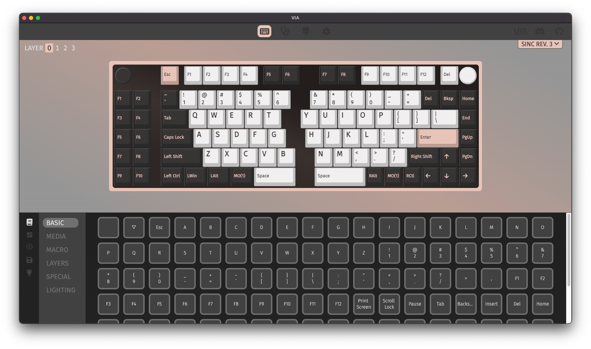
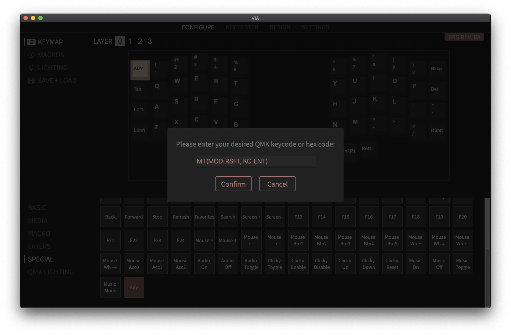
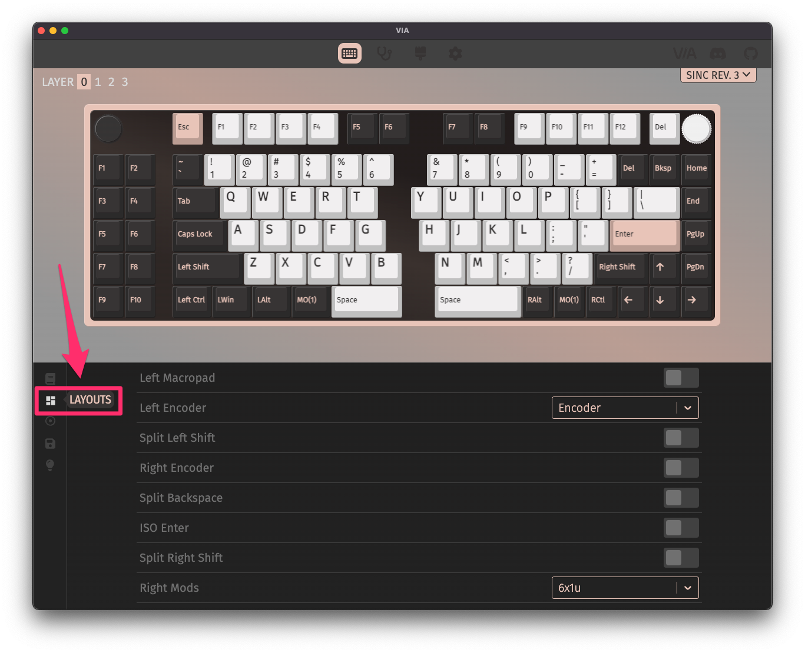
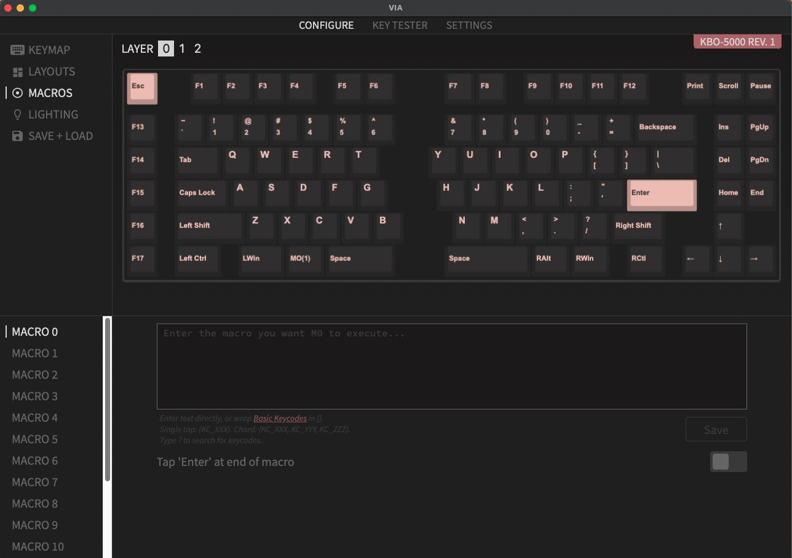
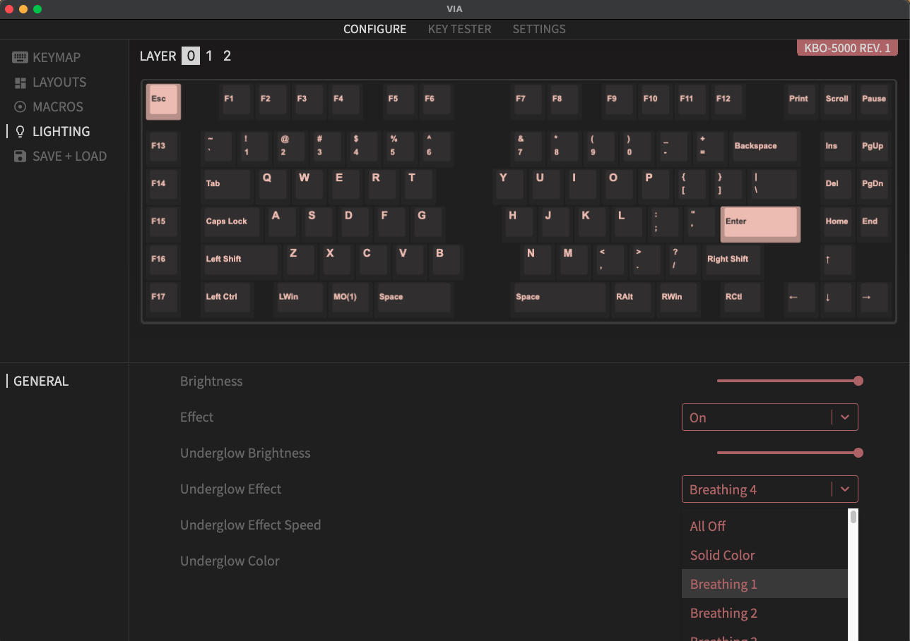
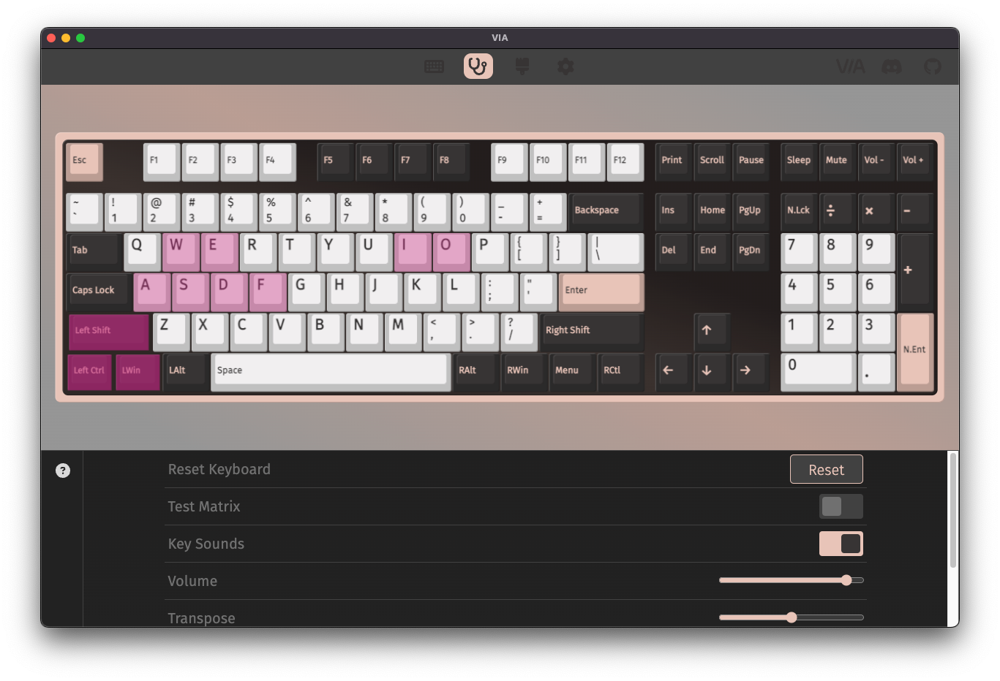
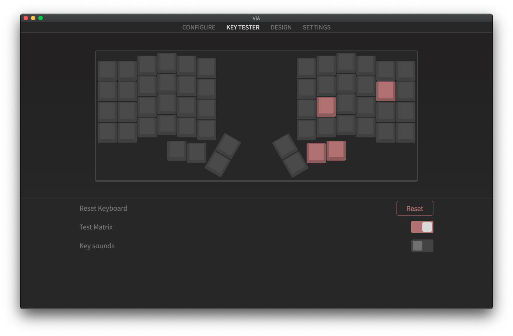

[VIA Configurator](https://www.caniusevia.com/) is a desktop app that talks to your VIA-enabled keyboard and allows you to remap keys on-the-fly, as well as toggling layout options, programming macros, and controlling lighting.

For info on how VIA relates to the underlying QMK Firmware, see this for more details: [VIA and QMK Firmware](via-technical)

## Is my keyboard supported by VIA?

Here's a list of keyboards with VIA support: [Supported Keyboards](https://caniusevia.com/docs/supported_keyboards). Note that just because your keyboard is listed there doesn't mean that you can immediately use VIA Configurator with it. The firmware flashed to the keyboard must have VIA support enabled, and you can find pre-compiled .hex/.bin firmware files with VIA support here: [VIA Firmware Downloads](https://caniusevia.com/docs/download_firmware).

## Getting VIA

To download the VIA Configurator app, you can go to the releases page here: [VIA Releases](https://www.github.com/the-via/releases/releases/latest). The app is available for Windows, macOS, and Linux.

## Launch VIA

It is recommended that _after_ you open VIA to plug in your keyboard. Once you connect your keyboard, you should see your keymap like below:

If your keyboard does not load, then check again that the firmware flashed to your board has VIA support enabled.

You'll want to be on the **Configure** tab (at the top) to verify a few things before testing your keys.

## Configure Tab

At the top left, you'll see some options available to choose from:

- Keymap - Edit your keymap
- Layouts - Adjust layout options
- Macros - Specify what a macro outputs
- Lighting - Control backlighting and RGB underglow if available
- Save + Load - Backup your layout to a file on your computer

## Keymap

The **Configure** tabs shows your keymap, and you can select different layers to edit. The main layer is 0.

You can click on a layer to edit it and select the key on your keyboard you want to change. There are various groups of keycodes at the lower left that you can set each key to:

- Basic
- Media
- Macro
- Layers
- Special
- QMK Lighting

### Basic

These are your basic keycodes, like letters, numbers, symbols, arrow, and modifiers.

The first two squares in the selection area are:

- `KC_NO` (Empty): Nothing is sent
- `KC_TRNS` (Upside Triangle): Pass-through, meaning whatever is mapped to that key on the next lower layer is sent

If you are a macOS user, `Win/GUI` is equivalent to `Cmd/Command`, while `Alt` is equivalent to `Opt/Option`.

### Media
If you're looking for volume and music/movie oriented controls, this section has you covered!
        
### Macro
You have 16 macro keys to do with what you will! Select a layer, then a key above and then select what macro you'd like to apply.

See the [Macros](#macro-1) section to configure the macro.

### Layers
If you hover over a layer option, VIA will give you a brief bit of information about what it does. For more in-depth knowledge about what a layer is and how to use them, see [A Primer on Layers](https://thomasbaart.nl/2018/12/06/qmk-basics-how-to-add-a-layer-to-your-keymap/#A_primer_on_Layers).

Some terms to know about turning layers on and off:

#### MO(layer)
Most commonly used layer keycode. This momentarily activates the desired layer while you are holding down the key. Once released, the keyboard goes back to its original layer.

#### TG(layer)
Toggles a layer on and off. Similar to Num Lock.

#### DF(layer)
This turns on and off your base layer. Most folks usually have their alphas, but if you're reserving your keyboard for gaming, you can use this to maintain a custom game layer to remain active. Game on, friends!

#### TO(layer)
This turns on one layer. BUT! Be aware this doesn't toggle _back_, so you need to program a key on this layer to get yourself back. Or be stuck in Kansas. Your choice.

#### OSL(layer)
This temporarily activates a layer until you press the next key. OSL, standing for "one-shot layer". This is generally if you want to do one thing and then jump back to what you were doing before without having to hold down the layer key.

#### TT(layer)
Smush MO and TG together and you get this. holding a key down activates the layer and it releases the layer as the key does. You can configure how many times it needs to be pressed to turn the layer on or off.

### Special
In this section you can enable language changes as well as operations that usually take a combination of two keys or more and apply it to one key for easy use. Other keycodes here include mousekeys, F13-F24, and symbols.

The last entry here is the `Any` key, which allows you to specify a [QMK Keycode](https://docs.qmk.fm/#/faq_keymap?id=what-keycodes-can-i-use) if one is not listed in any of the groups.

### How to use Any key

The `Any` key can be used to do some more complex keycodes, like ones involving [modifiers](https://docs.qmk.fm/#/keycodes?id=modifiers), [layers](https://docs.qmk.fm/#/keycodes?id=layer-switching), or [mod-tap keys](https://docs.qmk.fm/#/keycodes?id=mod-tap-keys).

Aliases are not supported, for example `C(kc)` can't be used, so `LCTL(kc)` would have to be used instead.

Also for Mod-Tap, only `MT(mod, kc)` can be used.

Here's some examples:

- `LALT(KC_TAB)` - Sends Alt-Tab
- `LCTL(KC_C)` - Sends Ctrl-C
- `LGUI(KC_C)` - Sends Cmd-C or Win-C
- `LSFT(LCTL(KC_END))` - Sends Shift-Ctrl-End
- `MO(1)` - Momentarily turn on layer 1
- `LCA(KC_DEL)` - Sends Ctrl-Alt-Del
- `MT(MOD_RSFT, KC_ENT)` - Sends Shift if held, Enter if tapped

### QMK Lighting
This series of operations enable you to give your keyboard changes to the lighting on-the-fly for future use without needing to plugin to VIA. Shortcuts? Yes, please.

`BL` stands for Backlight (typically single-color LEDs for each key).

## Layouts

Once selected, the screen below the keyboard will allow you to change what your shift keys, left/right bottom row, backspace (split vs 2u) and enter key (ISO/ANSI) look like.

You can verify if all your settings saved by clicking on the **Key Tester** tab at the top.

## Macro

If you've added a macro keycode to your keymap, you can program the macro here.

For example, you can program a macro to type out text for you. Not recommended to do this with passwords, albeit that is absolutely possible.

You can either type text directly without having to know anything about QMK keycode names, or if your put stuff in curly brackets (`{}`), you can use basic QMK keycodes.

### Some terms to know
**MO(layer):** This activates the layer when held down and you come back to your prior layer when you release the key. Similar to Shift and Fn keys in operation.
 
          
**LM(layer, modifier):** This activates a layer and will also maintain a modifier for you while pressed.

**LT(layer, keycode):** Press this and hold to activate a layer _and_ send the keycode when tapped briefly. Best use for keys you usually only press quickly like Tab or Space.

### Example Macros

- `MyPassw0rd!` - Sends `MyPassw0rd!`
- `{KC_A,KC_C,KC_E}` - Sends `ace`
- `{KC_LCTL,KC_C}` - Sends Ctrl-C

## Lighting

Depending on your board, not all of the options below will be availablee.

### Brightness
Want to blind yourself? Or have a soft whisper of light? You have both of those choices and more here!

### Effect
Want special flickers and jazz? Turn it on if you do!

### Underglow Brightness
All the lights under the keyboard are controlled here.

### Underglow Effect
With many options, you can choose how wild or tame you want to get with your pizzazz lighting. Some keyboards has reactive RGB effect enabled, which mean the effect is based on which key you press.

Below is a video demonstrating most of the effects available.

<iframe width="560" height="315" src="https://www.youtube.com/embed/7f3usatOIKM" title="YouTube video player" frameborder="0" allow="accelerometer; autoplay; clipboard-write; encrypted-media; gyroscope; picture-in-picture" allowfullscreen></iframe>

### Underglow Effect Speed
Make it zippy! Or sleepy. Choice is yours!

### Underglow color
Not feeling that shimmery? Just pick the one color you want here!

## Key Tester Tab

After getting your setting where you want them, it's good to test if all your keys are operating properly.

You can see [Testing Your PCB](testing-pcb.md) for more details.

For special keys, like layer keys that aren't on a normal keyboard, you can switch to matrix mode by selecting `Test Matrix`. This will let you see if all of the physical locations of keys work.

## Settings Tab

You generally won't need to use this tab unless needing to do some workarounds.

- Show Design tab - Enables the Design tab, so you can load in custom keyboard definitions that haven't been merged into VIA yet
- Fast Key Mapping - If enabled, when you remap a key, the key selection box to remap automatically moves to the next key
- Allow remapping via keyboard - Allows you to type the key you want a key to be remapped to
